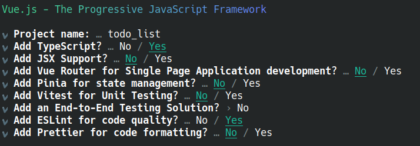
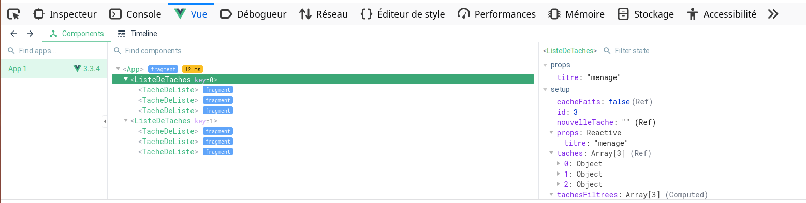
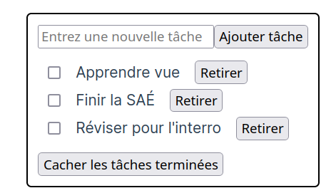
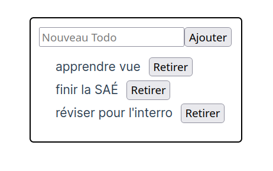


<!-- #  JavaScript -- Vue.js -->

<!-- ### IUT Montpellier-Sète – Département Informatique -->

<!-- ## TD1 -- Initiation à Vue.js -- Réalisation d'une liste de tâches -->


## Introduction
<!-- Indique à liquide d'ignorer les {{ }} jusqu'au enraw en fin de document -->
Jusqu'à maintenant, nous n'avons utilisé que du JavaScript "nature".
Ce langage offre beaucoup de possibilités, mais de nombreux frameworks permettent d'aller beaucoup plus loin.
Ces frameworks offrent souvent des outils permettant de faire un certain nombre de tâches récurrentes plus facilement. Ils imposent (ou suggèrent) la plupart du temps une manière d'organiser le code d'un projet ainsi qu'un certain nombre de bonnes pratiques associées. Notez que puisque JavaScript peut aussi s'utiliser côté serveur, il existe des frameworks *frontend* et des frameworks *backend*.

Dans ce TD, nous allons étudier les bases de *Vue* qui est l'un des frameworks *frontend* les plus populaires. Ce que nous allons voir est donc spécifique à ce framework. Cependant, la plupart des idées importantes (en particulier, la *réactivité* et la notion de *composants*) se retrouvent chez la plupart des frameworks même si les détails d'implémentation peuvent varier considérablement. Nous allons aussi profiter de ce TD pour découvrir TypeScript. C'est une surcouche du langage JavaScript qui permet d'utiliser les types et donc d'augmenter la qualité, la ré-utilisabilité et la testabilité du code produit.


Ce TD est partiellement inspiré du [tutoriel *Vue*](https://vuejs.org/tutorial/#step-1). La [documentation de *Vue*](https://vuejs.org/guide/introduction.html) fournit beaucoup d'information de manière assez lisible sur l'ensemble des fonctionnalités de *Vue*.

## Première page avec `Vue.js` et `npm`
Jusqu'à maintenant, nous n'avons utilisé que du JavaScript "nature". Nous pouvions donc simplement écrire notre fichier `js`, l'inclure dans le fichier `html` et le navigateur web faisait le reste du travail sans même avoir besoin d'un serveur web. Beaucoup de frameworks JS coexistent avec tout un paquet d'utilitaires (compilateur, *linter*, serveur de développement...). Ces utilitaires sont très simples à installer grâce à Node.JS et [npm](https://fr.wikipedia.org/wiki/Npm) (officieusement l'acronyme de "Node Package Manager", officiellement le rétroacronyme de "npm is not an acronym").

Npm est déjà disponible sur l'image docker que nous avons configuré (l'installer est normalement assez simple sous Linux). Pour initier un projet *Vue*, vous pouvez alors ouvrir votre terminal dans le dossier où vous souhaitez créer votre projet, puis entrez la commande :


```sh
npm create vue@latest
```

Nous allons distinguer la version du code "en production" servie par notre serveur web (ici le serveur docker) de la version "en développement" servie par [*Vite*](https://vite.dev/guide). Notre version en développement ne sera donc pas dans le dossier `/var/www/html`, mais dans le dossier `/root/workspace`.


<div class="exercice" markdown="1">

Déplacez-vous **dans le terminal de votre docker** dans le dossier `/root/workspace` et entrez la commande qui permet d'initier le projet.

L'utilitaire vous demande d'abord le nom du projet à créer : vous pouvez choisir `todo_list` (puisque nous allons commencer par réaliser une liste de tâches). Ensuite, il vous propose d'inclure plusieurs fonctionnalités supplémentaires dès la création du projet. Nous allons toutes les refuser sauf TypeScript (nous ignorerons les erreurs de type au début, mais nous y reviendrons ensuite) et ESLint.


</div>


Enfin, on nous propose d'entrer les 3 lignes suivantes pour commencer à travailler sur le projet :

```sh
cd todo_list
npm install
npm run dev
```
La seconde commande permet d'installer les différentes dépendances du projet (comme `composer install` pour PHP, sauf qu'ici il faut le faire dès la première fois). La troisième commande lance normalement le serveur de développement de *Vite* qui permet de travailler dans de bonnes conditions. Cependant, comme nous l'utilisons depuis docker, il va falloir rajouter quelques lignes au fichier de configuration `vite.config.ts` pour que cela fonctionne.

```ts
import { fileURLToPath, URL } from 'node:url'

import { defineConfig } from 'vite'
import vue from '@vitejs/plugin-vue'

// https://vitejs.dev/config/
export default defineConfig({
  plugins: [
    vue(),
  ],
  resolve: {
    alias: {
      '@': fileURLToPath(new URL('./src', import.meta.url))
    },
  },
  server: {
      host: true,
      port: 5173
  }
})
```


<div class="exercice" markdown="1">

1. Entrez les deux premières commandes **dans le terminal de votre docker**. 

2. Faite la modification du fichier `vite.config.ts` en modifiant les quelques lignes nécessaires, puis faites le `npm run dev`.
</div>

Si tout va bien, la dernière commande donne la sortie suivante :

```
> todo_list@0.0.0 dev
> vite

  VITE v5.4.10  ready in 305 ms

  ➜  Local:   http://localhost:5173/
  ➜  Network: http://172.18.0.3:5173/
  ➜  press h + enter to show help
```
On peut alors ouvrir le lien `http://localhost:5173/` dans le navigateur web de notre choix (Firefox ou Chrome/Chromium). Notre page est disponible sur ce lien et celle-ci se met à jour dès que l'on modifie les fichiers, ce qui est plutôt pratique pour développer. Actuellement, vous devez avoir la page d'accueil d'un projet *Vue* de base. Ne fermez pas votre terminal sinon le serveur de développement cessera de fonctionner.

L'utilitaire que nous avons utilisé pour créer ce projet et faire tourner le serveur de développement s'appelle *Vite*. Pour l'instant, pas besoin d'en savoir plus, mais nous reparlerons de quelques fichiers de configuration *Vite* plus tard.


### Petit point IDE et navigateur

La documentation *Vue* semble encourager l'usage de VS code. De même, TypeScript que nous allons utiliser est développé par le même éditeur que VScode (Microsoft). Tous ces outils sont libres et open source. Pour ces différentes raisons, c'est un bon choix d'utiliser VS code (ou l'alternative VScodium qui est une version de VScode sans la télémétrie de Microsoft) et d'installer le plugin `Vue - Official` (on pourrait aussi installer un paquet d'autres plugins utiles tels que `ESLint` par exemple). Cependant, Webstorm propose a priori aussi un très bon support pour TypeScript et *Vue* sans installation préalable de plugin.

Nous allons aussi installer un plugin au navigateur pour nous aider à déboguer un site codé avec *Vue*:
sous [Firefox](https://addons.mozilla.org/fr/firefox/addon/vue-js-devtools/) et sous [Chrome](https://chrome.google.com/webstore/detail/vuejs-devtools/nhdogjmejiglipccpnnnanhbledajbpd). Ces plugins offrent un nouvel onglet dans les outils de développement qui ressemble à ceci :



### La première page


Ouvrez le projet dans votre IDE et commencez à observer le contenu du dossier `todo_list/src`. Commençons par regarder les deux fichiers `main.ts` et `App.vue`. Le fichier `main.ts` est le point d'entrée principal du site et pour l'instant, il se contente d'importer un composant définit dans le fichier `App` et de le déclarer comme composant principal avec la dernière ligne. Ouvrez le fichier `index.html` pour voir à quoi le `#app` fait référence: on pourrait le remplacer par n'importe quel sélecteur valide.

Nous allons pour l'instant surtout nous concentrer sur le fichier `App.vue`. La première chose à constater c'est qu'il contient:
- du JS entre les balises `<script>`, 
- du HTML entre les balises `<template>` 
- et enfin du CSS entre les balises `<style>`. 

Ce découpage contredit l'organisation du code à laquelle vous êtes habitués. Nous allons tout de même effectuer un découpage, mais il sera "composant" par "composant". C'est le choix fait par la plupart des frameworks JS populaires. Certains proposent de séparer le code en composant et de séparer le HTML, le CSS et le JS de chaque composant. Nous verrons les détails des composants plus tard. Pour l'instant, le JS importe deux composants (`HelloWorld` et `TheWelcome`) qui sont ensuite utilisés dans le HTML.

Remplacez le contenu de `App.vue` par
 
```vue
<script setup lang="ts">
  let texte =  "un texte qui s'affiche";
</script>


<template>
  <div id="wrapper">
    <h1>TODO liste</h1>
    <p>{{texte}}</p>
  </div>
</template>

<style scoped>
</style>
```

Vérifiez dans le navigateur que l'affichage a bien été mis-à-jour. Vous pouvez aussi supprimer le dossier `src/component` que nous n'utiliserons pas dans le premier exercice.

## Base du réactive : moustache, v-bind, v-on et v-model

Prenez le temps d'observer la page minimale que nous avons créée et de comprendre comment elle est décrite par notre fichier `App.vue`. Vous avez certainement remarqué dans l'exemple précédent que dans la page HTML le texte `{{texte}}` a été remplacé par le contenu de la variable. C'est la syntaxe "moustache" (doubles accolades) qui permet l'interpolation de texte (ça devrait vous rappeler Twig). On peut utiliser des expressions plus compliquées. Par exemple, on pourrait écrire `{{texte1+" "+texte2}}` pour afficher la concaténation des deux variables séparés par une espace.

La moustache ne fonctionne que pour inclure du texte dans le HTML. Si l'on veut utiliser une variable dans un attribut d'une balise, il va falloir utiliser `v-bind:monAttribut="maVariable"`. Par exemple, on pourrait ajouter au JS la définition `let url = "https://vuejs.org/";` et au HTML la ligne `<a v-bind:href="url"> Site de Vue</a>`.

<div class="exercice" markdown="1">

Essayez de définir un lien de cette manière et vérifiez que ça fonctionne.

</div>


> *Vue* fournit plusieurs de ces attributs spéciaux en `v-` qui s'appellent des directives. Dans ce TD, vous allez découvrir `v-bind`, `v-on`, `v-model` et `v-for`.

On aimerait ensuite rajouter un compteur simple en dessous du texte de notre page. On va ajouter au HTML le bouton suivant : `<button v-on:click="incremente">+</button>`. Cette fois, nous utilisons la directive `v-on:` qui indique que l'on cherche à détecter un événement qui est précisé ensuite (donc `v-on:click` détecte un clic alors que `v-on:keyup` détecte un appui de touche). La valeur donnée est le nom de la fonction JS à appeler (on peut aussi écrire du code directement, mais sauf s'il est particulièrement court, c'est une mauvaise pratique d'écrire le JS au milieu du HTML).

Vous l'avez compris, il faut donc écrire la fonction `incremente`. Voilà ce qu'on peut ajouter dans la partie script :

``` js
let compteur = 7;
function incremente(){
  compteur++;
  console.log(compteur);
}
```

<div class="exercice" markdown="1" >

1. Faites-le puis vérifiez que cela fonctionne : ouvrez la console pour vérifier l'affichage de la valeur. 

2. Vous pouvez maintenant utiliser la syntaxe moustache pour afficher la variable compteur dans votre page. Que se passe-t-il ?

</div>

On peut constater dans la console que la valeur de la variable change, et pourtant l'affichage n'est pas mis à jour. C'est normal, l'interface n'est mis-à-jour que lorsqu'une variable "réactive" change, or pour l'instant, nous n'avons pas défini de variable réactive. Pour rendre la variable compteur réactive, vous allez devoir faire les trois choses suivantes :

1. Importer la fonction `ref` en ajoutant la ligne suivante en haut du script 
   ```js
   import {ref} from 'vue';
   ```
   Cette ligne indique simplement que nous importons la fonction `ref` depuis le module `vue`. 
   
   La notion de module permet de séparer le code JS en "blocs logiques" et donc d'avoir des projets mieux organisés. En particulier, plutôt que de devoir inclure tous nos fichiers JS dans l'entête du HTML, on peut ainsi inclure le module JS principal qui importe les modules JS dont il a besoin qui vont eux même importer les modules JS dont ils ont besoin. On a donc des dépendances beaucoup plus claires pour l'humain, pour l'IDE et pour le navigateur.

2. Modifier la définition de compteur pour utiliser `ref` ainsi `let compteur = ref(7);`.

3. Remplacer toutes les utilisations de compteur dans le script par `compteur.value` (par contre, gardez `compteur` dans la partie `HTML`).

<div class="exercice" markdown="1" >

Faites-le et vérifiez que tout fonctionne.

</div>

La fonction `ref` renvoie un objet réactif qui encapsule l'objet donné en argument. Il faut donc maintenant utiliser `monobjet.value` pour accéder à sa valeur dans le JS. En contrepartie, dès qu'il change, l'interface se met-à-jour correctement. Il faudra définir et utiliser tous les objets réactifs de cette manière.

> La fonction `ref` utilise l'objet proxy de JavaScript que nous avons utilisé dans un contexte similaire l'an dernier. En fait, *Vue* définie une fonction `reactive` dont le fonctionnement est très proche de la fonction `reactive` que nous avons écrit l'an dernier. La fonction `ref` utilise en fait `reactive`, mais `ref` est plus simple d'utilisation et nous utiliserons donc principalement `ref`.


> **Attention :** Pour utiliser une variable `ref` dans la partie `script JS` il faut écrire `maVariable.value` pour accéder à sa valeur alors qu'il faut faire `maVariable` dans la partie `template HTML`. Cela risque de vous causer pas mal d'erreur au début si vous l'oubliez !!

Nous allons maintenant voir comment associer une variable au contenu d'un champ de formulaire.

<div class="exercice" markdown="1" >

1. Ajoutez un champ texte `<input>` et utiliser `v-bind` pour que `value` de cet input soit toujours la variable `compteur`. Vérifiez que si l'on change la valeur en cliquant sur le bouton de l'exercice précédent, l'affichage se met à jour dans notre nouvel input. 

2. Utilisez `v-on:input` et la fonction suivante pour que la modification du contenu de l'input mette la variable à jour.

   ```js
   function onInput(e) {
     compteur.value = e.target.value
   }
   ```

3. Vérifiez qu'en changeant au clavier la valeur du champ la valeur affichée précédemment est bien modifiée.
</div>


On a réussi à associer une variable à notre `input` dans les deux directions. En fait, on aurait pu faire cela directement grâce à la directive `v-model`.

<div class="exercice" markdown="1" >
Remplacez l'input par `<input v-model="compteur">` et supprimez la fonction `onInput`. Vérifiez que tout fonctionne.
</div>


De manière générale, `v-model` permet de relier une variable à un input de manière cohérente (par exemple, si `type="checkbox"` alors la variable sera un booléen).

Les directives ont un rôle assez important et nous en verrons d'autres. 
Les directives très utilisées ont des syntaxes raccourcies que nous allons privilégier à partir de maintenant : 
* `:monattribut="mavariable"` est équivalent à `v-bind:monattribut="mavariable"`;
* `@event="mafonction"` est un raccourci pour `v-on:event="mafonction"`.

## Réalisation d'une liste de tâches
Les deux exercices classiques pour découvrir un framework JS sont le morpion ou
la liste de tâche (*TODO list*). Nous avons fait un morpion en "*R4.A.10 --
Complément web*" l'an dernier donc pour découvrir la réactivité, nous allons réaliser une
liste de tâches. Il sera possible d'ajouter des tâches, de retirer des tâches et
de cocher certaines tâches pour indiquer qu'elles ont été effectuées. Elle
ressemblera à ça: 



### Afficher la liste de tâches 

Nous allons utiliser une nouvelle directive `v-for` qui permet de faire une boucle sur une collection dans le `<template>`.

<div class="exercice" markdown="1" >

Remplacez le contenu de `App.vue` par le code suivant :


```vue
<script setup lang="ts">
  import {ref} from 'vue';
  let id = 0;
  const taches = ref([
    { id: id++, description: "Apprendre Vue", faite: false },
    { id: id++, description: "Finir la SAÉ", faite: false },
    { id: id++, description: "Réviser pour l'interro", faite: false }
  ]);
</script>

<template>
  <div id="wrapper">
    <ul>
      <li v-for="tache in taches" :key="tache.id">
        <label>{{tache.description}}</label>
      </li>
    </ul>
  </div>
</template>

<style scoped>
</style>
```

</div>

Dans la partie JS, nous définissons le tableau réactif `taches` qui contient les éléments de la liste de tâches. Chaque élément de la liste de tâches possède un texte qui décrit la tâche, un booléen qui décrit si la tâche est effectuée ou non et une `id` dont nous allons voir l'utilité. L'autre partie intéressante est la ligne `<li v-for="tache in taches" :key="tache.id">` qui permet de faire une boucle sur tous les éléments de `taches` et de créer un `<li>` pour chacun d'entre eux. La partie `:key="tache.id"` permet d'associer une clef différente à chaque élément. Pour l'instant le code pourrait fonctionner sans, mais le fait d'associer une clef unique à chaque élément permet à *Vue* de comprendre quel élément correspond à quel élément quand le tableau change (par exemple, si l'on supprime une case au milieu du tableau et que le contenu de certaines cases est modifié). Dans le doute, il faut toujours associer une clef unique à chaque élément dans un `v-for`.


### Ajouter et retirer un élément à la liste de tâches

Nous allons maintenant permettre d'ajouter un élément à la liste de tâches.

<div class="exercice" markdown="1" >


1. Commencez par ajouter, avant l'affichage de la liste, un `<input type="texte">` associé à une variable réactive qu'on pourra appeler `nouvelleTache` (il faut donc utiliser `ref` et `v-model`). On ajoutera un `placeholder` pertinent à l'input.

2. Écrivez une nouvelle fonction `ajouterTache` qui ajoute un nouvel élément à `taches` (on pourra utiliser la méthode [`push`](https://developer.mozilla.org/fr/docs/Web/JavaScript/Reference/Global_Objects/Array/push) des tableaux). Ce nouvel élément doit posséder une nouvelle `id` (on peut utiliser `id++`), une description qui correspond au contenu de la variable `nouvelleTache` et le booléen `faite:false`. La fonction `ajouterTache` devra aussi vérifier que `nouvelleTache` est différent de `""` avant de l'ajouter à `taches` puis réinitialiser la valeur de `nouvelleTache` à `""`. N'oubliez pas que pour utiliser nos variables `ref` dans le JS, il faut utiliser `.value`. 

3. Ajoutez un bouton qui appelle `ajouterTache` (on utilisera `@click`). Vérifiez que tout fonctionne.

4. Pour que chaque `<label>` soit associé à son `<input>`, il faut ajouter un
   attribut `id` à chaque `<input type="checkbox">` et indiquer cet `id` dans
   l'attribut `for` de la balise `<label>`. Ainsi, un clic sur le `<label>`
   entrainera un clic sur sa `checkbox` associée.
</div>


On aimerait bien que l'ajout d'une tâche ignore les espaces inutiles en début ou fin de chaine (en particulier, on aimerait que la chaine `"   "` soit ignorée tout comme la chaine vide). On a une solution très simple pour ça : le [modificateur `.trim`](https://vuejs.org/guide/essentials/forms.html#trim). Pour l'utiliser, à la place d'écrire `v-model="nouvelleTache"` on doit écrire `v-model.trim="nouvelleTache"` et le contenu de `nouvelleTache` sera alors le même que celui de l'input, mais en ignorant les espaces de début et de fin.

<div class="exercice" markdown="1" >

Faites-le et vérifiez que tout fonctionne.

</div>

De manière générale, la syntaxe complète des directives est la suivante `name:argument.modifiers="value"`. Par exemple, `v-on:click.prevent="gestionDuClic"` appelle la fonction `gestionDuClic` dès que l'élément est cliqué tout en empêchant la propagation de l'événement (en l'occurrence, on préfère utiliser la version courte `@click.prevent="gestionDuClic"`).

On va maintenant ajouter la possibilité de retirer un élément de la liste de tâche. 

<div class="exercice" markdown="1" >


1. Ajoutez le bouton `<button @click="retirerTache(tache)">Retirer</button>` à chaque élément. Un clic sur ce bouton va donc appeler la fonction `retirerTache` avec comme argument `tache` qui correspond à l'élément du tableau `taches`. 

2. Codez la fonction `retirerTache`. On pourra utiliser la méthode [`filter`](https://developer.mozilla.org/en-US/docs/Web/JavaScript/Reference/Global_Objects/Array/filter) en ne gardant que les éléments qui sont différents de `tache`.

   **Attention :** Votre IDE devrait normalement vous dire qu'il y a une erreur (`Parameter 'tache' implicitly has an 'any' type.`). On peut ignorer cette erreur pour l'instant, nous verrons plus tard ce qu'elle veut dire.

3. On peut ajouter un CSS minimal dans `<style scoped>` pour un résultat un peu
   plus joli. Par exemple :

    ```css
    #wrapper{
      border-radius: 5px;
      border:solid black 2px;
      padding: 10px;
    }
    ul,label{
      padding:10px;
    }
    li{
      list-style: none;
      padding: 2px 0px;
    }
    ```

    


4. Il est temps d'aller explorer l'onglet *Vue* dans les outils de développement du navigateur. Vous pouvez par exemple l'utiliser pour changer la valeur de certaines variables à la volée ou simplement observer leurs valeurs. Commencez par vérifier qu'on peut voir les variables évoluer quand on ajoute une tâche. Ensuite, vous pouvez essayer de modifier le nom d'une tâche depuis cet onglet.
</div>


### Sélectionner les tâches faites

Nous voulons maintenant permettre à l'utilisateur de noter si une tâche est faite ou non. Et on voudrait que chaque tâche faite apparaisse raturée. Pour cela, nous allons ajouter les lignes suivantes au CSS

```css
.fait{
  text-decoration: line-through;
}
```

Il faudrait ensuite associer la classe CSS `fait` à toutes les tâches qui sont faites. La directive `v-bind:class` fonctionne de manière un peu particulière. L'un des manières de l'utiliser est de lui donner un objet dont les noms des propriétés sont les noms des classes à ajouter et la valeur de chaque propriété est un booléen qui indique si la classe correspondante doit être ajoutée. Ces classes se cumulent avec celles définies dans l'attribut HTML `class="..."` (par convention les classes définies ainsi ne doivent pas être retirées par la suite, d'ailleurs la syntaxe de `:class` ne permet pas de les retirer). Par exemple, un `<div>` avec

```js
<div class="blip blop" :class="{class1: true, class2: false, toto: true}">
```

aurait donc comme classes `"blip blop class1 toto"`. On peut utiliser la valeur d'une variable pour désigner le booléen (et le nom de la classe). 
Observez que les valeurs des directives et les moustaches [peuvent prendre n'importe quelle expression JS](https://vuejs.org/guide/essentials/template-syntax.html#using-javascript-expressions), c'est-à-dire tout morceau de code dont l'évaluation donne une valeur.
 
<div class="exercice" markdown="1" >

1. Devant chaque tâche, ajoutez un `<input type="checkbox">` reliée à la valeur `tache.faite` correspondante. Vous pouvez utiliser l'onglet *Vue* pour vérifier que les booléens `faite` change de valeur quand on clique une *checkbox*. 

3. Ajoutez les 3 lignes de CSS.

3. Ajoutez au `label` associé à chaque `tache` la classe `fait` quand son booléen `tache.faite` est à `true`. 

4. Vérifiez que tout fonctionne.

</div>
 
Notez qu'il est aussi possible d'utiliser `:class` avec une variable qui contient le tableau des classes à ajouter.


### Cacher les tâches faites

Nous voulons ajouter un bouton qui permet de cacher/afficher les tâches qui sont déjà faites. Nous allons utiliser le code suivant pour le bouton, dans le JS

```js
const cacheFaits = ref(false);
```

dans le HTML
```html
<button @click="cacheFaits = !cacheFaits">
  {{ cacheFaits ? 'Tout montrer' : 'Cacher les tâches terminées' }}
</button>
```


<div class="exercice" markdown="1" >

Prenez le temps de comprendre le fonctionnement du code de ce bouton, vous devriez pouvoir expliquer tout ce qu'il fait. Ajoutez-le après la todo liste.

</div>

Nous souhaitons maintenant que quand le booléen `cacheFaits` est à faux, la boucle `v-for` n'affiche que les tâches dont le booléen `faite` est à `false`.
Pour cela, notons que le tableau utilisé dans une boucle `v-for` peut être donné par une fonction avec la syntaxe suivante

```html
<li v-for="tache in filtrerTaches()" :key="tache.id">
```

Si la fonction `filtrerTaches` utilise des variables réactives (définies avec `ref(...)`), *Vue* se charge de le détecter et de mettre l'affichage à jour à chaque changement de ces variables réactives.

<div class="exercice" markdown="1" >

1. Modifiez le HTML pour que le `v-for` dépende du résultat d'une fonction
`filtrerTaches`.

2. Écrivez la fonction `filtrerTaches` qui utilise [`filter`](https://developer.mozilla.org/en-US/docs/Web/JavaScript/Reference/Global_Objects/Array/filter) pour renvoyer un tableau qui contient les tâches à afficher (cette fonction dépend donc des deux variables réactives `cacheFaits` et de `tache.faite`). Attention, cette fonction ne doit pas modifier le tableau `taches`, mais bien retourner un autre tableau.

3. Vérifiez que tout fonctionne.

</div>

#### Propriétés calculées

Maintenant, nous voulons stocker le résultat de `filtrerTaches()` dans une
propriété `tachesFiltrees` afin de ne pas avoir à la recalculer à chaque fois
que l'on veut l'utiliser.


<div class="exercice" markdown="1" >

Faites-le et modifiez la directive `v-for` pour utiliser la propriété
`tachesFiltrees`. Constatez que l'application ne marche plus quand on clique sur
*Cacher les tâches terminées*.

</div>

En effet, `tachesFiltrees` n'est pas mis-à-jour quand les dépendances réactives
de `filtrerTaches` changent.

<!--
C'est un peu plus compliqué : v-for surveille tachesFiltrees, qui est de type reactive par réactivité profonde 
(car c'est taches.value)

Donc les changements au tableau réactif taches.value sont bien répercutés, par exemple une nouvelle tâche.

Par contre, v-for ne surveille pas cacheFaits.

Pire, si on clique sur Retirer, taches.value est un nouveau tableau réactif, et n'est plus le même que tachesFiltrees (qui est celui affiché). Du coup, Retirer est cassé. Et une fois qu'on a cliqué sur Retirer, l'ajout de nouvelle tache ne s'affiche plus (l'ajout se fait sur taches.value, et pas sur tachesFiltrees).
En effet, dans
taches.value = taches.value.filter(tache => tache.id !== tacheARetirer.id)
le filter crée un nouveau Array, qui est transformé en réactif lors qu'il est stocké dans taches.value (par réactivité profonde)
-->

Pour permettre ceci, nous allons faire de `tachesFiltrees` une propriété
calculée . Une propriété calculée se comporte comme une propriété qui se met
automatiquement à jour. Il faut commencer par importer la fonction `computed` en
changeant l'import au début.

```js
import {ref, computed} from 'vue';
```
On importe maintenant deux fonctions du module `vue`. On aurait pu ajouter une
deuxième ligne et faire une ligne par import plutôt que d'importer plusieurs
fonctions en une seule ligne.

Ensuite, au lieu de `const tachesFiltrees = filtrerTaches()`, on écrira `const
tachesFiltrees = computed(filtrerTaches)`. 

<div class="exercice" markdown="1" >

Faites-le et vérifiez que tout fonctionne.

</div>

L'application se met bien à jour désormais car `v-for` surveille
`tachesFiltrees`, et `tachesFiltrees` est automatiquement mise à jour dès que
l'une de ses dépendances réactives est modifiée. 

Par rapport à la solution précédente avec une fonction `filtrerTaches()`, la
propriété calculée `tachesFiltrees` a l'avantage de *mettre en cache* le
résultat de la fonction. Ainsi, chaque occurrence de `tachesFiltrees` renvoie la
valeur stockée, et cela sans exécuter à nouveau la fonction.

Il faut faire attention d'éviter le problème inverse qui serait de définir une propriété calculée qu'on doit tout le temps calculer alors qu'on l'utilise rarement. Il faut toujours réfléchir au choix le plus pertinent entre fonction et propriété calculée. Surtout, il se peut qu'un choix soit plus clair et lisible et donc préférable dans certains contextes (ici, a priori, on comprend un peu plus facilement le HTML qui contient la propriété calculée).


Notre liste de tâche est terminée. Vous pouvez améliorer le CSS avant de passer à la suite.

## Et TypeScript dans tout ça ?
Avant d'expliquer l'usage de TypeScript considérez les deux instructions suivantes

```js
let a="4";
a=a+1;
```
<div class="exercice" markdown="1" >

Quel est le contenu de `a` à la fin ?
Vérifiez en exécutant le code précédent dans la console du navigateur.

</div>

Une connaissance élémentaire du langage permet de répondre correctement ici, mais dans un projet de plusieurs milliers de lignes de code, on peut rencontrer des cas beaucoup plus compliqués. Le typage permet entre autre d'éviter d'avoir besoin de se poser ce genre de questions.

TypeScript (TS) est une légère surcouche à JavaScript qui permet de "typer" son code. Il va donc permettre de déclarer des types dans les déclarations des variables et des fonctions. Le typage n'est pas "obligatoire" et il existe un type `any` qui correspond à "n'importe quel type" (comme `mixed` en PHP, pas possible en Java). Par contre, contrairement à PHP, les types TS ne sont pas vérifiés pendant l'exécution, mais avant l'exécution, pendant la phase de transpilation qui transforme le TS en JS.

Typer les variables permet à l'IDE et à divers outils de développement de détecter automatiquement différents bugs potentiels. Le typage permet aussi d'améliorer considérablement la complétion automatique que fourni l'IDE, notamment pour de gros projets. 

Le fonctionnement de TypeScript est très simple : il fournit quelques manières d'annoter le code avec des types. Pour produire un code JavaScript valide, il suffit d'effacer toutes ces annotations (à part dans quelques cas avancés...). Il faut un outil spécial pour transformer le code TypeScript en JavaScript que le navigateur pourra exécuter (on peut facilement l'installer avec `npm`). Dans notre cas, *Vite* gère *Vue* et TypeScript en même temps (nous avions coché la case "*Add TypeScript ?*" quand nous avions initié le projet).

La fonctionnalité principale de TypeScript est de pouvoir définir le type d'une variable avec la syntaxe `mavariable:montype`. Ça n'est pas forcément utile quand on déclare une variable puisque TypeScript peut deviner automatiquement le type en se basant sur le type de l'affection associée. Dans l'exemple suivant, TS peut deviner que le type de `helloWorld` est `string`

```js
let helloWorld = "Hello World"
```
mais on pourrait écrire

```js
let helloWorld:string = "Hello World"
```
On peut aussi l'utiliser dans les définitions de fonctions comme ceci :
```ts
function maFonction(param1:type1, param2:type2):typeDeRetour{
  ...
}
```

TypeScript pourra ainsi vérifier qu'à chaque appel de cette fonction des arguments avec des types compatibles sont fournis (ceci n'a pas lieu à l'exécution, mais à la vérification du code). L'autre fonctionnalité principale que nous allons utiliser est la possibilité de définir des types particuliers, comme les interfaces et les unions. Nous allons surtout utiliser les interfaces pour indiquer qu'un objet doit posséder certains attributs avec le bon type. Mais on peut aussi en faire un usage très proche de celui que vous avez vu en Java en précisant les méthodes qu'un objet devrait posséder (TS possède un certain nombre de notions qui permettent de faire de la POO plus proche de celle que vous connaissez en Java).

<div class="exercice" markdown="1" >

Remplacez temporairement votre fonction `ajouterTache` par celle-ci :

```js
function ajouterTache(){
  if(nouvelleTache.value === "") return;
  taches.value.push({id: id++, description: nouvelleTache.value, faite: "false"});
  nouvelleTache.value = "";
}
```
Normalement, votre IDE indique qu'il s'attend à voir un booléen à la place d'un `string` ici et c'est TypeScript qui lui permet cela. Pour faire cela, il a deviné le type de `taches` à partir de sa ligne d'initialisation. Il part du principe qu'un tableau contient des éléments qui ont tous le même type, mais on pourrait forcer un type plus général en le précisant explicitement.

Annulez ce changement.

</div>
 
Normalement, votre IDE soulève déjà une première erreur TypeScript que nous avons ignorée jusqu'à présent dans la définition de la fonction `retirerTache` :

```
Parameter 'tache' implicitly has an 'any' type.
```

Le type `any` est un type spécial qui correspond à "n'importe quel type". Ici l'IDE nous dit qu'il a été obligé de deviner que c'était le type attendu pour cette fonction. On peut dans un premier temps corriger l'erreur en corrigeant la déclaration de `function retirerTache(tache:any)`. Ce n'est évidemment pas très utile de mettre `any` partout puisqu'il y a alors trop peu d'information pour que les types permettent de détecter une erreur. Nous allons donc définir une interface comme ceci :

```ts
interface NomDeMonInterface {
  nomDeLaPropriete1: TypeDeLapropriete1
  nomDeLaPropriete2: TypeDeLapropriete2
  ...
}
```

Rappelez-vous que ce que vous appelleriez un attribut en Java s'appelle une propriété en JS/TS (tant mieux, le JS set à manipuler du HTML et les balises HTML ont déjà des "attributs"). Bien sûr, les fonctions aussi sont des propriétés et donc on peut dans la définition d'une interface définir une fonction avec les types de ses arguments et son type de retour.

Les types qu'on va utiliser sont donc :
* les trois types primitifs (`string`, `boolean`, `number`),
* les interfaces,
* les fonctions,
* des collections d'un type primitif donné (par exemple, un tableau de string),
* le type `any` (aussi rarement que possible).

Il y a de nombreuses autres possibilités que nous allons ignorer : *union*, *enums*, types littéraux, `null`, `undefined`, types génériques (l'équivalent des types paramétrés)...

<div class="exercice" markdown="1" >

1. Vérifiez que votre IDE est satisfait en déclarant le type `any` pour tache.

2. Déclarer une interface pour le type `Tache` qui contient trois propriétés `id`, `description` et `faite` avec les types adéquats.

3. Remplacez `tache:any` par `tache:Tache`, normalement votre IDE arrive à vérifier que tout va bien.

4. Essayez temporairement `tache:string` ou `tache:number` pour voir ce que votre IDE vous indique.

</div>

En passant notre souris sur la définition de `taches`, on voit que le type est plutôt compliqué. On peut le forcer à identifier qu'il contient un tableau réactif de `Tache`. Pour cela, il faut importer le type `Ref` avec la ligne `import type { Ref } from 'vue';` et on peut ensuite lui assigner le type `const taches:Ref<Tache[]>` (`Tache[]` est le type d'un tableau de `Tache`, et ici on a une `Ref` vers un tableau de `Tache` à cause de la fonction `ref()`).
 
<div class="exercice" markdown="1" >

Faites-le et vérifiez que tout va bien.

</div> 

Notez qu'on peut donc définir un type dans un autre fichier et l'importer, et que probablement ce qu'il aurait fallu faire pour le type `Tache`. Nous le ferrons par la suite.

À partir de maintenant, nous essayerons de donner des types corrects et précis aux objets, mais vous savez déjà presque tout ce qu'il faut savoir pour l'utilisation de TypeScript dans le cadre de ce cours.

### Et le *linter*
Un *linter* est un programme qui parcourt le code pour essayer d'y trouver des défauts. Beaucoup de *linter* ne se contentent pas de détecter des erreurs évidentes du langage, mais vérifient aussi qu'un certain nombre de conventions habituelles et de bonnes pratiques sont respectées. Le terme *linter* vient simplement du fait que le premier *linter* s'appelait `lint` (et était écrit pour le langage C). Utiliser un *linter* permet d'améliorer la qualité du code produit. Il peut exister plusieurs *linter* pour un même langage.

En créant votre projet, vous avez coché "yes" pour le *linter* et *Vite* s'est donc chargé de configurer tout ce qu'il faut pour utiliser un *linter* JS/*Vue* simplement.

<div class="exercice" markdown="1" >

1. Ouvrez le terminal dans lequel vous avez entré la commande `npm run dev` (donc dans le docker !! ). Fermez le serveur de développement en pressant la touche `q`. Tapez la commande `npm run lint` pour lancer le *linter* nommé *eslint*.

2. Le *linter* produit peut être quelques warnings. Si c'est le cas, corrigez les et relancer le *linter* pour vérifier qu'ils ont disparu. Votre IDE propose probablement lui-même du lintage ce qui rend ces commandes un peu superflues en pratique.

3. Avant de relancer le serveur de développement, essayer la commande `npm run type-check`. Comme son nom l'indique, cette commande vérifie le typage et nous avons réglé les problèmes de type précédemment, vous ne devriez donc pas avoir de warning.

4. Relancez le serveur de dev avec `npm run dev` pour pouvoir reprendre le TD. Par la suite, on pourra régulièrement relancer le *linter*.

</div>

Les commandes `npm run dev/lint/type-check` sont définies dans la section `scripts` du fichier `package.json`. Ouvrez-le pour jeter un coup d'œil. Vous pouvez ici définir de nouvelles commandes ou modifier les commandes existantes (on pourrait par exemple définir une nouvelle commande qui lance `lint` et `type-check`). 

Notez que les scripts qui sont appelés par `npm run`, c-à-d `vite`, `eslint` (EcmaScript Lint) ou `vue-tsc` (Vue TypeScript Compiler) peuvent se trouver dans `node_modules/.bin`, car `npm run` rajoute ce répertoire au `PATH` pour pouvoir les exécuter. Ces scripts sont installés lors de `npm install`. 

## Conclusion

Vous avez découvert un certain nombre de fonctionnalités de *Vue* pour la réalisation de notre liste de tâches. Dans le prochain TD, nous découvrirons la notion de composant pour réaliser un tableau de bord de liste de tâches.

## Liens avec *R.4.01-Architecture Logicielle*

Nous avons l'an dernier écrit notre petite bibliothèque de programmation réactive dans la ressource [*R.4.01-Architecture Logicielle*, alias *JavaScript*](https://gitlabinfo.iutmontp.univ-montp2.fr/r4.01-developpementweb/td7).

Pour rappel, la programmation réactive permet d'enregistrer, pour chaque
propriété d'un objet réactif, la liste des fonctions qui lisent cette propriété.
Ainsi, quand une propriété d'un objet réactif change, on relance toutes ces
fonctions pour mettre à jour l'application.

Nous avions 3 fonctions principales : `applyAndRegister`, `reactive` et
`startReactiveDom`. 
1. L'appel à la fonction `reactive` sur un objet `obj` renvoyait une version
réactive de l'objet.
2. De son côté, `applyAndRegister(foo)` exécute la fonction `foo` et
l'enregistre comme dépendance de toutes les propriétés des objets réactifs
qu'elle lit. 
3. Enfin, `startReactiveDom` lançait `applyAndRegister(foo)` pour des fonctions
`foo` telles que le remplissage du contenu texte d'une balise ou le changement
de valeur de l'attribut d'une balise.

Nous pouvons maintenant utiliser les connaissances de l'an dernier pour mieux
expliquer le fonctionnement de Vue :
1. les moustaches `{{ expressionJS }}` de *Vue* font, en simplifiant,
   ```js
   applyAndRegister(function(){baliseCourante.textContent=eval(expressionJS)})
   ```
   où `baliseCourante` est la balise dont le contenu textuel contient les
   moustaches, et `eval` est une fonction JS permettant d'évaluer une expression
   JS. Notez que l'implémentation de *Vue* est plus compliquée car elle  gère
   d'autres problématiques, comme la sécurité de l'évaluation. Ainsi, ce code
   s'exécute à chaque modification d'une propriété d'un objet réactive
   intervenant dans `expressionJS`, mettant ainsi à jour le contenu texte de la
   balise. Ceci généralise les attributs `data-textvar` et `data-textfun` que
   nous avions codé l'an dernier.

2. la directive *Vue* `v-bind:nomAttribut="expressionJS"` revient à faire (en gros)
   ```js
   applyAndRegister(function(){baliseCourante.nomAttribut=eval(expressionJS)})
   ```
   Nous ne l'avons pas fait l'an dernier, mais nous aurions facilement pu le faire.
   Notez que notre méthode `applyAndRegister` est un peu l'équivalent de la méthode
   `watchEffect` de *Vue*.

3. les *propriétés calculées* de *Vue* telle que
   ```js
   const tachesFiltrees = computed(filtrerTaches);
   ```
   sont réécrites en 
   ```js
   const tachesFiltrees = ref()
   applyAndRegister( function() { tachesFiltrees.value = filtrerTaches() })
   ```
   lors de la compilation des Single File Component (SFC) dont nous reparlerons au
   prochain TD. 

Replongeons-nous maintenant sur le fonctionnement de la réactivité vu au
semestre 4. Ce fonctionnement était d'ailleurs basé sur celui de *Vue* (*cf.* la
documentation de Vue sur [*La réactivité en
détail*](https://fr.vuejs.org/guide/extras/reactivity-in-depth)).

Les 2 points clés sont de savoir comment 
1. on détecte la lecture d'une propriété d'un objet réactif, ceci afin
   d'enregistrer la fonction en cours d'exécution au sein de `applyAndRegister`
   comme dépendance de cette propriété. 
2. on détecte l'écriture d'une propriété d'un objet réactif, ceci dans le but
   d'exécuter à nouveau toutes les fonctions dépendant de cette propriété.

L'an dernier, nous avions codé la fonction `reactive` de sorte qu'elle
intercepte l'accès aux propriétés d'un objet grâce aux `Proxy`. *Vue* possède
aussi une fonction `reactive` très proche dans l'esprit de celle que nous avions
codée l'an dernier (elle utilise l'objet `Proxy` pour rajouter des *getters* et
*setters*). Cependant, la fonction `Reactive` de *Vue* gère de nombreux cas
particuliers et la réactivité en profondeur. Voici pour rappel une implémentation
simplifiée de notre version de l'an dernier :
```js
function reactive(obj) {
  return new Proxy(obj, {
    get(target, key) {
      enregistrerFonctionEnCours(target, key)
      return target[key]
    },
    set(target, key, value) {
      target[key] = value
      executerFonctionsDependantes(target, key)
    }
  })
}
```

Il existe cependant une deuxième façon d'intercepter l'accès aux propriétés en
JavaScript : [les
accesseurs](https://developer.mozilla.org/fr/docs/Web/JavaScript/Reference/Functions/get)
/ [les
mutateurs](https://developer.mozilla.org/fr/docs/Web/JavaScript/Reference/Functions/set),
qui sont utilisés dans *Vue* pour les `ref`, dont voici une implémentation simplifiée : 
```js
function toReactive(value) {return isObject(value) ? reactive(value) : value};
class RefImpl {
  constructor(value) {
    // On rend value réactif, ce qui n'est possible que si c'est un objet
    this._value = isObject(value) ? reactive(value) : value;
  }
  get value() {
    enregistrerFonctionEnCours(this, 'value')
    return this._value;
  }
  set value(newValue) {
    // On rend newValue réactif, ce qui n'est possible que si c'est un objet
    this._value = isObject(newValue) ? reactive(newValue) : newValue;
    executerFonctionsDependantes(this, 'value')
  }
};
function ref(value) { return new RefImpl(value); }
```

La différence avec les Proxys est que les accesseurs / mutateurs doivent
indiquer le nom de la propriété, et ont donc besoin de connaître ce nom à
l'avance (`value` dans notre cas). Le principal avantage de `ref` est qu'il peut
contenir n'importe quel type, y compris les types primitifs tels que `string`,
`number` ou `boolean`, alors que `reactive` ne marche que sur les objets. À
cause de cette limite et [d'autres mentionnées dans la
documentation](https://fr.vuejs.org/guide/essentials/reactivity-fundamentals#limitations-of-reactive),
*Vue* recommande l'usage de `ref`.

Enfin, une `ref`rendra sa valeur profondément réactive. Cela signifie que vous
pouvez vous attendre à ce que les changements soient détectés même lorsque vous
mutez des objets imbriqués ou des tableaux
([source](https://fr.vuejs.org/guide/essentials/reactivity-fundamentals#deep-reactivity)).
D'ailleurs, `ref` se sert de `reactive` pour surveiller les modifications de ses propriétés.

<!--
La réactivité profonde au sein de reactive à l'air d'être faite dans Proxy.get de BaseReactiveHandler
qui ne renvoie pas tout de suite res = Reflect.get(...) mais plutôt reactive(res) si c'est un objet.
-->



