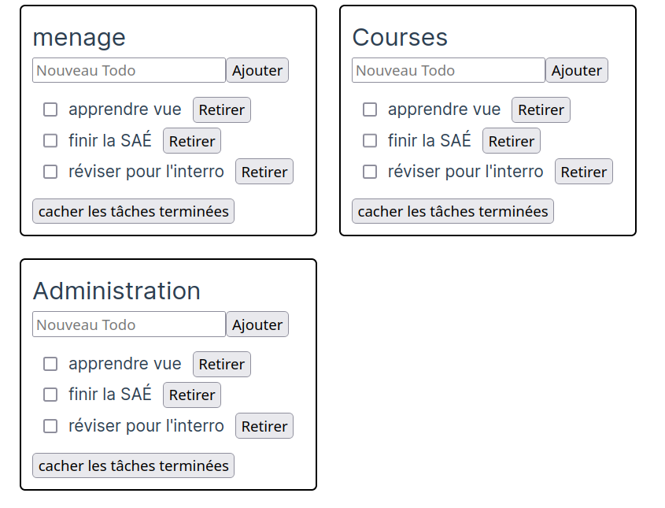

#  JavaScript -- Vue.js

### IUT Montpellier-Sète – Département Informatique

## TD1


## Introduction

<!-- Indique à liquide d'ignorer les {{ }} jusqu'au enraw en fin de document -->
Jusqu'à maintenant, nous n'avons utilisé que du JavaScript "nature".
Ce langage offre beaucoup de possibilités, mais de nombreux frameworks permettent d'aller beaucoup plus loin.
Ces frameworks offrent souvent des outils permettant de faire un certain nombre de tâches récurrentes plus facilement. Ils imposent (ou suggèrent) la plupart du temps une manière d'organiser le code d'un projet ainsi qu'un certain nombre de bonnes pratiques associées.

Dans ce TD, nous allons étudier les bases de Vue qui est l'un des frameworks les plus populaires. Ce que nous allons voir est donc spécifique à ce framework. Cependant, la plupart des idées importantes (en particulier, la réactivité et la notion de composant) se retrouvent chez la plupart des frameworks même si les détails d'implémentation peuvent varier considérablement. Nous allons aussi profiter de ce TD pour découvrir TypeScript. C'est une surcouche du langage JavaScript qui permet d'utiliser les types et donc d'augmenter la qualité, la ré-utilisabilité et la testabilité du code produit.


Ce TD est partiellement inspiré du [tutoriel Vue](https://vuejs.org/tutorial/#step-1). La [documentation de Vue](https://vuejs.org/guide/introduction.html) fournit beaucoup d'information de manière assez lisible sur l'ensemble des fonctionnalités de Vue.

## Première page avec `Vue.js` et `npm`
Jusqu'à maintenant, nous n'avons utilisé que du JavaScript "nature". Nous pouvions donc simplement écrire notre fichier `js`, l'inclure dans le fichier `html` et le navigateur web faisait le reste du travail sans même avoir besoin d'un serveur web. Beaucoup de Frameworks JS coexiste avec tout un paquet d'utilitaires (compilateur, linter, serveur de développement...). Ces utilitaires sont très simples à installer grâce à Node.JS et [npm](https://fr.wikipedia.org/wiki/Npm) (officieusement l'acronyme de "Node Package Manager", officiellement le rétroacronyme de "npm is not an acronym").

Node et npm est déjà disponibles en salle machine, si vous êtes sur votre machine personnelle, vous aurez surement besoin de l'installer (ce qui est normalement assez simple sous un Linux). Pour initier un projet Vue, vous pouvez alors ouvrir votre terminal dans le dossier où vous souhaitez créer votre projet, puis entrez la commande :


```sh
npm init vue@latest
```

Faites-le. L'utilitaire vous demande d'abord le nom du projet à créer : vous pouvez choisir `todo_list` (puisque nous allons commencer par réaliser une liste de tâches). Ensuite, il vous propose d'inclure plusieurs fonctionnalités supplémentaires dès la création du projet. Nous allons toutes les refuser sauf TypeScript (nous ignorerons les erreurs de type au début, mais nous y reviendrons ensuite) et ESLint.


Enfin, on nous propose d'entrer les 3 lignes suivantes pour commencer à travailler sur le projet :

```sh
cd todo_list
npm install
npm run dev
```

Faites-le. La seconde commande permet d'installer les différentes dépendances du projet. Si tout va bien, la dernière commande donne la sortie suivante

```
test@0.0.0 dev
vite


VITE v4.4.2  ready in 420 ms

➜  Local:   http://localhost:5173/
➜  Network: use --host to expose
➜  press h to show help
```
On peut alors ouvrir le lien `http://localhost:5173/` dans le navigateur web de notre choix (Firefox ou Chrome/Chromium). Notre page est disponible sur ce lien et celle-ci se met à jour dès que l'on modifie les fichiers, ce qui est plutôt pratique pour développer. Actuellement, vous devez avoir la page d'accueil d'un projet vue de base. Ne fermez pas votre terminal sinon le serveur de développement cessera de fonctionner.

L'utilitaire que nous avons utilisé pour créer ce projet et faire tourner le serveur de développement s'appelle `Vite`. Pour l'instant, pas besoin d'en savoir plus, mais nous reparlerons des fichiers de configuration `Vite` plus tard.


### Petit point IDE et navigateur

La documentation Vue semble recommander l'usage de VS code. De même, TypeScript que nous allons utiliser est développé par le même éditeur que VScode (MicroSoft). Tous ces outils sont libres et open source. Pour ces différentes raisons, c'est un bon choix d'utiliser VS code (ou l'alternative VScodium qui est une version de VScode sans la télémétrie de Microsoft) et d'installer les plugins `Vue Language Features (Volar)` et `TypeScript Vue Plugin (Volar)`. Webstorm propose a priori aussi un très bon support pour TypeScript et Vue sans installation préalable de plugin.

Nous allons aussi installer un plugin au navigateur pour nous aider à déboguer un site codé avec vue.
Sous [Firefox](https://addons.mozilla.org/fr/firefox/addon/vue-js-devtools/) et sous [Chrome](https://chrome.google.com/webstore/detail/vuejs-devtools/nhdogjmejiglipccpnnnanhbledajbpd). Ces plugins offrent un nouvel onglet dans les outils de développement qui ressemble à ça :


### La première page


Ouvrez dans votre IDE le dossier `todo_list/src`. Commençons par regarder les deux fichiers `main.ts` et `App.vue`. Le fichier `main.ts` est le point d'entrée principal du site et pour l'instant, il se contente d'importer un composant définit dans le fichier `App` et de le déclarer comme composant principal avec la dernière ligne. Ouvrez le fichier `index.html` pour voir à quoi le `#app` fait référence : on pourrait le remplacer par n'importe quel sélecteur valide.

Nous allons pour l'instant surtout nous concentrer sur le fichier `App.vue`. La première chose à constater c'est qu'il contient du JS entre les balises `<script>`, du `HTML` entre les balises `<template>` et enfin du CSS entre les balises `<style>`. Ce découpage contredit le découpage auquel nous sommes habitués. Nous allons tout de même effectuer un découpage, mais il sera composant par composant. C'est la méthode adoptée par de nombreux framework JS. Nous verrons les détails des composants plus tard, mais pour l'instant, vous pouvez constater que le JS importe deux composants qui sont ensuite utilisés dans le HTML (`HelloWorld` et `The_welcome`).

Remplacez le contenu de `App.vue` par
 
```vue
<script setup lang="ts">
  let texte =  "un texte qui s'affiche";
</script>


<template>
  <div id="wrapper">
    <h1>TODO liste</h1>
    <p>{{texte}}</p>
  </div>
</template>

<style scoped>
</style>
```

Vérifiez dans le navigateur que l'affichage a bien été mis-à-jour. Vous pouvez aussi supprimer le dossier `src/component` que nous n'utiliserons pas dans le premier exercice.

## Base du réactive, moustache, v-bind, v-on et v-model

Prenez le temps d'observer la page minimale que nous avons créée et de comprendre comment elle est décrite par notre fichier `App.vue`. La première chose à remarquer est que cette page contient du JS entre les balises `<script>` et du HTML entre les balises `<template>`. Vous avez peut-être déduit que le CSS doit être entre les balises `<style>`.
Cette organisation est opposée à ce que vous avez vu jusqu'à présent. Nous verrons un peu plus loin que plutôt que de séparer le HTML, le CSS et le JS, nous allons séparer le code en composant. C'est le choix fait par plusieurs frameworks, certain proposent même de séparer le code en composant et de séparer le HTML, le CSS et le JS de chaque composant.

Vous avez probablement aussi remarqué dans l'exemple précédent que dans la page HTML le texte `{{texte}}` a été remplacé par le contenu de la variable. C'est la syntaxe "moustache" (doubles accolades) qui permet l'interpolation de texte. On peut utiliser des expressions plus compliquées. Par exemple, on pourrait écrire `{{texte1+" "+texte2}}` pour afficher la concaténation des deux variables séparés par une espace.

La moustache ne fonctionne que pour inclure du texte dans le HTML. Si l'on veut utiliser une variable dans l'attribut d'une balise, il va falloir utiliser `v-bind:monAttribut="maVariable"`. Par exemple, on pourrait ajouter au JS la définition `let url = "https://vuejs.org/";` et au HTML la ligne `<a v-bind:href="url"> Site de vue</a>`.

<div class="exercice" markdown="1">

**Exercice :** Essayez de définir un lien de cette manière.

</div>


> Vue fournit plusieurs de ces attributs spéciaux en `v-` qui s'appellent des directives. Dans ce TD, vous allez découvrir `v-bind`, `v-on`, `v-model` et `v-for`.

On aimerait ensuite rajouter un compteur simple en dessous du texte de notre page. On va ajouter au HTML le bouton suivant : `<button v-on:click="incremente">+</button>`. Cette fois, nous utilisons la directive `v-on:` qui indique que l'on cherche à détecter un événement qui est précisé ensuite (donc `v-on:click` détecte un clic alors que `v-on:keyup` détecte un appui de touche). La valeur donnée est le nom de la fonction JS à appeler (on peut aussi écrire du code directement, mais sauf s'il est particulièrement court, c'est une mauvaise pratique d'écrire le JS au milieu du HTML).

Vous l'avez compris, il faut donc écrire la fonction `incremente`. Voilà ce qu'on peut ajouter dans la partie script :

``` js
let compteur = 7;
function incremente(){
  compteur++;
  console.log(compteur);
}
```

<div class="exercice" markdown="1" >

**Exercice :** Vérifiez que cela fonctionne (ouvrez la console pour vérifier l'affichage de la valeur). Vous pouvez maintenant utiliser la syntaxe moustache pour afficher la variable compteur dans votre page. Que se passe-t-il ?

</div>

On peut constater dans la console que la valeur de la variable change, mais l'affichage n'est pas mis à jour. C'est normal, l'interface n'est mis-à-jour que lorsqu'une variable "réactive" change, hors pour l'instant, nous n'avons pas défini de variable réactive. Pour rendre la variable compteur réactive, vous allez devoir faire les trois choses suivantes :

1. Importer la fonction `ref` en ajoutant la ligne suivante en haut du script 
   ```js
   import {ref} from 'vue';
   ```
   Cette ligne indique simplement que nous importons la fonction `ref` depuis le module `vue`. 
   
   La notion de module permet de séparer le code JS en "blocs logiques" et donc d'avoir des projets mieux organisés. En particulier, plutôt que de devoir inclure tous nos fichiers JS dans l'entête du HTML, on peut ainsi inclure le module JS principal qui importe les modules JS dont il a besoin qui vont eux même importer les modules JS dont ils ont besoin. On a donc des dépendances beaucoup plus claires pour l'humain, pour l'IDE et pour le navigateur.

2. Modifier la définition de compteur pour utiliser `ref` ainsi `let compteur = ref(7);`.

3. Remplacer toutes les utilisations de compteur dans le script par `compteur.value` (par contre, gardez compteur dans la partie `HTML`).

<div class="exercice" markdown="1" >

**Exercice :** Faites-le et vérifiez que tout fonctionne.

</div>

La fonction `ref` renvoie un objet réactif qui encapsule l'objet donné en argument. Il faut donc maintenant utiliser `monobjet.value` pour accéder à sa valeur dans le JS. En contrepartie, dès qu'il change, l'interface se met-à-jour correctement (cette fonction utilise l'objet proxy de JavaScript que nous avons utilisé dans un contexte similaire l'an dernier). Il faudra définir et utiliser tous les objets réactifs de cette manière.

___

**Attention :** Quand on utilise une variable `ref` dans la partie `script JS` il faut bien utiliser `maVariable.value` pour accéder à sa valeur alors qu'il faut faire `maVariable` dans la partie `template HTML`. Cela risque de cause pas mal d'erreur au début si vous l'oubliez !!

___

<div class="exercice" markdown="1" >

**Exercice :** Maintenant, ajouter un bouton `<input>` et utiliser `v-bind` pour que `value` de cet input soit toujours la variable `compteur`. Vérifiez que si l'on change la valeur en cliquant sur le bouton précédent, l'affichage se met à jour dans notre nouvel input. 

Ensuite, utilisez `v-on:input` et la fonction suivante pour que la modification du contenu de l'input mette la variable à jour.

</div>

```js
function onInput(e) {
  compteur.value = e.target.value
}
```

On a réussi à associer une variable à l'input dans les deux directions. En fait, pour faire cela directement, il existe une troisième directive `v-model`.

<div class="exercice" markdown="1" >
**Exercice :** Remplacez l'input par `<input type="input" v-model="compteur">` et supprimez la fonction `onInput`. Vérifiez que tout fonctionne.
</div>


De manière générale, `v-model` permet de relier une variable à un input de manière cohérente (par exemple, si `type="checkbox"` alors la variable sera un booléen).

___
Les directives ont un rôle assez important et nous en verrons d'autres. En particulier, `v-bind:monattribut="mavariable"` et `v-on:event="mavariable"` sont très utilisées et il existe une syntaxe plus courte : `:monattribut="mavariable"` et `@event="mavariable"` que nous allons privilégier à partir de maintenant.

___


## Réalisation d'une liste de tâches

### Afficher la liste de tâches
Nous allons réaliser la liste de tâches. Nous allons utiliser une nouvelle directive `v-for` qui permet de faire une boucle.

<div class="exercice" markdown="1" >

**Exercice :** Remplacez le contenu de `App.vue` par le code suivant :


```vue
<script setup lang="ts">
  import {ref} from 'vue';
  let id = 0;
  const taches = ref([{id:id++, description:"Apprendre vue", faite:false},
    {id:id++, description:"Finir la SAÉ", faite:false},
    {id:id++, description:"Réviser pour l'interro", faite:false}]);
</script>

<template>
  <div id="wrapper">
    <ul>
      <li v-for="tache in taches" :key="tache.id">
   	 <span>{{tache.description}}</span>
      </li>
    </ul>
  </div>
</template>

<style scoped>
</style>
```

</div>

Dans la partie JS, nous définissions le tableau `taches` qui contient les éléments de la liste de tâches. Chaque élément de la liste de tâches, possède un texte qui décrit la tâche, un booléen qui décrit si la tâche est effectuée ou non et une `id` dont nous allons voir l'utilité. L'autre partie intéressante est la ligne `<li v-for="tache in taches" :key="tache.id">` qui permet de faire une boucle sur tous les éléments de `taches` et de créer un `<li>` pour chacun d'entre eux. La partie `:key="tache.id"` permet d'associer une clef différente à chaque élément. Pour l'instant le code pourrait fonctionner sans, mais le fait d'associer une clef à chaque élément permet à Vue de comprendre quel élément correspond à quel élément quand le tableau change (par exemple, si l'on supprime une case au milieu du tableau). Il faut donc toujours associer une clef unique à chaque élément.


### Ajouter et retirer un élément à la liste de tâches

Nous allons maintenant ajouter la possibilité d'ajouter un élément à la liste de tâches.

<div class="exercice" markdown="1" >

**Exercice :**

1. Commencez par ajouter un input texte associé à une variable réactive qu'on pourra appeler `nouvelleTache` (il faut donc utiliser `ref` et `v-model`). On ajoutera un `placeholder` pertinent à l'input.

2. Écrivez une nouvelle fonction `ajouterTache` qui ajoute un nouvel élément à `taches` (on pourra utiliser [Array.prototype.push](https://developer.mozilla.org/fr/docs/Web/JavaScript/Reference/Global_Objects/Array/push)). Ce nouvel élément doit posséder une nouvelle `id` (on peut utiliser `id++`), une description qui correspond au contenu de la variable `nouvelleTache` et le booléen `faite:false`. La fonction `ajouterTache` devra aussi vérifier que `nouvelleTache` est différent de `""` avant de l'ajouter à `taches` puis réinitialiser la valeur de `nouvelleTache` à `""`.

3. Ajoutez un bouton qui appelle `ajouterTache` (on utilisera `@click`). Vérifiez que tout fonctionne.
</div>


On aimerait bien que l'ajout d'une tâche ignore les espaces inutiles en début ou fin de chaine (en particulier, on aimerait que la chaine "   " soit ignorée tout comme la chaine vide). On a une solution très simple pour ça : le [modificateur `.trim`](https://vuejs.org/guide/essentials/forms.html#trim). Pour l'utiliser, à la place d'écrire `v-model="nouvelleTache"` on doit écrire `v-model.trim="nouvelleTache"` et le contenu de `nouvelleTache` sera alors le même que celui de l'input, mais en ignorant les espaces de début et de fin.

<div class="exercice" markdown="1" >

**Exercice :** Faites-le et vérifiez que tout fonctionne.

</div>

De manière générale, la syntaxe complète des directives est la suivante `name:argument.modifiers="value"`. Par exemple, `v-on:click.prevent="gestionDuClic"` appelle la fonction `gestionDuClic` dès que l'élément est cliqué tout en empêchant la propagation de l'événement (en l'occurrence, on préfère utiliser la version courte et on écrirait `@click.prevent="gestionDuClic"`).

On va maintenant ajouter la possibilité de retirer un élément de la liste de tâche. 
<div class="exercice" markdown="1" >

**Exercice :**
1. Ajouter un bouton `<button @click="retirerTache(tache)">Retirer tâche</button>` à chaque élément, puis coder la fonction `retirerTache`. 
   
   On pourra utiliser la méthode [`filter`](https://developer.mozilla.org/en-US/docs/Web/JavaScript/Reference/Global_Objects/Array/filter) en ne gardant que les éléments qui sont différents de `tache`.

   Attention, votre IDE devrait normalement vous dire qu'il y a une erreur (`Parameter 'tache' implicitly has an 'any' type.`). On peut ignorer cette erreur pour l'instant, nous verrons plus tard ce qu'elle veut dire.

1. On peut ajouter un CSS minimal pour un résultat un peu plus joli. Par exemple :

    ```css
    #wrapper{
      border-radius: 5px;
      border:solid black 2px;
      padding: 10px;
    }
    ul,span{
      padding:10px;
    }
    li{
      list-style: none;
      padding: 2px 0px;
    }
    ```

    


3. Il est temps d'aller explorer l'onglet Vue dans les outils de développement du navigateur. Vous pouvez par exemple l'utiliser pour changer la valeur de certaines variables à la volée ou simplement observer leurs valeurs. Essayer de voir un peu ce que vous pouvez faire.

</div>


### Sélectionner les tâches faites

<div class="exercice" markdown="1" >

**Exercice :**  
1. Devant chaque tâche, ajoutez un input de type `checkbox` reliée à la valeur `tache.faite` correspondante.


2. Pour que chaque tâche faite apparaisse raturée, nous allons ajouter les lignes suivantes au CSS

    ```css
    .fait{
      text-decoration: line-through;
    }
    ```

</div>

Il faut ensuite associer la classe `fait` à toutes les tâches qui sont faites. La directive `v-bind:class` fonctionne de manière un peu particulière. L'un des manières de l'utiliser est de lui donner un objet dont les noms des attributs sont les noms classes à ajouter et la valeur de chaque attribut est un booléen qui indique si la classe correspondante doit être ajoutée. Ces classes se cumulent avec celles définies en HTML classique avec `class ="..."`. Par exemple, un `<div>` avec

```js
<div class="blip blop" :class="{class1: true, class2:false, toto:true}">
```
 aurait donc comme classes `"blip blop class1 toto"`. On peut utiliser la valeur d'une variable pour désigner le booléen (et le nom de la classe).
 
<div class="exercice" markdown="1" >

**Exercice :** Ajoutez au `span` associé à chaque `tache` la classe `fait` si son booléen `tache.faite` est `true`. Vérifiez que tout fonctionne.

Observez que les moustaches [peuvent prendre n'importe quelle expression JS](https://vuejs.org/guide/essentials/template-syntax.html#using-javascript-expressions), c'est-à-dire tout bout de code dont l'évaluation donne une valeur.

</div>
 
Notez qu'il est aussi possible d'utiliser `:class` avec une variable qui contient le tableau des classes à ajouter.


### Cacher les tâches faites

Nous voulons ajouter un bouton qui permet de cacher/afficher les tâches qui sont déjà faites. Nous allons utiliser le code suivant pour le bouton, dans le JS

```js
const cacheFaits = ref(false);
```

dans le HTML
```html
<button @click="cacheFaits = !cacheFaits">
  {{ cacheFaits ? 'Tout montrer' : 'Cacher les tâches terminées' }}
</button>
```
<div class="exercice" markdown="1" >

**Exercice :** Prenez le temps de comprendre le fonctionnement du bouton et ajoutez-le.

</div>

Pour sélectionner les tâches qu'on affiche nous allons modifier la ligne qui boucle sur `taches` ainsi

```html
<li v-for="tache in tachesFiltrees()" :key="tache.id">
```

<div class="exercice" markdown="1" >

**Exercice :** Faites-le, puis écrivez la fonction `tachesFiltrees` qui utiliser [`filter`](https://developer.mozilla.org/en-US/docs/Web/JavaScript/Reference/Global_Objects/Array/filter) pour renvoyer un tableau qui contient les tâches à afficher (ça dépend donc de `cacheFaits` et de `tache.faite`). Vérifiez que tout fonctionne.

</div>

Plutôt que d'utiliser la fonction, nous allons utiliser une propriété calculée `tachesFiltrees`. Une propriété calculée se comporte comme un attribut qui dépend uniquement des autres attributs et on l'utilise donc comme une variable qui se met automatiquement à jour. Il faut commencer par importer la fonction `computed` en changeant l'import au début.

```js
import {ref, computed} from 'vue';
```
On importe maintenant deux fonctions du module `vue`. On aurait pu ajouter une deuxième ligne et faire une ligne par import plutôt que d'importer plusieurs fonctions en une seule ligne.

Ensuite, au lieu de `function tachesFiltrees(){ ... return ...}` on écrira
`const tachesFiltrees = computed(() => {... return ...});` (on peut invoquer une fonction définie ailleurs au lieu de définir une fonction sur place). On peut ensuite utiliser `tachesFiltrees` comme si c'était une variable à la ligne du `v-for`.

<div class="exercice" markdown="1" >

**Exercice :** Faites-le et vérifiez que tout fonctionne.

</div>

La variable `tachesFiltrees` qu'on a définie est une "propriété calculée". Le résultat est calculé et mis à jour automatiquement dès qu'une des variables réactive utilisée est modifiée. Si `tachesFiltrees` est utilisée plusieurs fois entre chaque mise-à-jour, cela évite de la recalculer à chaque fois et on peut donc gagner en performance. Il faut faire attention d'éviter le problème inverse qui serait de définir une propriété calculée qu'on doit tout le temps calculer alors qu'on l'utilise rarement. Il faut toujours réfléchir au choix le plus pertinent entre fonction et propriété calculée. Comme toujours, il se peut aussi qu'un choix soit plus clair et lisible et donc préférable dans certains contextes.


Notre liste de tâche est terminée. Vous pouvez améliorer le CSS avant de passer à la suite.

### Et TypeScript dans tout ça ?
Avant d'expliquer l'usage de TypeScript considérez les deux instructions suivantes

```js
let a="4";
a=a+1;
```
<div class="exercice" markdown="1" >

**Exercice :** Quel est le contenu de `a` à la fin ?
Vérifiez dans la console du navigateur.

</div>

Une connaissance élémentaire du langage permet de répondre correctement ici, mais dans un projet de plusieurs milliers de lignes de code on peut rencontrer des cas beaucoup plus compliqués. Le typage permet entre autre d'éviter d'avoir besoin de se poser ce genre de question.

TypeScript est une légère surcouche à JavaScript qui permet de "typer" son code. Il va donc permettre de déclarer des types dans les déclarations des variables et des fonctions. Cela permet ensuite à l'IDE et à divers outils de développement de détecter automatiquement différents bugs potentiels. Le typage permet aussi d'améliorer considérablement la complétion automatique, notamment pour de gros projets.

Le fonctionnement de TypeScript est très simple : il fournit quelques manières d'annoter le code avec des types. Pour produire un code JavaScript valide, il suffit d'effacer toutes ces annotations (à part dans quelques cas avancés...). Normalement, il faut donc un outil spécial (qu'on peut facilement installer avec `npm`) pour transformer le code TypeScript en JavaScript que le navigateur pourra exécuter. Dans notre cas Vite gère Vue et TypeScript en même temps (nous avons coché la case "Add TypeScript ?" quand nous avons initié le projet).

La fonctionnalité principale de TypeScript est de pouvoir définir le type d'une variable avec la syntaxe `mavariable:montype`. Ça n'est pas forcément utile quand on déclare une variable puisque TypeScript peut deviner automatiquement le type en se basant sur le type de l'affection associée. Dans l'exemple suivant, TS peut deviner que le type de `helloWorld` est `string`

```js
let helloWorld = "Hello World"
```
mais on pourrait écrire

```js
let helloWorld:string = "Hello World"
```
On peut aussi l'utiliser dans les définitions de fonctions
```ts
function maFonction(param1:type1, param2:type2):typeDeRetour{
  ...
}
```
et TypeScript pourra ainsi vérifier que tout se passe correctement lors de l'appel de cette fonction. L'autre fonctionnalité principale est de définir des types particuliers, comme les interfaces et les unions.

<div class="exercice" markdown="1" >

**Exercice :**
Remplacez temporairement votre fonction `ajouterTache` par celle-ci :

  ```js
  function ajouterTache(){
    if(nouvelleTache.value === "") return;
    taches.value.push({id: id++, description: nouvelleTache.value, faite: "false"});
    nouvelleTache.value = "";
  }
  ```
Normalement, votre IDE indique qu'il s'attend à voir un booléen à la place d'un `string` ici et c'est TypeScript qui lui permet cela. Pour faire cela, il a deviné le type de `taches` à partir de sa ligne d'initialisation. Il part du principe qu'un tableau contient des éléments qui ont tous le même type, mais on pourrait forcer un type plus général en le précisant explicitement.

Annulez ce changement.

</div>
 


Normalement, votre IDE soulève déjà une première erreur TypeScript que nous avons ignorée jusqu'à présent

```
Parameter 'tache' implicitly has an 'any' type.
```

Le type `any` est un type spécial qui correspond à "n'importe quel type". Ici l'IDE nous dit qu'il a été obligé de deviner que c'était le type attendu pour cette fonction. On peut dans un premier temps corriger l'erreur en corrigeant la déclaration de `function retirerTache(tache:any)`. Ce n'est évidemment pas très utile de mettre `any` partout puisqu'il y a alors trop peu d'information pour que les types permettent de détecter une erreur. Nous allons donc définir une interface comme ceci :

```ts
interface Tache {
  id: number;
  description:string;
  faite:boolean;
}
```

<div class="exercice" markdown="1" >

**Exercice :** Ajoutez la définition de l'interface dans votre JS. Remplacez `tache:any` par `tache:Tache`, normalement votre IDE arrive à vérifier que tout va bien. Essayez `tache:string` ou `tache:number` pour voir ce que votre IDE vous indique.

</div>

En passant notre souris sur la définition de `taches` on voit que le type est plutôt compliqué. On peut le forcer à identifier qu'il contient un tableau de `Tache`. Pour cela, il faut importer le type `Ref` avec la ligne `import type { Ref } from 'vue';` et on peut ensuite lui assigner le type `const taches:Ref<Tache[]>` (`Tache[]` est le type d'un tableau de `Tache`, et ici on a une `Ref` vers un tableau de `Tache` à cause de la fonction `ref()`).
 
<div class="exercice" markdown="1" >

**Exercice :** Faites-le et vérifiez que tout va bien.

</div>

À partir de maintenant, nous essayerons de donner des types corrects et précis aux objets, mais vous savez déjà presque tout ce qu'il faut savoir pour utiliser TypeScript.

### Et le linter
Un linter est un programme qui parcourt le code pour essayer de trouver d'y trouver des défauts. Beaucoup de linter ne se contentent pas de détecter des erreurs évidentes du langage, mais vérifient aussi qu'une certain nombre de conventions habituelles sont respectées. Le terme linter vient simplement du fait que le premier linter s'appelait `lint` (et était écrit pour le langage C). Utiliser un linter permet d'améliorer la qualité du code produit. Il peut exister plusieurs linters pour le même langage puisqu'on peut vouloir vérifier différentes conventions.

En créant votre projet, vous avez coché "yes" pour le linter et Vite s'est donc chargé de configurer tout ce qu'il faut pour utiliser un linter JS/Vue simplement.

<div class="exercice" markdown="1" >

**Exercice :**
1. Ouvrez le terminal dans lequel vous avez entré la commande `npm run dev`. Fermez le serveur de développement en pressant la touche `q`. Tapez la commande `npm run lint` pour lancer le linter.

2. Le linter produit peut être quelques warnings. Si c'est le cas, corrigez les et relancer le linter pour vérifier qu'ils ont disparu. Votre IDE propose probablement lui-même du lintage ce qui rend ces commandes un peu superflues en pratique.

3. Avant de relancer le serveur de développement, essayer la commande `npm run type-check`. Comme son nom l'indique, cette commande vérifie le typage et nous avons réglé les problèmes de type précédemment, vous ne devriez donc pas avoir de warning.

4. Relancez le serveur de dev avec `npm run dev` pour pouvoir reprendre le TD. Par la suite, on pourra régulièrement relancer le linter.
</div>

Les commandes `npm run` (`dev`, `lint` et `type-check`) sont définies dans le fichier `package.json`. Ouvrez-le pour jeter un coup d'œil. Vous pouvez ici définir de nouvelles commandes ou modifier les commandes existantes (on pourrait par exemple définir une nouvelle commande qui lance `lint` et `type-check`).

## Tableau de bord de listes de tâches

Nous allons repartir de notre exemple de liste de tâches, pour le faire évoluer en une application qui permet de créer plusieurs listes de tâches avec des noms différents (on pourrait imaginer les listes de tâches "administratif", "ménage" et "jardinage"). C'est surtout l'occasion de parler de la dernière notion centrale de Vue que nous n'avons pas encore évoquée : les composants.

### Premiers composants et *props*

Vous êtes normalement familier avec la structure arborescente d'une page web. Une balise contient des balises qui contiennent des balises qui contiennent des balises... L'idée derrière les composants est de définir nos propres "balises" avec des comportements bien définis et de pouvoir les utiliser à l'intérieur d'autres composants.
Cela permet donc de découper le code d'un site web en fonction des blocs de fonctionnalité : on va pouvoir définir dans des fichiers séparés le composant *header*, le composant *footer*, le composant menu et dans un autre le composant page principale (probablement lui-même constitué de plusieurs composants) et on écrira un composant qui assemble tous ces composants ensemble. Le second intérêt est que si plusieurs morceaux de notre page utilisent des fonctionnalités similaires, on va pouvoir réutiliser plusieurs fois le même composant. On peut d'ailleurs aussi très facilement utiliser les composants écrits par d'autres utilisateurs.


<div class="exercice" markdown="1" >

**Exercice :** Pour définir notre premier composant, ajouter dans le dossier src un dossier `composants` et à l'intérieur de ce dossier créer un fichier `ListeDeTaches.vue`. Copiez le code de `App.vue` dans `ListeDeTaches.vue`. Et voilà nous avons créé un composant (en fait, `App.vue` définissait déjà un composant). Pour utiliser ce composant, remplacez le code de `App.vue` par le suivant :


 ```vue
<script setup lang="ts">
    import ListeDeTaches from '@/composants/ListeDeTaches.vue';
</script>

<template>
    <ListeDeTaches />
</template>

<style scoped>
</style>
```

</div>

Normalement, votre site fonctionne toujours, mais nous avons utilisé notre premier composant. Le `@` dans le chemin correspond à la racine du site. Utiliser ce symbole permet d'éviter des problèmes de chemins. 

Il se peut que votre IDE signale que le fichier du composant n'existe pas, relancer l'IDE à la racine du projet semble régler le problème. 

(
?? Est-ce que ça arrive vraiment ??
Romain : Oui, ça m'est arrivé sous VSCode.
)

La ligne `import ...` permet de rendre le composant accessible et on peut alors l'utiliser dans `<template>` comme si c'était une balise HTML. Une grosse partie du travail de *Vue* est de faire fonctionner tout ça. Notez que le nom de l'import à faire `ListeDeTaches` a été déduit automatiquement du nom du fichier qui le contient.

<div class="exercice" markdown="1" >

**Exercice :** Trouvez comment afficher trois listes de tâches dans la page (indice : c'est très simple). Vérifiez que ces listes sont bien trois listes différentes et que modifier l'une d'entre elle n'impacte pas les autres.

</div>

On aimerait bien donner des noms à nos différentes listes de tâches. Pour que ce soit utilisable, il faut que le nom de la liste se comporte comme un attribut ou un paramètre de la liste de tâche. C'est ce qu'on appelle les "props" du composant (les "accessoires" en français). Pour définir, les props d'un composant, on va utiliser la fonction `defineProps` comme ceci :

```ts
  const props = defineProps<{prop1: type1, prop2: type2, prop3: type3}>();
```
Cette ligne indique que le composant possède 3 props appelés `prop1`, `prop2` et `prop3` de type respectifs `type1`, `type2` et `type3`. La syntaxe utilisée est celle des "generics" et elle devrait vous rappeler celle des types paramétrés en Java (qui sont essentiellement la même chose). Nous ne rentrerons pas dans les détails de leur fonctionnement. Pour indiquer que notre composant possède un prop `titre` qui est de type `string`, il faut donc écrire :

```ts
  const props = defineProps<{titre: string}>();
```

<div class="exercice" markdown="1" >

**Exercice :** Ajoutez cette ligne en haut du composant `ListeDeTaches`.

</div>

 Pour utiliser le prop, on peut simplement écrire `props.titre` (dans la partie HTML, on peut faire `props.titre` ou `titre`, mais nous allons préférer la première manière par cohérence entre HTML et JS). Pour donner sa valeur au prop quand on utilise le composant, on utilise la même syntaxe que pour un attribut HTML

```vue
<ListeDeTaches titre="Menage"/>
```
Pour l'associer à une variable, on peut utiliser `v-bind` comme pour n'importe quel attribut

```vue
<ListeDeTaches v-bind:titre="maVariable"/>
ou
<ListeDeTaches :titre="maVariable"/>
```

<div class="exercice" markdown="1" >

**Exercice :** Donnez un titre aux trois listes de tâches et modifier le composant `ListeDeTaches` pour qu'il affiche son titre dans une balise `<h2>` en haut de la liste.

</div>

Vous devriez obtenir quelque chose qui ressemble à ça:



Vous pouvez prendre le temps de personnaliser un peu votre CSS.

Nous voulons maintenant ajouter la possibilité d'ajouter des listes de tâches. Voilà ce qu'il va falloir faire :

1. Créer un tableau `listes` qui contient les `ids` et les titres des listes

2. Utiliser la directive `v-for` pour créer une liste de tâche pour chaque élément du tableau `listes`. Pour donner les titres en props, nous avons vu en début de TD comment passer la valeur d'une variable dans un attribut.

3. Ajouter un input textuel et un bouton qui permettent d'ajouter un élément au tableau `listes` quand on clique sur le bouton.

<div class="exercice" markdown="1" >

**Exercice :**

1. Faites-le et vérifiez que tout fonctionne. Vous pouvez vous inspirer du fonctionnement de `ListeDeTâche`.
2. Si vous ne l'avez pas fait depuis un moment, ouvrez l'onglet *Vue* des outils de développement du navigateur. Constatez qu'on peut voir l'arborescence des composants qui évolue en direct. Prenez le temps d'expérimenter un peu.


</div>

### Emit and emitted events

Nous aimerions rajouter un bouton dans chaque liste qui permet de supprimer la liste. Une nouvelle difficulté se présente à nous : si le bouton est dans le composant `ListeDeTache` alors c'est ce composant qui peut détecter que le bouton de suppression a été activé. Il faut donc faire remonter l'information à son parent (`App.vue`) pour qu'elle puisse le supprimer. *Vue* offre une manière très simple de surmonter ce problème : la fonction `$emit`. Quand elle est appelée, la fonction `$emit("nomEvenement")` déclenche un événement qui peut être écouté par le parent du composant.

<div class="exercice" markdown="1" >

**Exercice :** Ajoutons le bouton suivant dans `ListeDeTache` (vous pouvez styliser un peu votre CSS pour qu'il soit mieux positionné et moins laid) :

```vue
<button @click="$emit('supprime')">x</button>
```

</div>

Cette ligne de code indique que quand on clique sur ce bouton, cela déclenche l'événement *supprime*. On peut maintenant détecter l'événement en ajoutant la directive  `@supprime="truc à faire"` dans un composant ListeDeTache. Dans notre cas ça donne

```vue
<ListeDeTaches v-for="liste in listes" :key="liste.id"
  :titre="liste.titre"
  @supprime="retirerListe(liste)"
/>
```

Il ne reste plus qu'à coder la fonction `retirerListe` (qui fonctionne comme la fonction `retirerTache`).

<div class="exercice" markdown="1" >

**Exercice :** Faites le et vérifier que tout fonctionne. N'oubliez pas de donner le type de l'argument de la fonction `retirerListe`. Son type est `{id:number,titre:string}`, mais nous pouvons définir une interface pour le type `Liste`. On peut ensuite préciser manuellement le type de notre tableau de listes comme nous avions fait dans `ListeDeTaches.vue`.

</div>

### Écrire le composant tâche

Nous avons écrit notre premier composant, nous allons extraire du code de `ListeDeTaches` et définir un composant pour améliorer le découpage du code. Plus précisément, nous allons essayer d'extraire la partie qui correspond au HTML suivant :

```vue
<input type ="checkbox" v-model="tache.faite">
<span :class="{fait: tache.faite}">{{tache.description}}</span>
<button @click="retirerTache(tache)">Retire</button>
```

Nous allons donc créer un composant `TacheDeListe.vue` qui contient ce HTML et que nous utiliserons dans `ListeDeTaches.vue`. Vous devez être capable d'imaginer comment le faire en utilisant des `props`, `emit`, et `emited event`.

<div class="exercice" markdown="1" >

**Exercice :**
Commençons par définir notre composant `TacheDeListe.vue`:

```vue
<script setup lang="ts">
  import {ref } from 'vue';
</script>

<template>
    <input type ="checkbox" v-model="tache.faite">
    <span :class="{fait: tache.faite}">{{tache.description}}</span>
    <button @click="retirerTache(tache)">Retirer</button>
</template>

<style scoped>
  .fait{
    text-decoration: line-through;
  }
</style>
```

</div>

Il y a plusieurs problèmes à régler pour rendre de composant fonctionnel. Premièrement, l'objet JavaScript `tache` n'est pas accessible ici. Une mauvaise manière de régler le problème serait de le passer en entier dans les `props`. En faisant cela, on passerait dans les *props* des valeurs qui n'ont aucun sens pour `TacheDeListe` et il serait plus difficile de rendre le composant "générique" pour qu'il soit réutilisable dans un autre contexte. Par ailleurs, un composant n'a pas le droit de modifier ses *props* (cela pourrait avoir des effets de bords difficilement contrôlables chez le composant parent). Il va donc falloir réfléchir un peu plus pour gérer le booléen `faite`.

Nous allons déclarer deux *props*: le nom de la tâche et le booléen `cochee`.

```js
const props = defineProps<{descriptionTache: string, cochee:boolean}>();
```

<div class="exercice" markdown="1" >

**Exercice :**

1. Ajoutez ces lignes et faites les trois changements correspondants dans le `template`. Attention, nous allons remplacer `v-model="tache.faite"` par `:checked="props.cochee"`, car mettre `cochee` dans `v-model` signifierait que cocher la case peut modifier `props.cochee`, mais un composant n'a pas le droit de modifier ses props !

2. Ensuite, plutôt que d'appeler une fonction `retirerTache`, on veut que le clic sur le bouton émette un signal `$emit('supprimerTache')` (qu'on pourra ensuite détecter dans le composant `ListeDeTache`.)

</div>

Le composant n'est pas encore parfaitement fonctionnel, mais il ne cause plus d'erreur. Nous pouvons donc l'inclure dans notre page pour le tester au fur et à mesure. Nous allons l'importer dans `ListeDeTaches.vue` avec la ligne :

```js
import TacheDeListe from '@/composants/TacheDeListe.vue';
```
Notez l'usage de `@` qui fait référence au dossier racine du site, on va toujours utiliser ce type de chemin à partir de maintenant pour éviter des problèmes de résolution de chemin. Pour utiliser le composant, remplacez les trois lignes à l'intérieur du `<li>` par :

```vue
<TacheDeListe
    :description-tache="tache.description"
    :cochee="tache.faite"
/>
```
Notez que `descriptionTache` est devenu `description-tache`. En HTML, les noms d'attributs ne sont généralement pas en CamelCase mais en kebab-case, ce qui n'est normalement pas possible en JS (vous avez normalement déjà vu ce problème notamment pour les styles en CSS: `background-color` devient `backgroundColor`). Ici, on pourrait utiliser `descriptionTache`, mais on peut aussi utiliser `description-tache`. Le plus important est d'être cohérent tout le long d'un projet.

<div class="exercice" markdown="1" >

**Exercice :** Faites l'import et utilisez le composant `TacheDeListe` dans `ListeDeTaches`.
Vérifiez que le site s'affiche correctement.

</div>

Il reste trois problèmes : les boutons "retirer" ne fonctionnent plus, le bouton "cacher les tâches" ne fonctionne plus et cocher une case ne barre pas la tâche.

Pour le bouton retirer, il suffit d'appeler la fonction `retirerTache` quand on détecte l'événement `supprimerTache`.


<div class="exercice" markdown="1" >

**Exercice :**  Faites-le.

</div>

Cela devrait suffire à faire fonctionner le bouton "Retirer". Cependant, si vous ouvrez le terminal de votre navigateur, vous devriez apercevoir des warnings qui concernent l'événement `supprimerTache`. Le contenu de ce warning est assez compliqué, heureusement il nous indique une manière de le régler qui est de déclarer explicitement l'événement. Pour ce faire, on utilise la fonction `defineEmits` dans le fichier du composant. Il y a plusieurs syntaxes, nous allons utiliser la syntaxe suivante (qui n'est valide qu'en TypeScript) :
 
```js
const emit = defineEmits<{
  premierEvenementAEnregistrer: [premierArgument: sonType, deuxiemeArgument:sonType]
  deuxiemeEvenementAEnregistrer: [premierArgument: sonType]
}>();
```

<div class="exercice" markdown="1" >

**Exercice :**
Dans notre cas, nous déclarons pour l'instant un seul événement et celui-ci n'attend pas d'argument donc on écrira en haut de `ListeDeTaches.vue` :

```js
const emit = defineEmits<{supprimerTache:[]}>();
```

</div>

Il existe d'autres syntaxes qui ne demandent pas de définir les types, mais puisque nous utilisons TypeScript c'est une bonne habitude d'utiliser les types autant que possible. De même, il n'est pas obligatoire de déclarer les `emit`, mais c'est une bonne pratique qui peut permettre de régler de nombreux bugs. Déclarer les événements qu'un composant peut émettre et leurs types améliore aussi l'autocomplétion de l'IDE et la vérification des types par TypeScript.

<div class="exercice" markdown="1" >

**Exercice :**
Dans `ListeDeTaches.vue`, déclarez l'événement `supprime` puisque ce composant peut émettre cet événement.

</div>


Il reste à réparer le bouton "Cacher les tâches terminées / Montrer tout" et le raturage des tâches terminées. Le problème est que le booléen `tache.faite`, n'est pas mis à jour par un clic sur la case à cocher. Il pourrait être tentant de modifier le *prop*, mais un composant n'a pas le droit de modifier ses *props* ! (C'est techniquement possible dans certains cas, mais c'est fortement déconseillé même dans ces cas-là !) La solution est de déclencher un événement dès que ce bouton est cliqué qui indique au parent du composant de changer la valeur du booléen correspondant. Nous allons donc devoir définir un événement qui prend un argument (pour indiquer la valeur actuelle de la case `true`/`false` si elle est cochée ou non).

<div class="exercice" markdown="1" >

**Exercice :**
Commencez par définir un nouvel événement en modifiant la définition de `emit`

```ts
const emit = defineEmits<{
  supprimerTache:[],
  checkedChange:[boolean]}
>();
```
La nouvelle ligne définie un nouvel événement qui produit une valeur booléenne. Maintenant, nous pouvons ajouter l'attribut suivant au bouton de `TacheDeListe`:

```vue
@change="$emit('checkedChange', ($event.target as HTMLInputElement).checked)"
```

</div>

L'expression `($event.target as HTMLInputElement).checked` est équivalente à `$event.target.checked` (qui vaut `true` si la case est cochée), mais elle indique à TypeScript que ici `$event.target` est forcément un `HTMLInputElement` ce qu'il ne sait pas déduire tout seul. Sans cela, il détecte une erreur qui n'en est pas une (il existe d'autres manières de contourner ce problème).

Il suffit maintenant de détecter l'événement `checkedChange` dans `ListeDeTaches` et de mettre à jour le booléen quand il change avec sa nouvelle valeur. Ce qu'on peut faire en ajoutant le code suivant au bon endroit :
```vue
@checkedChange="(v) => tache.faite=v"
```

<div class="exercice" markdown="1" >

**Exercice :** Faites-le, vérifiez que tout fonctionne à nouveau et prenez le temps de comprendre tout ce que nous venons de faire.

</div>

Plutôt que de définir un `prop` et un événement, nous aurions pu définir un `v-model` pour notre composant. Revenons d'abord sur le fonctionnement de `v-model`. Étant donné une variable de type `string` on peut associer son contenu avec un `<input>` avec la ligne suivante

```vue
<input v-model="variableTexte" />
```

En fait, on peut obtenir le même comportement que `v-model` en utilisant `v-bind` et `v-on`:

```vue
<input
  :value="variableTexte"
  @input="variableTexte = $event.target.value"
/>
```

Pour une input checkbox ce serait plutôt

```vue
<input type="checkbox" v-model="variableBool" />
```
est équivalent à :

```vue
<input
  type="checkbox"
  :checked="variableBool"
  @change="variableBool = $event.target.checked"
/>
```

De la même manière, la ligne `<monComposantPersonalise v-model="maVariable">` est automatiquement transformé en :

```vue
<monComposantPersonalise
  :modelValue="maVariable"
  @update:modelValue="(nouvelleValeur) => maVariable = nouvelleValeur"
/>
```

Il suffit alors de définir le `prop` et l'événement correspondant dans le composant `monComposantPersonalise`:

```vue
<script setup>
  defineProps({modelValue:monType});
  defineEmits<{
  "update:modelValue": [premierArgument: sonType, deuxiemeArgument:sonType]
  }>();
</script>

<template>
<input type="checkbox" :checked="modelValue"
  @change="$emit('update:modelValue', ($event.target as HTMLInputElement).checked)"
/>
</template>
```

<div class="exercice" markdown="1" >

**Exercice :**

1. Faites les modifications nécessaires en remplaçant `cochee` par `modelValue` et `checkedChange` par `update:modelValue` dans `TacheDeListe.vue`. (Attention dans `defineEmits` à bien mettre `"update:modelValue"` sinon JavaScript est gêné par les `:`).

2. Modifiez `ListeDeTache` pour utiliser `v-model` ainsi

    ```vue
    <TacheDeListe
      :description-tache="tache.description"
      v-model="tache.faite"
      @supprimer-tache="retirerTache(tache)"
    />
    ```

3. Vérifiez que tout fonctionne à nouveau.

4. Profitez de l'instant.

</div>

Retenez qu'on utilise les *props* pour faire descendre de l'information d'un composant vers son enfant et les événements pour faire remonter l'information. La directive `v-model` permet de faire descendre et remonter l’information, mais c’est simplement un raccourci qui utilise un *prop* et un évènement. Nous n'en parlerons pas ici, mais on peut "nommer" les `v-model` ce qui permet d'associer plusieurs `v-model` au même composant.

## Utiliser le slot

Jusqu'à maintenant nous avons utilisé nos composants comme des balises HTML autofermantes `<monComposant />`, mais il est aussi possible de les utiliser avec la syntaxe `<monComposant>...</monComposant>`. Le composant pourra utiliser le code HTML écrit entre les 2 balises. Supposons que j'utilise mon composant ainsi

```vue
<monComposant><span class="toto">du texte</span></monComposant>
```
et que dans le `<template>` de mon composant est

```vue
<template>
  du html
  <slot></slot>
  du html
</template>
```

alors la balise `<slot>` est automatiquement remplacée par le HTML contenu entre les balises `<monComposant>` : `<span class="toto"> du texte</span>`. On peut voir cela un peu comme une autre manière d'envoyer de l'information à un composant enfant. La différence majeure avec les *props* est qu'on passe ici du HTML qui sera bien interprété comme du HTML au niveau du composant enfant. Ce HTML est généré par le parent, peut contenir des variables du parent et utilisera le CSS défini par le parent. L'autre différence importante est que le sens sémantique est assez différent : intuitivement, on comprend la différence entre le contenu d'une balise et les attributs d'une balise. Nous n'en parlerons pas, mais il est possible de définir plusieurs `slot` pour la même balise.


<div class="exercice" markdown="1" >

**Exercice :** Retirer le prop `description-tache` de `TacheDeVue` et utiliser `<slot></slot>` à sa place dans le `<template>`. 

Modifier ensuite son utilisation dans `ListeDeTaches`: au lieu de passer `tache.description` dans un attribut, utiliser la syntaxe moustache à l'intérieur de la balise. Vérifiez que tout fonctionne.

</div>

Ici l'utilisation que nous avons fait du slot n'est pas impressionnante, mais elle permettrait par exemple d'utiliser facilement une image au lieu d'un texte pour certaines tâches.

C'était la dernière modification au site de gestionnaire de listes de tâches. Il nous reste maintenant à apprendre à déployer le site.

<div class="exercice" markdown="1" >

**Exercice :** Avant de passer au déploiement le site, refaites un appel au linter (`npm run lint`). Et explorez un peu l'onglet *Vue* du navigateur pour voir les informations qu'il peut fournir.

</div>

## Déployer le site

Pour l'instant, nous avons utilisé Vite pour faire tourner notre site sur un serveur de développement. Nous allons discuter les étapes à suivre pour pouvoir déployer notre site sur un serveur en production. Vite permet de facilement "construire" le site qui sera déployé ("build" en anglais, cette étape transforme le code et ressemble un peu à une étape de compilation). Cette étape de "construction" transforme notre code Vue en un code JS optimisé et beaucoup plus court et donc plus léger à envoyer sur le web, mais beaucoup moins lisible pour un humain.

<div class="exercice" markdown="1" >

**Exercice :**

1. Lancez la compilation de votre site : Allez dans votre terminal, tapez `q` pour couper temporairement le serveur, puis entrez

   ```
   npm run build
   ```

2. Le résultat de la compilation du site est stocké dans le répertoire
   `todo_list/dist`. Nous allons maintenant déployer le site sur un serveur Web.
   Nous donnons les instructions dans l'exemple où vous êtes à l'IUT.

   Nous voudrions faire comme si ce répertoire `dist` était stocké dans `public_html`. Nous allons donc créer un lien symbolique dans `public_html` qui pointe vers `dist`.

   ```bash
   ln -s todo_list/dist ~/public_html/TD_vueJS/TD1 
   ``` 

   Vous pouvez donc désormais accéder à votre site à l'URL
   `https://webinfo.iutmontp.univ-montp2.fr/~votre_login/TD_vueJS/TD1`.
   Cependant, la page Web est vide et l'onglet *Console* indique des problèmes
   de chargement des fichiers de votre site. 

</div>
 
En effet, Vite part du principe que le site que nous construisons sera le seul
site servi par le serveur web et sera donc à la racine du site, c'est-à-dire à
l'URL `https://webinfo.iutmontp.univ-montp2.fr/` au lieu de
`https://webinfo.iutmontp.univ-montp2.fr/~votre_login/TD_vueJS/TD1`. C'est
habituellement, ce que l'on fait pour un site professionnel. Cependant, nous
avons un seul serveur web pour tous nos TDs à l'IUT et nous ne pouvons pas
procéder ainsi. Nous touchons ici au “coût” d’utilisation des frameworks : Ils
offrent des manières plus simples de faire beaucoup de choses standards, mais en
contrepartie, il peut devenir un peu plus compliqué de faire des choses plus
exotiques. Dans la plupart des projets professionnels, les avantages d’utiliser
un framework restent largement rentables.

Nous allons d'abord devoir ouvrir le fichier de configuration `vite.config.ts`
pour indiquer à Vite le chemin de base du site Web.

<div class="exercice" markdown="1" >

**Exercice :**

1. Dans le fichier `vite.config.ts`, ajoutez à la fin du `export default defineConfig` le champ `base: '/~votre_login/TD_vueJS/TD1'`.
   
   Notez que `base` permet aussi d'indiquer l'URL complète (avec le nom de domaine) ou d'utiliser un chemin relatif, mais ça pourrait poser des difficultés plus tard.

2. Relancez la compilation avec `npm run build` et le site doit maintenant 
   être accessible à l'URL `https://webinfo.iutmontp.univ-montp2.fr/~votre_login/TD_vueJS/TD1`.

</div>

Nous reparlerons de ce fichier plus tard pour pouvoir installer un proxy qui nous permettra d'utiliser notre API.

N'oubliez pas de relancer le serveur de développement avec `npm run dev` si vous devez continuer à coder sur le TD.


# Conclusion

Vous avez découvert Vue et TypeScript. Nous avons mentionné la plupart des notions les plus importantes (mais nous avons laissé beaucoup de détails sous le tapis).
Les trucs à retenir :
- le rôle de TypeScript (définir les types et les interfaces),
- notion de réactif et de composant dans Vue,
- `v-bind:attribut` (équivalent à `:attribut`),
- `v-on:event` (équivalent à `@event`),
- `v-model` pour synchroniser une variable à un `<input>`,
- `v-for` permet de lister des éléments,
- comment définir un composant avec ses *props* et ses *events*,
- comment construire et déployer le site.

Pour pouvoir connecter notre façade Vue avec une API PHP, nous verrons dans le prochain TD comment utiliser le proxy de Vite pour pouvoir connecter le serveur de développement à l'API et comment utiliser le composant KeepAlive (un composant spécial fourni par Vue).

<!-- Une liste non exhaustives des notions que nous ne discuterons pas composables, v-if, v-show, lifeCycle, watchers. -->




