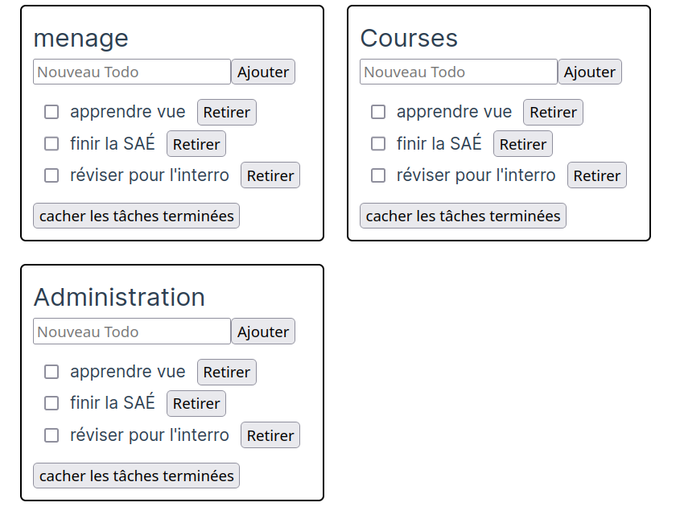

<!-- #  JavaScript -- Vue.js

### IUT Montpellier-Sète – Département Informatique

## TD2 -->



## Tableau de bord de listes de tâches

Nous allons repartir de notre exemple de liste de tâches du TD précédent, pour le faire évoluer en une application qui permet de créer plusieurs listes de tâches avec des noms différents (on pourrait imaginer les listes de tâches "administratif", "ménage" et "jardinage"). C'est surtout l'occasion de parler de la dernière notion centrale de Vue que nous n'avons pas encore évoquée : **les composants**.

### Premier composant et *props*

Vous êtes normalement familiers avec la structure arborescente d'une page web. Une balise contient des balises qui contiennent des balises... L'idée derrière les composants est de définir nos propres "balises" avec des comportements bien définis et de pouvoir les utiliser à l'intérieur d'autres composants. Cette possibilité est prévue par les [standards du web](https://developer.mozilla.org/fr/docs/Web/API/Web_components).

Cela permet donc de découper le code d'un site web en fonction des blocs de fonctionnalité : on pourrait par exemple définir dans des fichiers séparés le composant *header*, le composant *footer*, le composant menu et le composant *page principale* (probablement lui-même constitué de plusieurs composants). Et on écrira un composant qui assemble tous ces composants ensemble. 

Vous connaissez aussi la notion de composition en programmation objet : un objet peut être composé de plusieurs autres objets (ses attributs/propriétés). 
L'idée ici est exactement la même. Si plusieurs morceaux de notre page utilisent des fonctionnalités similaires, on va pouvoir réutiliser plusieurs fois le même composant. Nous verrons au prochain TD que grâce à `npm`, on peut aussi très facilement utiliser les composants écrits par d'autres utilisateurs.


<div class="exercice" markdown="1" >

1. Pour définir notre premier composant, dupliquez le fichier `App.vue` dans un nouveau fichier `ListeDeTaches.vue`. Et voilà, nous avons créé un composant (en fait, le fichier `App.vue` définissait aussi un composant). 

2. Pour utiliser ce composant dans `App.vue`, remplacez le code de `App.vue` par le suivant :

   ```vue
   <script setup lang="ts">
       import ListeDeTaches from '@/ListeDeTaches.vue';
   </script>
   
   <template>
       <ListeDeTaches />
   </template>
   
   <style scoped>
   </style>
   ```

3. Vérifiez que tout fonctionne.

</div>

Il se peut que votre IDE signale que le fichier du composant n'existe pas : relancer l'IDE à la racine du projet semble régler le problème. 

La ligne `import ...` permet de rendre le composant accessible et on peut alors l'utiliser dans `<template>` comme si c'était une balise HTML. Une grosse partie du travail de *Vue* est de faire fonctionner tout ça. 

Le `@` dans le chemin correspond au dossier `src`. Cette définition est faite dans le fichier `tsconfig.app.json` et on pourrait la modifier si besoin (vous pouvez ouvrir ce fichier pour avoir une idée de ce qu'il contient). Bref, utiliser ce symbole permet d'éviter des problèmes de chemins pour les imports. 

L'import est légèrement différent de ceux qu'on a faits jusqu'à maintenant qui ressemblaient à


```js
import {ref} from 'vue';
```

En fait, un module JS peut exporter un certain nombre de fonctions, variables et autres par leur nom. La syntaxe `import {nom1, nom2} from 'module'` permet de lister précisément les imports `nom1` et `nom2` qu'on fait importer et qui doivent être défini dans le module. Cependant, les modules JS peuvent aussi définir un export "par défaut" et quand on utilise la commande sans accolades `import nomLocalChoisi from 'module'` on demande à importer l'export par défaut (et il sera alors accessible sous le nom `nomLocalChoisi` que j'ai choisi). À partir du code de `ListeDeTache.vue`, Vue définit automatiquement un composant dont l'export par défaut correspond au composant.


<div class="exercice" markdown="1" >

1. Pour améliorer l'organisation du projet, vous allez plutôt créer dans le dossier `src` un dossier `composants` dans lequel nous mettrons tous nos composants. Déplacez le fichier `ListeDeTaches.vue` dans ce dossier. Votre IDE vous propose certainement de corriger l'import dans le fichier `App.vue`: si oui acceptez, si non allez le faire par vous-même. 

2. Trouvez comment afficher trois listes de tâches dans la page (indice : c'est très simple). 

3. Vérifiez que ces listes sont bien trois listes différentes et que modifier l'une d'entre elle n'impacte pas les autres.

</div>

#### Props

On aimerait bien donner des noms à nos différentes listes de tâches. Pour que ce soit utilisable, il faut que le nom de la liste se comporte comme un "attribut" ou un "paramètre" de la liste de tâches. C'est ce qu'on appelle les "props" du composant (les "accessoires" en français). Pour définir, les props qu'un composant s'attend à recevoir, on va utiliser la fonction `defineProps` comme ceci :

```ts
  const props = defineProps<{prop1: type1, prop2: type2, prop3: type3}>();
```
Cette ligne indique que le composant qu'on définit possède 3 props appelés `prop1`, `prop2` et `prop3` de type respectifs `type1`, `type2` et `type3`. La syntaxe utilisée ici est celle des "generics" et elle devrait vous rappeler celle des types paramétrés en Java (qui sont essentiellement la même chose). Nous ne rentrerons pas dans les détails de leur fonctionnement. Sachez qu'il existe deux autres syntaxes dont une en JS pure qui n'utilise donc pas de type. Pour indiquer que notre composant possède un prop `titre` qui est de type `string`, il faudra donc écrire dans le `<script setup>` :

```ts
  const props = defineProps<{titre: string}>();
```

 Pour utiliser le prop à l'intérieur du composant, on peut alors simplement écrire `props.titre`. Pour donner sa valeur au prop quand on utilise le composant dans un autre composant, on utilise la même syntaxe que pour un attribut HTML

```vue
<ListeDeTaches titre="Menage"/>
```

Pour l'associer à une variable, on peut utiliser `v-bind` comme pour n'importe quel attribut

```vue
<ListeDeTaches v-bind:titre="maVariable"/>
<!-- ou avec la syntaxe courte de v-bind -->
<ListeDeTaches :titre="maVariable"/>
```

<div class="exercice" markdown="1" >

 
1. Modifiez le composant `ListeDeTaches` pour qu'il accepte un prop nommé `titre` de type `string`.

2. Modifiez le composant `ListeDeTaches` pour qu'il affiche son titre dans une balise `<h2>` en haut de la liste.

3. Modifiez `App.vue` pour donner un titre aux trois listes de tâches. Vérifiez que tout fonctionne.

</div>

Vous devriez obtenir quelque chose qui ressemble à ça :



Vous pouvez prendre le temps de personnaliser un peu votre CSS.

### Ajouter des listes de tâches

Nous voulons maintenant ajouter la possibilité d'ajouter des listes de tâches. Pour cela, nous allons modifier le fichier `App.vue` ainsi :


<div class="exercice" markdown="1" >

1. Créez un tableau réactif `todoListes` qui contient les `ids` et les titres des listes. Initialisez-le avec 3 noms de liste.

2. Utiliser la directive `v-for` pour créer une liste de tâches pour chaque élément du tableau `todoListes`. On peut faire le `v-for` directement sur le composant `ListeDeTaches`. Vous pouvez vous inspirer du fonctionnement de `ListeDeTaches`. Pour donner les titres en props, nous avons vu en début de TD comment passer la valeur d'une variable dans un attribut.

3. Vérifiez que tout fonctionne.

4. Ajouter un input textuel et un bouton qui permettent d'ajouter un élément au tableau `todoListes` quand on clique sur le bouton. Inspirez-vous du bouton similaire du TD précédent (il faudra donc créer une variable et une fonction supplémentaire).

5. Vérifiez que tout fonctionne. Si vous ne l'avez pas fait depuis un moment, ouvrez l'onglet *Vue* des outils de développement du navigateur. Constatez qu'on peut voir l'arborescence des composants qui évolue en direct. Prenez le temps d'expérimenter un peu (cliquez sur une liste de tâches et regardez comment les variables évoluent quand on supprime/valide des taches...).


</div>

### Évènements de composant

Nous aimerions rajouter un bouton dans chaque liste qui permet de supprimer la liste. Une nouvelle difficulté se présente à nous : si le bouton est dans le composant `ListeDeTache` alors c'est ce composant qui peut détecter que le bouton de suppression a été activé. Il faut donc faire remonter l'information à son parent (`App.vue`) pour qu'il puisse le supprimer. *Vue* offre une manière très simple de surmonter ce problème : la fonction `$emit`. Quand elle est appelée, la fonction `$emit("nomEvenement")` déclenche un événement qui peut être écouté par le parent du composant.

<div class="exercice" markdown="1" >

 Ajoutons le bouton suivant dans `ListeDeTache` (vous pouvez changer le texte et/ou styliser un peu votre CSS pour qu'il soit mieux positionné et moins laid) :

```vue
<button @click="$emit('supprimerListe')">x</button>
```

</div>

Cette ligne de code indique que quand on clique sur ce bouton, cela déclenche l'événement *supprimerListe*. On peut maintenant détecter l'événement en ajoutant la directive `@supprimerListe="truc à faire"` dans un composant `ListeDeTache`. Dans notre cas ça donne

```vue
  <ListeDeTaches v-for="liste in listes" 
    :key="liste.id"  
    :titre="liste.titre"
    @supprimerListe="retirerListe(liste)" />
```

Il ne reste plus qu'à coder la fonction `retirerListe` (qui fonctionne comme la fonction `retirerTache`).

<div class="exercice" markdown="1" >

 1. Faites-le et vérifier que tout fonctionne. 
 
 2. N'oubliez pas de donner le type de l'argument de la fonction `retirerListe`. Son type est `{id: number,titre: string}`, mais il est plus avisé de définir une interface pour ce type qu'on pourrait appeler `ListeInfo`. On peut ensuite aussi préciser manuellement le type de notre tableau `todoListes` comme nous avions fait dans `ListeDeTaches.vue`.

</div>

## Écrire le composant tâche

Nous avons écrit notre premier composant, nous allons extraire du code de `ListeDeTaches` et définir un composant pour améliorer le découpage du code. Plus précisément, nous allons essayer d'extraire la partie qui correspond au HTML suivant :

```vue
<label :class="{ fait: tache.faite }" >
  <input type="checkbox" v-model="tache.faite">
  {{ tache.description }}
</label>
<button @click="retirerTache(tache)">Retirer</button>
```

Nous allons donc créer un composant `Tache.vue` qui contient ce HTML et que nous utiliserons dans `ListeDeTaches.vue`. Vous devez être capable d'imaginer comment le faire en utilisant des `props`, `emit`, et `emited event`.

<div class="exercice" markdown="1" >


Commençons par définir notre composant `TacheElement.vue`:

```vue
<script setup lang="ts">
  import {ref} from 'vue';
</script>

<template>
  <label :class="{ fait: tache.faite }" >
    <input type="checkbox" v-model="tache.faite">
    {{ tache.description }}
  </label>
<button @click="retirerTache(tache)">Retirer</button>
</template>

<style scoped>
  .fait{
    text-decoration: line-through;
  }
</style>
```

</div>

Il y a plusieurs problèmes à régler pour rendre de composant fonctionnel. 
Premièrement, l'objet JavaScript `tache` n'est pas accessible ici. Une mauvaise manière de régler le problème serait de le passer en entier dans les `props`. En faisant cela, on passerait dans les *props* des valeurs qui n'ont aucun sens pour `TacheElement` (l'`id`, par exemple) et il serait plus difficile de rendre le composant "générique" pour qu'il soit réutilisable dans un autre contexte. Par ailleurs, une des bonnes pratiques fondamentales de Vue est d'interdire aux composants de modifier leurs *props* (cela pourrait avoir des effets de bords difficilement contrôlables chez le composant parent). Il va donc falloir réfléchir un peu plus pour gérer le booléen `faite`.


### Déclarer les props

Nous allons déclarer deux *props*: le nom de la tâche et le booléen `cochee`.

```ts
const props = defineProps<{descriptionTache: string, cochee:boolean}>();
```

<div class="exercice" markdown="1" >


1. Ajoutez ces lignes et faites les trois changements pour utiliser ces props dans le `template`. Attention, nous allons remplacer 
   ```
   v-model="tache.faite"
   ``` 
   par 
   ```
   :checked="props.cochee"
   ```  
   En effet, `v-model="props.cochee"` signifierait que cocher la case peut modifier `props.cochee`, mais un composant n'a pas le droit de modifier ses props !

2. Ensuite, plutôt que d'appeler une fonction `retirerTache`, on veut que le clic sur le bouton émette un signal `$emit('supprimerTache')` (qu'on pourra ensuite détecter dans le composant `ListeDeTache`.)

</div>

### Utiliser le composant dans la liste de tâches

Le composant n'est pas encore fonctionnel, mais il ne cause plus d'erreur. Nous pouvons donc l'inclure dans notre page pour le tester au fur et à mesure. Nous allons l'importer dans `ListeDeTaches.vue` avec la ligne :

```js
import TacheElement from '@/composants/TacheElement.vue';
```
Pour utiliser le composant, remplacez les trois lignes à l'intérieur du `<li>` par :

```vue
<TacheElement :description-tache="tache.description" :cochee="tache.faite" />
```

**Remarque :** Ici `descriptionTache` est devenu `description-tache`. En HTML, les noms d'attributs ne sont généralement pas en CamelCase, mais en kebab-case. C'est normalement le contraire en JS (vous avez déjà vu ce problème pour les styles en CSS : `background-color` devient `backgroundColor`). L'étape de build des SFC nous autorise à utiliser l'un ou l'autre (tout est "converti" en kebab-case). Si l'on utilisait directement des composants personnalisés dans un fichier `.html` il faudrait utiliser le kebab-case. Cela s'applique aussi au nom des composants : `TacheElement` pourrait être remplacé par `tache-element` (et devrait être remplacé si l'on était dans le fichier `html`). Bref pour nous les deux sont possibles et le plus important est d'utiliser une convention cohérente tout le long d'un projet.

<div class="exercice" markdown="1" >

 Faites l'import et utilisez le composant `TacheElement` dans `ListeDeTaches`.
Vérifiez que le site s'affiche correctement.

</div>

Il reste trois problèmes : les boutons "Retirer" ne fonctionnent plus, le bouton "Cacher les tâches terminées" ne fonctionne plus et cocher une case ne barre pas la tâche.

### Réparer le bouton retirer et déclarer les emits

Pour le bouton "Retirer", il suffit d'appeler la fonction `retirerTache` quand on détecte l'événement `supprimerTache`.


<div class="exercice" markdown="1" >

 Faites-le et vérifiez que ça fonctionne.

</div>

Cela devrait suffire à faire fonctionner le bouton "Retirer". Cependant, si vous ouvrez la console de votre navigateur, vous devriez apercevoir des warnings qui concernent l'événement `supprimerTache`. Le contenu de ce warning est assez compliqué, heureusement il nous indique une manière de le régler qui est de déclarer explicitement l'événement. Pour ce faire, on utilise la fonction `defineEmits` dans le fichier du composant. Il y a plusieurs syntaxes, nous allons utiliser la syntaxe suivante (qui n'est valide qu'en TypeScript) :
 
```js
const emit = defineEmits<{
  premierEvenementAEnregistrer: [premierArgument: sonType, deuxiemeArgument:sonType]
  deuxiemeEvenementAEnregistrer: [premierArgument: sonType]
}>();
```
Il existe d'autres syntaxes qui ne demandent pas de définir les types, mais puisque nous utilisons TypeScript c'est une bonne habitude de déclarer les types autant que possible. De même, il n'est pas obligatoire de déclarer les `emit`, mais c'est une bonne pratique qui peut permettre de régler de nombreux bugs. Déclarer les événements qu'un composant peut émettre et leurs types améliorent aussi l'autocomplétion de l'IDE et la vérification des types par TypeScript.


<div class="exercice" markdown="1" >


1. Dans notre cas, nous déclarons pour l'instant un seul évènement et celui-ci n'attend pas d'argument donc on écrira en haut de `TacheElement.vue` :

   ```js
   const emit = defineEmits<{supprimerTache:[]}>();
   ```

2. Dans `ListeDeTaches.vue`, déclarez l'événement `supprimerListe` puisque ce composant peut émettre cet événement. On va maintenant déclarer tous les évènements de nos composants.

</div>

### Réparer le booléen "faite" et définir le `v-model`

Il reste à réparer le bouton "Cacher les tâches terminées / Tout montrer" et le raturage des tâches terminées. Le problème est que le booléen `tache.faite`, n'est pas mis à jour par un clic sur la case à cocher. Il pourrait être tentant de modifier le *prop*, mais un composant n'a pas le droit de modifier ses *props* ! (En fait, c'est techniquement possible dans pas mal de cas, mais c'est très fortement déconseillé dans tous les cas !) 

La solution est de déclencher un événement dès que ce bouton est cliqué qui indique au parent du composant de changer la valeur du booléen correspondant. Nous allons donc devoir définir un événement qui prend un argument (pour indiquer la valeur actuelle de la case `true`/`false` si elle est cochée ou non).

<div class="exercice" markdown="1" >


Commencez par définir un nouvel événement en modifiant la définition de `emit`

```ts
const emit = defineEmits<{
  supprimerTache:[],
  changerTacheFaite:[boolean]}
>();
```
La nouvelle ligne définie un nouvel événement qui prend en entrée une valeur booléenne. 

Maintenant, nous pouvons ajouter l'attribut suivant à la checkbox de `TacheElement` :

```vue
@change="$emit('changerTacheFaite', ($event.target as HTMLInputElement).checked)"
```

</div>

L'expression `($event.target as HTMLInputElement).checked` est équivalente à `$event.target.checked` (qui vaut `true` si la case est cochée). Le `as HTMLInputElement` indique à TypeScript que ici `$event.target` est forcément un `HTMLInputElement` ce qu'il ne sait pas déduire tout seul. Sans cela, il détecte une erreur qui n'en est pas une (il existe d'autres manières de contourner ce problème). Vous pouvez essayer de retirer temporairement le `as HTMLInputElement` pour voir l'erreur produite.

Il suffit maintenant de détecter l'événement `changerTacheFaite` dans `ListeDeTaches` et de mettre à jour le booléen quand il change avec sa nouvelle valeur. Ce qu'on peut faire en ajoutant le code suivant au bon endroit :

```vue
@changerTacheFaite="(v) => tache.faite=v"
```

<div class="exercice" markdown="1" >

 Faites-le, vérifiez que tout fonctionne à nouveau et prenez le temps de comprendre tout ce que nous venons de faire.

</div>

### `v-model` sur les composants

Plutôt que de définir un `prop` et un événement, nous aurions pu définir un `v-model` pour notre composant. Revenons d'abord sur le fonctionnement de `v-model`. Étant donné une variable de type `string` on peut associer son contenu avec un `<input>` avec la ligne suivante

```vue
<input v-model="variableTexte" />
```

En fait, on peut obtenir le même comportement que `v-model` en utilisant `v-bind` et `v-on` (*cf.* [documentation de Vue](https://fr.vuejs.org/guide/essentials/forms.html#form-input-bindings)) :

```vue
<input
  :value="variableTexte"
  @input="variableTexte = $event.target.value"
/>
```

<br>

De même, pour une `<input type="checkbox">`, le code

```vue
<input type="checkbox" v-model="variableBool" />
```
est équivalent à :

```vue
<input
  type="checkbox"
  :checked="variableBool"
  @change="variableBool = $event.target.checked"
/>
```

<br>

De la même manière, `v-model` peut être utilisé dans un composant et sert de
raccourci (*cf.* [documentation de Vue](https://fr.vuejs.org/guide/components/v-model.html#component-v-model)). Ainsi, la ligne 
```vue
<monComposantPersonalise v-model="maVariable">
``` 
est automatiquement transformé en :

```vue
<monComposantPersonalise
  :modelValue="maVariable"
  @update:modelValue="(nouvelleValeur) => maVariable = nouvelleValeur"
/>
```

Il suffit alors de définir le `prop` et l'événement correspondant dans le composant `monComposantPersonalise`. Par exemple, pour définir le `v-model` associée à une `input` textuelle dans un sous composant, on pourrait faire :

```vue
<script setup>
  const props = defineProps<{modelValue: string}>();
  defineEmits<{
  "update:modelValue": [string]
  }>();
</script>

<template>
<input type="texte" 
  :value="modelValue"
  @change="$emit('update:modelValue', ($event.target as HTMLInputElement).value)"
/>
</template>
```

<div class="exercice" markdown="1" >


1. Faites les modifications nécessaires pour définir le `v-model` de `TacheElement`. Puisque nous avions déjà codé le bon prop et le bon emit, il suffit de les renommer correctement : `cochee` devient `modelValue` et `changerTacheFaite` devient `update:modelValue`. (Attention dans `defineEmits` à bien mettre les guillemets doubles `"update:modelValue"` sinon JavaScript est gêné par les `:`).

2. Modifiez `ListeDeTache` pour utiliser `v-model` ainsi

    ```vue
    <TacheElement
      :description-tache="tache.description"
      v-model="tache.faite"
      @supprimer-tache="retirerTache(tache)"
    />
    ```

3. Vérifiez que tout fonctionne à nouveau.

4. Profitez de l'instant.

</div>

Retenez qu'on utilise les *props* pour faire descendre de l'information d'un composant vers son enfant et les événements pour faire remonter l'information. La directive `v-model` permet de faire descendre et remonter l’information d'un composant, mais c’est simplement un raccourci qui utilise un *prop* et un *évènement*. Remarquez qu'il n'était pas beaucoup plus compliqué de faire fonctionner le `v-model` du côté du composant, mais que cela est plus simple pour celui qui utilise le composant. C'est donc une bonne pratique de définir un `v-model` quand c'est pertinent. Nous n'en parlerons pas ici, mais on peut aussi "nommer" les `v-model` ce qui permet d'associer plusieurs `v-model` au même composant.

## Échappement des variables

Avant de définir les *slots* faisons une petite parenthèse pour discuter de l'échappement des variables.


<div class="exercice" markdown="1" >

 
1. Dans le fichier `App.vue`, ajoutez temporairement une variable `const monHTML= "<h2>un titre</h2>"` et dans le template affichez le contenu de la variable en écrivant `{{monHTML}}`. Que constatez-vous ? 

2. Annulez ce changement.
   
</div>

Le HTML est échappé automatiquement. C'est un comportement tout à fait volontaire, cela permet d'éviter qu'un utilisateur malicieux puisse "injecter" du HTML (ou pire du JS) dans notre site. Nous n'avons donc pas besoin de nous soucier d'échapper le HTML. En effet, les moustaches `{{ expressionJS }}` ont pour effet d'exécuter `baliseCourante.textContent = eval(expressionJS)})`, et `textContent` échappe le HTML comme nous l'avions vu [l'an dernier en cours de JavaScript](https://romainlebreton.github.io/R.4.01-DeveloppementWeb-JavaScript/classes/class2.html#modification-du-contenu).


Pour simuler la navigation sur notre site, nous utiliserons les routes au prochain TD et nous n'aurons pas besoin de nous soucier d'échapper les variables utilisées dans les URLs de notre site. Par contre, il faut malgré tout garder cette problématique en tête par exemple si nous devons faire des requêtes AJAX dont l'URL contient une variable.


## Utiliser le slot

Jusqu'à maintenant, nous avons utilisé nos composants comme des balises HTML autofermantes `<monComposant />`, mais il est aussi possible de les utiliser avec la syntaxe `<monComposant>...</monComposant>`. Le composant pourra utiliser le code HTML écrit entre les 2 balises. Supposons que j'utilise mon composant ainsi

```vue
<monComposant><span class="toto">du texte</span></monComposant>
```
et que dans le `<template>` de mon composant est

```vue
<template>
  du html
  <slot></slot>
  du html
</template>
```

alors la balise `<slot>` est automatiquement remplacée par le HTML contenu entre les balises `<monComposant>` : `<span class="toto"> du texte</span>`. On peut voir cela un peu comme une autre manière d'envoyer de l'information à un composant enfant. La différence majeure avec les *props* est qu'on passe ici du HTML qui sera bien interprété comme du HTML au niveau du composant enfant. Ce HTML est généré par le parent, peut contenir des variables du parent et utilisera le CSS défini par le parent. L'autre différence importante est que le sens sémantique est assez différent : intuitivement, on comprend la différence entre le contenu d'une balise et les attributs d'une balise. Enfin, mentionnons juste qu'il est possible de définir plusieurs `slot` pour la même balise.


<div class="exercice" markdown="1" >

1. Retirer le prop `description-tache` de `TacheElement.Vue` et utiliser `<slot></slot>` à sa place dans le `<template>`. 

2. Modifier ensuite son utilisation dans `ListeDeTaches` : au lieu de passer `tache.description` dans un attribut, utiliser la syntaxe moustache à l'intérieur de la balise. 

3. Vérifiez que tout fonctionne.

</div>

Ici l'utilisation que nous avons fait du slot n'est pas impressionnante, mais elle permettrait par exemple d'utiliser facilement une image au lieu d'un texte pour certaines tâches.

C'était la dernière modification au site de gestionnaire de listes de tâches. Il nous reste maintenant à apprendre à déployer le site. Avant cela, nous allons faire quelques vérifications.

<div class="exercice" markdown="1" >

 
1. Refaites un appel au linter (`npm run lint`). Corrigez les erreurs et warnings. En particulier, vous risquez d'avoir des variables inutilisées. Quand nous faisons `const emit = defineEmits<...>();`, la variable emit peut être utile, mais si nous ne l'utilisons pas, nous pouvons simplement appeler la fonction sans stocker son résultat dans une variable `defineEmits<...>();`.

2. Refaites un `npm run type-check`. Il ne devrait pas y avoir de problème.

3. Et explorez un peu l'onglet *Vue* du navigateur pour voir les informations qu'il peut fournir.

</div>

## Déployer le site

Pour l'instant, nous avons utilisé Vite pour faire tourner notre site sur un serveur de développement. Nous allons discuter les étapes à suivre pour pouvoir déployer notre site sur un serveur en production. Vite permet de facilement "construire" le site qui sera déployé ("build" en anglais, cette étape transforme le code et ressemble un peu à une étape de compilation). Cette étape de "construction" transforme notre code Vue en un code JS optimisé et beaucoup plus court (donc plus léger à envoyer sur le web), mais beaucoup moins lisible pour un humain.

<div class="exercice" markdown="1" >


1. Lancez la compilation de votre site : Allez dans votre terminal, tapez `q` pour couper temporairement le serveur, puis entrez

   ```
   npm run build
   ```

2. Le résultat de la compilation du site est stocké dans le répertoire
   `todo_list/dist`. Nous allons maintenant déployer le site sur notre serveur web. Pour cela rien de plus simple, nous allons simplement copier le contenu du dossier `dist` dans le dossier `\var\www\html` qui est servi par notre serveur web (sur les PC de l'IUT, il aurait fallu le copier dans le dossier `public_html`). On va donc entrer dans notre terminal du docker:

   ```bash
    mkdir /var/www/html/todolist
    cp -R /root/workspace/todo_list/dist /var/www/html/todolist
   ``` 

   Vous pouvez donc normalement accéder à votre site à l'URL
   `https://localhost/todolist/dist/`.
   Cependant, la page Web est vide et l'onglet *Console* indique des problèmes de chargement des fichiers de votre site :
   ```
   Échec du chargement pour le module dont la source est « https://localhost/assets/index-C1PZ9DA2.js »
   ```
  
3. Ouvrez les sources de la page pour essayer de comprendre le problème (`Ctrl+U` dans le navigateur).

</div>

Le lien vers le JS est `/assets/index-xxx.js`. C'est un lien absolu qui n'est pas le bon ici.
En effet, Vite part du principe que le site que nous construisons sera le seul site servi par le serveur web et sera donc à la racine du site, c'est-à-dire en l'occurrence à l'URL `https://localhost/` au lieu de
`https://localhost/todolist/dist`.
C'est habituellement, ce que l'on fait pour un site professionnel. Cependant, nous utilisons la même machine docker pour tous nos TDs et nous ne pouvons pas procéder ainsi (nous aurions le même problème si nous utilisions le `public_html` à l'IUT). 

Nous allons d'abord devoir ouvrir le fichier de configuration `vite.config.ts` pour indiquer à Vite le chemin de base où sera hébergé le site Web.

<div class="exercice" markdown="1" >

1. Dans le fichier `vite.config.ts`, ajoutez à la fin du `export default defineConfig` le champ `base: '/todolist/dist'`.
   
    Notez qu'il est aussi possible d'indiquer l'URL complète du site dans `base` (avec le nom de domaine) ou d'utiliser un chemin relatif (`base:"./",`), mais cela peut poser des difficultés plus tard.

2. Relancez la compilation avec `npm run build` (pour rappel, il faut se placer dans `/root/workspace/todo_list/`) puis on va recopier le résultat
```bash
    cp -R /root/workspace/todo_list/dist /var/www/html/todolist
```
Le site doit maintenant être accessible à l'URL `https://localhost/todolist/dist`.

</div>

Ce fichier de configuration permet de configurer le comportement de Vite dans beaucoup de détails, mais nous n'en reparlerons pas dans le cadre de ce TD.

N'oubliez pas de relancer le serveur de développement avec `npm run dev` si vous devez continuer à coder sur le TD.

# Remarques finales

La ligne de code suivant effectue 2 actions :
```vue
const props = defineProps<{titre: string}>();
```
La fonction `defineProps` rend les props accessibles dans le `<template>`, alors qu'enregistrer le résultat dans la variable `props` permet d'accéder aux props dans la partie `<script>`. Si on utilise les props uniquement dans le template, on peut écrire simplement
```vue
defineProps<{titre: string}>();
```

Notez enfin que dans la partie template, la bonne pratique est d'utiliser directement le nom du prop (donc `titre` au lieu de `props.titre`). 

Une remarque similaire s'applique à `$emit` et `defineEmits`. Nous avons vu qu'il vaut mieux écrire `defineEmits<...>()` que `const emit = defineEmits<...>()` si nous n'utilisons pas la variable `emit`. Cependant, la fonction `$emit` que nous avons utilisée n'est disponible que dans le template. Par contre, la fonction `defineEmits` renvoie une fonction qui fait la même chose que `$emit`. Donc pour faire un emit depuis le script, il faut écrire `const emit = ...` et c'est alors cette fonction `emit` que nous utilisons (avec la même syntaxe que `$emit`, c'est-à-dire `emit("nomDeLevenement")`).

# Conclusion

Vous avez découvert Vue et TypeScript. Nous avons mentionné la plupart des notions les plus importantes (mais nous avons laissé beaucoup de détails sous le tapis).
Les trucs à retenir :
- le rôle de TypeScript (définir les types et les interfaces),
- notion de réactif et de composant dans Vue,
- `v-bind:attribut` (équivalent à `:attribut`),
- `v-on:event` (équivalent à `@event`),
- `v-model` sur un composant : pour synchroniser une variable réactive avec un prop d'un composant. Revient à faire à la fois un `v-bind` et un `v-on`,
- `v-for` permet de lister des éléments,
- comment définir un composant avec ses *props* et ses *events*,
- comment construire et déployer le site.


Dans le prochain TD, nous utiliserons Vue pour produire une façade à notre API *TheFeed*. Pour cela, nous aurons besoin de quelques notions supplémentaires dont les routes pour simuler la navigation sur un site et les stores pour stocker certaines données.




