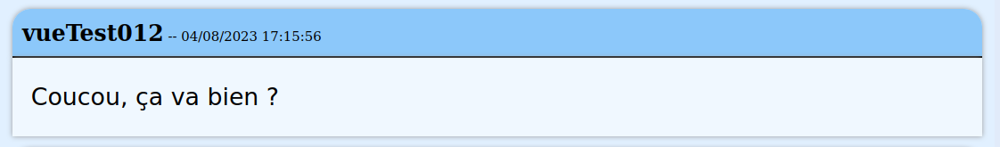



Nous souhaitons utiliser Vue pour produire une façade à notre API *TheFeed*. Il se trouve qu'API Platform [peut générer automatiquement](https://api-platform.com/docs/create-client/vuejs/) un code `Vue` en TypeScript associé à une API développée en utilisant API Platform. Le résultat obtenu est évidemment très formaté, mais si l'on comprend son fonctionnement, il est évidemment possible de le personnaliser à souhait. 

Dans ce TD, nous allons réaliser notre client Vue nous-même, mais tout ce que nous verrons est utile pour comprendre le fonctionnement du code généré par API Platform (mais il utilise aussi d'autres notions que nous n'aurons pas le temps d'étudier comme les `composables`).


## Initialisation du projet

Nous allons créer un nouveau projet Vue en utilisant les commandes

```bash
cd /root/workspace/
npm create vue@latest theFeedFront
```

Cette fois, nous allons activer une option supplémentaire en acceptant le `Vue Router` :


<div class="exercice" markdown="1">

1. Faites-le (n'oubliez pas que tout se fait dans le terminal du docker). Comme dans le projet précédent, il faut rajouter les 4 lignes suivantes dans le fichier `vite.config.ts`
    
   ```ts
    export default defineConfig({
        ...,
        server: {
            host: true,
            port: 5173
        },
        base: "/the_feed_front/dist"
   ```

    Même si nous n'allons pas déployer le site tout de suite, indiquer le `base` immédiatement nous permettra de détecter certains bugs potentiels au fur et à mesure plutôt que de découvrir tous les problèmes à la fin.

2. Ensuite entrez les 3 lignes suggérées dans le terminal :

    ```bash
    cd theFeedFront
    npm install
    npm run dev
    ```

3. Ouvrez la page correspondant au projet dans votre navigateur. Nous pouvons commencer à travailler sur notre projet.

4. Modifiez le titre de la page en `The Feed` dans le fichier `index.html`.


</div>

## Nos premières routes

Dans ce TD, nous allons réaliser une "Application à Page Unique" (Single page application ou SPA). L'idée étant que lors de la navigation sur le site, on ne chargera jamais une nouvelle page `html`, mais le JavaScript sera responsable des mises à jour de la page. Cela permet une navigation plus efficace et moins couteuse en bande passante (au lieu de recharger l'ensemble du code `html` de la page, on ne charge que les nouvelles données). Cependant, pour rendre la navigation agréable pour l'utilisateur, il faut qu'elle se comporte comme si l'on avait plusieurs pages, il faudrait notamment :
- sauvegarder les "pages visitées" dans l'historique, 
- autoriser un clic sur le bouton "page précédente",
- permettre l'utilisation d'une URL qui change en fonction des "pages" (pour pouvoir l'enregistrer dans mes favoris ou la partager avec un autre utilisateur).

On pourrait gérer tout cela nous-même, mais le `router` de Vue est une solution très simple à utiliser qui règle tous ces problèmes. On va définir des "view" (des "vues" en français). Ces vues sont en fait des composants et on va simplement configurer les routes pour indiquer lesquelles pointent vers quels composants/vues. On pourra ensuite utiliser la balise `<router-view />` dans notre composant principal qui se chargera de détecter le composant/vue à charger en fonction de l'URL. On pourra aussi utiliser le routeur pour générer automatiquement l'URL d'une vue (pour définir un lien par exemple). 
Bien que le contexte et le fonctionnement soient assez différents, l'utilisation et la syntaxe des routes devraient vous rappeler les routes de Symfony.

Commençons par créer notre première vue.

<div class="exercice" markdown="1">

 
1. Commencez déjà par vider le contenu des dossiers `src/components` et `src/views`.

2. Remplacez le fichier `App.vue` par [celui-ci](../assets/App.vue).


3. Créer un fichier `views/FeedMain.vue` qui contient le code suivant
    ```vue
    <template> 
    Ceci est la vue du Feed.
    </template>
    ```

4. Remplacez le contenu du fichier `router/index.ts` par le contenu suivant (en fonction de la version de Vue, il se peut que vous ayez un fichier `router.ts` à la place du fichier `router/index.ts`, le fonctionnement est le même) :
    ```ts
    import { createRouter, createWebHistory } from 'vue-router'
    import Feed from '@/views/FeedMain.vue'

    const router = createRouter({
        //Cette ligne indique qu'on utilise la gestion html5 des urls
        //l'argument donné à la fonction createWebHistory sert de base pour la réécriture des routes
        //on utilise donc import.meta.env.BASE_URL qui correspond à la valeur donné à base dans le fichier vite.config.ts
        history: createWebHistory(import.meta.env.BASE_URL),
        routes: [
            {
                path: '/',
                component: Feed
            },
            {
                path: '/feed',
                component: Feed
            }
        ]
    })

    export default router
    ```

5. Dans le dossier `assets/` remplacez le contenu du fichier `main.css` par 
    ```css
    body{
        margin:0;
        padding:0;
    }
    ```
    et supprimez les deux autres fichiers.

6. Vérifiez que votre page s'affiche correctement sans erreurs. Il faut qu'en dessous du menu, vous ayez l'affichage du texte `Ceci est la vue du Feed.`.
</div>

Prenons le temps de comprendre ce qu'il se passe. Commençons par regarder le contenu du fichier `main.ts`. On y trouve deux nouvelles lignes : 
```ts
import router from './router'
app.use(router)
```

La première ligne permet d'importer le routeur en indiquant où il est stocké (ici dans le dossier `router`). La seconde ligne permet de rendre le routeur disponible à l'ensemble des composants qu'on va charger par la suite dans `app`.

Ensuite dans le fichier `router/index.ts` la partie qui nous intéresse est celle qui définie deux routes différentes `/` et `/feed` qu'on associe toutes les deux au composant `Feed`. Le deuxième import du fichier défini le composant `Feed` comme étant celui contenu dans le fichier `/views/FeedMain.vue`.

Finalement, dans le fichier `App.vue`, la seule ligne intéressante est celle qui contient  
`<router-view />`. Cette ligne indique que cette partie du template doit être remplacée par le composant correspondant à la route actuelle. En l'occurrence, nous avons indiqué que la route `/`, correspondait au composant `views/FeedMain.vue` et c'est donc celui qui devrait s'afficher. 


<div class="exercice" markdown="1">

1. Ouvrez la console du navigateur. Ajoutez `/blabla` au bout de l'URL et rechargez la recharge la page. Que constatez-vous dans la page et dans la console ? 

2. Essayez ensuite avec `/feed` à la place de `/blabla` que constatez-vous ?

</div>

Pour s'assurer que vous avez compris, créons une autre vue qui nous servira plus tard.

<div class="exercice" markdown="1">
 
1. Créez le fichier `AllUsers.vue` sur le même modèle que `FeedMain.vue`, mais avec le texte `Ceci est la liste des utilisateurs.`

2. Ajoutez une route `/users` dans le fichier `router/index.ts` qui invoque le composant que nous venons de définir. N'oubliez pas de faire l'import du composant avant de définir la route.

3. Vérifiez que cette nouvelle route fonctionne.
</div>

Une fois que nos premières routes sont définies, il est temps de faire nos premiers liens vers nos routes. La première manière de faire cela consiste à utiliser la méthode `push` du routeur qui redirige l'utilisateur vers la route donnée en argument. 
Dans les template, le router est directement accessible avec `$router` (c'est la ligne `app.use(router)` qui permet cela).
Ensuite, l'appelle à la méthode `$router.push('maroute')` redirige l'utilisateur vers la route `maroute`. Ainsi, par exemple en ajoutant l'attribut `@click="$router.push('/maroute')"` à une balise `html`, je m'assure qu'un clic sur cette balise change la route.

<div class="exercice" markdown="1">

 Modifiez le fichier `App.vue` pour qu'un clic sur le `<h1>The feed</h1>` renvoie sur la route `/feed` et qu'un clic sur de `<div>Les membres</div>` renvoie sur la route `/users`. Vérifiez que tout fonctionne.

</div>

On peut aussi nommer nos routes en rajoutant un `name` à la route comme ceci
```ts
    {
        path: '/',
        name:'feed',
        component: Feed
    },
```

On peut ensuite utiliser la route par son nom plutôt que par son chemin dans le reste du projet. Pour l'utiliser avec `$router.push`, on écrira :
```ts
$router.push({name: 'nomDeLaRoute'})
```

Cette syntaxe peut sembler plus lourde que la précédente, mais elle possède certains avantages. Elle diminue les risques d'erreurs et augmente la clarté du code, mais surtout elle va nous simplifier la vie plus tard avec les routes paramétrées.

On peut aussi définir les redirections d'une route. La définition de route suivante indique que la route `/home` redirige en fait vers la route nommée `homepage` (qu'il faut donc avoir définie).
```ts
    routes: [
        //...
        { 
            path: '/home',
            redirect: { name: 'homepage' } 
        },
        //...
    ]
```

Notez qu'on pourrait aussi rediriger directement vers le `path` d'une autre route plutôt qu'en utilisant son nom.

<div class="exercice" markdown="1">

1. Nommez la route `/users` avec le nom `allUsers` et utiliser ce `name` dans le `push` comme montré au-dessus.

2. Nommez la route `/feed` avec le nom `feed` et corriger à nouveau le `push` correspondant.

3. Changez la route de chemin `/` pour qu'elle redirige vers la route `feed`.

4. Le *path* spécial `path: '/:pathMatch(.*)*',` permet d'attraper tous les *path* qui n'ont pas été attrapés par une autre route. On pourrait le traiter soit comme une erreur 404 soit comme un cas par défaut. Dans notre cas, on voudrait que cette route redirige aussi vers la route Feed.

5. Testez ces modifications. En particulier, visitez la page pour vérifier que la redirection fonctionne `http://localhost:5173/the_feed_front/dist/`.

</div>


**Remarque :** La ligne `app.use(router)` nous permet d'utiliser `$router` directement dans le template. Par contre, si l'on veut l'utiliser dans le script, il faut commencer par le récupérer en faisant
```vue 
<script setup lang="ts">
    import {useRouter} from 'vue-router';
    const router = useRouter();
    //on peut maintenant utiliser router
    router.push(...)
</script>
```


## Les routes paramétrées

Pour notre application, nous aurons besoin d'une autre fonctionnalité des routes : les routes paramétrées. Nous avons rencontré le même concept dans Symfony : ce sont des routes dont l'URL contient une variable (par exemple, l'identifiant d'un utilisateur).

Pour définir une route paramétrée, il suffit de précéder le paramètre du symbole `:`. Ainsi, par exemple, je peux définir la route suivante :
```ts
{ 
    path: '/users/:id', 
    name: 'singleUser',
    component: User 
},
```

Ensuite dans le composant/vue correspondant à notre route, il faut récupérer ce paramètre. Il suffit de récupérer l'objet `route`, puis d'aller y chercher le ou les paramètres désirés. Par exemple, pour récupérer le paramètre `id` défini dans la route précédente, on pourrait faire : 

```ts
import { useRoute } from 'vue-router'
const route = useRoute()
const id = route.params.id
```

<div class="exercice" markdown="1">

 
1. Créez une vue `views/SingleMessage.vue` qui récupère le paramètre `id` de la route et affiche `J'affiche le message d'id {{id}}`. 

2. Ajoutez dans le routeur une route `/feed/:id` nommée `singleMessage` qui conduit vers la vue précédemment définie. Vous pouvez faire l'import du composant comme précédemment, ou vous pouvez utiliser la syntaxe suivante directement dans la définition de la route :

   ```ts
   component: () => import('@/views/SingleMessage.vue')
   ```
   Cette syntaxe utilise un import dynamique : le fichier correspondant n'est chargé que s'il est réellement utile. Ça peut faire une différence de performance si le composant/vue en question est très gros avec lui-même de nombreuses dépendances (ce ne sera pas notre cas).

3. Vérifiez que tout fonctionne en testant l'URL de la route `/feed/17`.

4. Faites de même pour une route `/users/:id` qui affiche une vue `SingleUser.vue` qui se contente d'afficher un message similaire au précédent pour l'instant.

</div>

<!-- *Vue Router* permet de gérer des routes plus compliquées avec -->

Vous savez maintenant presque tout ce que vous avez besoin de savoir sur les routes. Nous allons maintenant pouvoir mettre en place quelques composants avant de commencer à utiliser l'API *The Feed* pour enfin rendre notre site fonctionnel.

## Mise en place des composants utilisateurs et message

Avant de chercher à utiliser l'API, nous allons commencer à voir comment nous utiliserons les informations de l'API. Ouvrir la page d'accueil de votre API pourrait être utile à partir de maintenant pour retrouver les informations sur son usage (normalement à l'adresse [https://localhost/the_feed_api/public/api](https://localhost/the_feed_api/public/api)). La première chose à faire est de définir des types correspondants à ce que l'API nous renverra. Deux objets en particulier seront intéressants, l'utilisateur et la publication. On peut voir qu'un utilisateur possède comme données son `id` (un `number`), son `adresseEmail` (un `string`), son `login` (un `string`) et le `boolean premium`. Il faudrait donc définir son interface ainsi

```ts
export interface Utilisateur{
    id: number;
    adresseEmail: string;
    login: string;
    premium: boolean;
}
```

On peut enregistrer la définition de cette interface dans un fichier `.ts`. On pourra ensuite importer la définition de ce type dans un autre fichier avec la ligne
```ts
import type {Utilisateur} from 'definitionDeMonInterface.ts';
```

Si plusieurs types sont définis dans mon fichier, je peux en importer plusieurs en les listant entre les `{...}`.


<div class="exercice" markdown="1">

   1. Créez un fichier `src/types.ts` dans lequel vous ajouterez la définition des interfaces d'un utilisateur avec le mot clef `export`.

   2. Ajoutez l'interface d'une publication avec le mot clef `export`. Pour l'interface `Publication`, basez-vous sur ce que votre API renvoie (il y a 4 champs). On utilisera un `string` pour la date. 

</div>

**Remarque :** On pourrait vouloir utiliser le type Date, mais cela demanderait d'adapter le traitement des réponses de l'API pour créer l'objet de type Date.

La prochaine étape est de définir un composant pour afficher les données de l'utilisateur. Pour ce site, nous allons utiliser une boite qui ressemble à ceci pour les différents éléments de contenus (les messages, les utilisateurs...) :


En fonction du contexte, nous allons parfois vouloir rendre ces boites cliquables, parfois y mettre des liens et il est donc assez compliqué d'écrire un composant unique adapté (mais ce serait tout à fait possible notamment avec quelques outils que nous n'avons pas mentionnés). Par contre, il est très simple d'utiliser un CSS commun pour plusieurs composants. Nous allons donc utiliser le CSS suivant (que vous pouvez adapter à vos goûts) :

```css
div.content-box{
    width:100%;
    margin:10px auto;
    display:flex;
    flex-direction:column;
}
.top{
    box-shadow: 0 0 0.3rem #999;
    border-radius: 15px 15px 0px 0px;
    background-color: rgb(140, 200, 250);
    border-bottom: black 2px solid;
    padding:8px;
    font-size: 8pt;
}
.top .clickable{
    font-size:16px;
    font-weight: 600;
    color:black;
    text-decoration: none;
}
.top .clickable:hover{
    color:aliceblue;
}
.content{
    margin:0px;
    padding:20px;
    flex-grow: 1;
    background-color: aliceblue;
    box-shadow: 0 0 0.3rem #999;
    font: 1.2em "Fira Sans", sans-serif;
}
.content.clickable:hover{
    box-shadow: 0 0 0.3rem #000;
    cursor: pointer;
}
```

Le HTML quant à lui ressemblera à ça
```html
<div class="wrapper">
    <div class="top">
        ici le titre du bloc
    </div>
    <div class="content" >
        ici le contenu du bloc
    </div>
</div>
```

Pour pouvoir importer un CSS dans le CSS de notre composant, il suffit d'utiliser les lignes suivantes :
```css
<style scoped>
  @import "/chemin/vers/moncss";
</style>
```

Remarquez que ce n'est pas un ajout de Vue, mais bien quelque chose qui est toujours possible en CSS (ici Vue se chargera d'appliquer aussi le `scoped` au fichier importé).

> *Petit point CSS :* Le CSS contenu dans `<style scoped>` n'est appliqué qu'au composant dans lequel, il est écrit. Schématiquement, Vue ajoute des `data-attribut` aux éléments d'un composant et modifie les sélecteurs de notre CSS pour qu'ils utilisent ces `data-attribut`. Mais [Vue rajoute de nombreuses possibilités](https://vuejs.org/api/sfc-css-features.html). Par exemple, la pseudo-classe `:deep` permet d'accéder aux enfants d'un composant. Notez qu'on peut aussi charger un CSS global comme c'est actuellement fait dans `main.ts`.


 Dans un premier temps, on pourra donc définir le composant correspondant à un utilisateur ainsi
```vue
<script setup lang="ts">
  import type {Utilisateur} from '@/types'; 
  defineProps<{utilisateur: Utilisateur}>();
</script>

<template>
  <div class="content-box">
    <div class="top">
      Profil de {{ utilisateur.login }}
    </div>
    <div class="content">
      <div class="group">
        <label>Login</label>
        <input :value="utilisateur.login" >
      </div> 
      <div class="group">
        <label>Adresse e-mail</label>
        <input :value="utilisateur.adresseEmail" > 
      </div> 
    </div>
  </div>
</template>


<style scoped>
    @import "@/components/css/content-box.css";
</style>
```

<div class="exercice" markdown="1">

 
1. Créez un fichier `components/css/content-box.css` et le fichier du composant `components/BoiteUtilisateur.vue` avec les contenus indiqués au-dessus.

2. Modifiez le contenu de `AllUsers.vue` pour :
    - Ajouter dans le script la définition du tableau `users` qui contient un `user` comme suit (plus tard nous remplirons ce tableau en interrogeant l'API)
    ```ts 
    const users:Ref<Utilisateur[]> = ref([{
        id:4, 
        adresseEmail:"toto@gouv.fr", 
        login:"toto", 
        premium:false
    }]);
    ```
    - Dans le template, utilisez un `v-for` pour afficher chaque élément du tableau dans un composant `BoiteUtilisateur` (vous pouvez utiliser l'`id` pour l'attribut `key`).
    - Ajouter les `import` nécessaires : on a besoin de `ref` et de `BoiteUtilisateur`, ainsi que des types `Ref` et `Utilisateur` (l'IDE doit pouvoir le faire pour vous).
    - Vérifiez que tout fonctionne. Ajoutez un deuxième utilisateur au tableau `users` pour vérifier votre boucle.

3. Modifiez la vue `SingleUser` pour qu'elle crée un faux `Utilisateur` (mais avec le bon `id` qu'on peut récupérer en paramètre de la route) et l'affiche en utilisant le composant `BoiteUtilisateur`. Attention, l'id en paramètre (`route.params.id`) est de type `string` alors que l'id d'un `Utilisateur` doit être un `number`. On peut utiliser `Number(monstring)` pour convertir un `string` en `number`. 

4. Vérifiez que votre route fonctionne et que la console ne contient pas de message d'erreur.


</div>

 On souhaite qu'un clic sur le login d'un utilisateur affiche son profil. 
 On pourrait utiliser `router.push`, mais pour faire un lien, nous pouvons utiliser à la place la balise `router-link`. Cette balise se comporte comme un `<a>` HTML avec l'URL correspondant à la route donnée en paramètre et s'utilise comme suit :

 ```html
 <router-link :to="RouteAUtiliser">texte du lien</router-link>
```

Il faut remplacer `RouteAUtiliser` par la route donc comme pour le `router-push`, on peut soit mettre directement le *path* de la route (`:to = "/users"`) ou son nom (`:to="{name:allUsers}"`). 

Par contre, nous n'avons pas encore vu comment indiquer le paramètre d'une route. La première idée serait d'utiliser le *path*, par exemple pour afficher le feed de l'utilisateur 2 on pourrait faire `:to = "/users/2"`. Mais si l'id était stocké dans une variable `identifiant`, il faudrait écrire `:to = "'/users/'+identifiant"` et il faudrait alors penser à encoder les paramètres correctement pour une URL. Il existe une syntaxe qui utilise le nom de la route et qui permet de donner les paramètres : 
```html
 <router-link :to="{name:'nomDeLaRoute',params:{param1:valeureParam1, param2:valeureParam2}}">texte du lien</router-link>
```

Avec l'exemple précédent ça donne :
 ```html
 <router-link :to="{name:'feed', params:{id:identifiant}}">texte du lien</router-link>
```

Avec cette syntaxe, il n'y a pas besoin de se poser de question d'encodage ou d'échappement de caractères. Elle a aussi l'avantage d'être beaucoup plus explicite puisque le nom de la route et de chaque paramètre apparait explicitement. On peut utiliser cette même syntaxe avec `router.push`.

<div class="exercice" markdown="1">

 1. Modifiez le composant `BoiteUtilisateur.vue` pour que le login de l'utilisateur (celui écrit avec `{{ ... }}`) soit un lien vers la page de cet utilisateur.
 
 2. Ajoutez la classe `clickable` à ce lien pour améliorer le CSS. 
 
 3. Vérifiez que le lien fonctionne en vous rendant sur la page `Les membres` (pour l'instant l'utilisateur affiché ne dépend pas du paramètre, mais vous pouvez vérifier dans l'URL que tout se déroule comme prévu).

</div>

Nous avons une première version de l'affichage des utilisateurs prête pour être connecté avec notre API. Avant cela, nous allons faire la même chose pour les publications. Pour le composant `BoitePublication` nous utiliserons le code suivant

```vue
<script setup lang="ts">
    import type { Publication } from '@/types';
    defineProps<{publication:Publication}>();
</script>

<template>
    <div class="content-box">
        <div class="top">
            <router-link 
                :to="{name:'singleUser', params: {id: publication.auteur.id}}" 
                class="clickable">
                    {{publication.auteur.login}}
            </router-link>
            -- {{(new Date(publication.datePublication)).toLocaleString("fr")}}
        </div>
        <div class="content clickable" @click="$router.push({name:'singleMessage', params: {id: publication.id}})">
            {{publication.message}}
        </div>
    </div>
</template>

<style scoped>
     @import "@/components/css/content-box.css";
</style>
```

Prenez le temps de comprendre ce qu'il s'y passe. La seule nouveauté est le `(new Date(publication.datePublication)).toLocaleString("fr")` qui permet d'afficher la date dans un format plus lisible que celui contenu dans `datePublication`.


<div class="exercice" markdown="1">

 
1. Créez `BoitePublication` avec le code donné plus tôt. 

2. En vous inspirant de `AllUsers.vue`, modifiez la vue `FeedMain.vue` pour qu'elle affiche une liste de publication en utilisant ce composant. On pourra pour l'instant initialiser une fausse liste de publication avec le contenu suivant :
    ```ts
    const publications:Ref<Publication[]> = ref([{
        id:3,
        message:"Hello world !!",
        datePublication:"2023-09-15T12:02:09.037Z",
        auteur:{
            id:4,
            adresseEmail:"toto@gouv.fr",
            login:"toto",
            premium:false
        }
    }]);
    ```

3. Vérifiez que cela fonctionne. 

4. Modifiez la vue `SingleMessage` pour qu'elle utilise le composant pour afficher une fausse publication pour l'instant. 

5. Vérifiez que cela fonctionne. 

</div>

## Déploiement 

Nous allons pouvoir commencer à remplir les vues que nous avons créées avec le contenu fourni par l'API. Mais avant ça pour s'assurer que tout fonctionne, nous allons déployer une première fois le site dans son état actuel.

<div class="exercice" markdown="1">

1. Dans le terminal du docker, avant de *build* commencez par faire un `npm run type-check` suivi d'un `npm run lint`. Corrigez les erreurs éventuelles.

2. Déployez votre site. Rappelez-vous, la commande `npm run build` permet de générer le site à déployer. Nous avions déjà choisi dans le fichier `vite.config.ts` que le site sera déployé à l'adresse `.../the_feed_front/dist/`. Vous pouvez utiliser la commande `mkdir` pour créer le sous-dossier nécessaire dans le dossier `/var/www/html/` puis `cp -R` pour déplacer le répertoire `dist`. 

3. Vérifiez que le site fonctionne à l'adresse [https://localhost/the_feed_front/dist/](https://localhost/the_feed_front/dist/). Normalement tout devrait fonctionner correctement sauf...

</div>

Sur la plupart des pages, rafraîchir la page ne fonctionne pas correctement. La raison est simple : le routeur modifie l'adresse, mais ce n'est pas une vraie adresse donc quand apache essaie de charger une page à cette adresse, il échoue. Il faut donc dire à apache de toujours charger la page `index.html` dès qu'il charge quelque chose dans le dossier `dist`. Pour cela, nous allons utiliser le fichier `.htaccess` suivant : 

```apache
# Activates the mod_rewrite module in Apache, which is necessary for processing the rewrite rules.
RewriteEngine On

# If the requested URL matches exactly index.html, no rewriting is performed (- means "no substitution").
# Flag [L] (for Last) : Stops processing further rules if this rule matches.
RewriteRule ^index\.html$ - [L]

# Conditions: Only apply the following rule if the request is not a file nor a directory.
# RewriteCond: Adds conditions to the next RewriteRule. Both conditions must be true for the rule to execute.
# -f: Checks if the requested path corresponds to an existing file.
# -d: Checks if the requested path corresponds to an existing directory.
#  !: Negates the condition
RewriteCond %{REQUEST_FILENAME} !-f
RewriteCond %{REQUEST_FILENAME} !-d

# Rule: For any other request (. matches any character), rewrite the URL to index.html.
# Flag [L] (for Last): Stops further rule processing once this rule is applied.
RewriteRule . index.html [L]
```

Il faut ajouter ce fichier apache dans le dossier `dist`. Si nous procédons ainsi, nous ajoutons le fichier directement dans le dossier `dist` nous risquons de devoir recommencer à chaque déploiement de l'application. Heureusement, il y a une solution toute simple : tous les fichiers qui se trouvent dans le sous-dossier `public` de notre application sont automatiquement copiés dans le répertoire `dist` à chaque build (pour l'instant, c'était le cas du *favicon*).

<div class="exercice" markdown="1">

1. Créez le fichier `.htaccess` dans votre projet.

2. Faite un nouveau build et copiez-le. Testez que tout fonctionne. Par exemple, le lien [https://localhost/the_feed_front/dist/users](https://localhost/the_feed_front/dist/users) doit fonctionner.

</div>

## Premier contact avec l'API

Commençons par nous occuper du composant `AllUsers.vue` qui doit récupérer la liste des utilisateurs sur l'API, puis l'afficher. Rappelez-vous que pour obtenir la liste des utilisateurs, il suffit de faire un `GET` à l'adresse `.../the_feed_api/public/api/utilisateurs` (il faut bien sûr remplacer `...` par l'URL à laquelle votre api `the_feed_api` est disponible). 

Dans notre composant `AllUsers`, on pourrait donc inclure le code suivant pour récupérer la liste des utilisateurs.
```vue
<script setup lang="ts">
import {ref} from 'vue'
const users = ref([]);

...

fetch('https://localhost/the_feed_api/public/api/utilisateurs')
  .then(reponsehttp => reponsehttp.json())
  .then(reponseJSON => {
    users.value = reponseJSON["hydra:member"];
  });
</script>

...
```

Notez qu'il faut bien s'assurer que `users` est réactif, puisqu'il n'aura pas la bonne valeur tout de suite, mais uniquement quand le `fetch` aura eu lieu et il faudra alors mettre l'affichage à jour. 

Pour une meilleure organisation du code, nous n'allons pas faire le `fetch()` directement dans nos composants. Les composants auront toujours la responsabilité de traiter la réponse HTTP, mais le `fetch()` sera fait dans un objet à part. Nous allons donc créer un nouveau fichier dans `src/util/apiStore.ts` avec le contenu suivant :

```ts
export const apiStore = {
    apiUrl: "https://localhost/the_feed_api/public/api/",

    getAll(ressource:string):Promise<any>{
        return fetch(this.apiUrl+ressource)
        .then(reponsehttp => reponsehttp.json())
    },
    //à compléter plus tard avec les autres appels à l'API
}
```

Avec notre `apiStore`, on pourra remplacer le `fetch` et le premier `then` par `apiStore.getAll('utilisateurs')`. Cet objet rend le code de nos composants beaucoup plus explicite. En cas de changement d'API, il suffit alors d'aller modifier ce fichier pour maintenir le fonctionnement de notre front.
Il faudra penser à importer l'objet dans les fichiers qui l'utilisent avec la ligne `import { apiStore } from '@/util/apiStore'`. 


<div class="exercice" markdown="1">

1. Créez le fichier `src/util/apiStore.ts` avec le code indiqué.
 
2. Modifiez le code de `AllUsers` pour qu'il affiche tous les utilisateurs. Vous pouvez initialiser la variable qui contient le résultat du `fetch()` avec une `ref` de tableau vide. Vérifiez que tout fonctionne.

3. Faites de même pour le composant/vue `FeedMain` en allant chercher toutes les publications. Il n'y a pas besoin de modifier le code de `apiStore`.

4. On veut maintenant s'occuper des vues `SingleMessage` et `SingleUser`. Cette fois, il va falloir rajouter une méthode à `apiStore` dont voici la signature
   `getById(ressource:string, id:number):Promise<any>`. Il faudra donner une valeur initiale à la variable réactive, vous pouvez simplement écrire `chargement` pour les différentes valeurs.


<!-- 4. N'oubliez pas d'utiliser `encodeURI()` sur toute variable qui pourrait se retrouver dans l'URL du `fetch`. Il faudra peut-être d'abord les convertir en string avec la fonction `String`. -->

</div>


## Gérer l'utilisateur
### La connexion
Rappelez-vous que l'authentification de notre API fonctionne avec les cookies. 
Lors de la connexion notre API renvoie les tokens pour qu'ils soient stockés dans les cookies. 
Du côté front, il n'y a donc rien de particulier à faire : on se contente d'appeler la route `/api/auth` et voilà.

Commençons par créer un formulaire de connexion :
```vue
<script setup lang="ts">
    import {ref} from 'vue'; 
    const connectingUser = ref({
        login: "",
        password:""
    });
    function connect():void{
        // à compléter
        // à compléter
    }
</script>

<template>
  <div class="wrapper">
    <div class="top">
      <h3>Création du profil</h3>
    </div>
    <form @submit.prevent="connect" class="content">
        <div class="group">
            <label>Login</label>
            <input v-model="connectingUser.login" >
        </div> 
        <div class="group">
            <label>Mot de passe</label>
            <input type="password" v-model="connectingUser.password" > 
        </div> 
        <button type="submit">
            Connexion
        </button>
    </form>
  </div>
</template>

<style scoped>
    @import "@/components/css/content-box.css";
</style>
```

Prenez le temps de comprendre tout ce qu'il se passe. Nous utilisons un événement spécial du `form` qui est `@submit` qui permet de détecter si le formulaire a été soumis. Le modificateur `.prevent` permet d'empêcher les autres événements liés à la soumission d'un formulaire d'avoir lieu. Autrement dit, quand on clique sur le bouton "Connexion" seul la fonction `connect` sera appelée. Techniquement, `.prevent` est juste une syntaxe de Vue qui appelle la fonction JS [`event.preventDefault()`](https://developer.mozilla.org/fr/docs/Web/API/Event/preventDefault) vu l'an dernier en [cours de JavaScript](https://romainlebreton.github.io/R.4.01-DeveloppementWeb-JavaScript/classes/class2.html#comportement-par-dfaut).

Il faudra compléter les parties manquantes de la fonction `connect`. Rappelez-vous la forme de la requête de connexion grâce à API Platform. Il faudra préciser la méthode de la requête (`POST`), le format du corps de la requête et le corps de la requête. Il faudra aussi ajouter l'option `credentials: 'include'` qui permet de s'assurer que le cookie serra enregistré par notre navigateur. Nous allons donc utiliser la syntaxe plus complète de `fetch` ce qui ressemblera à ceci :
```ts
fetch(".../api/auth", {
    method: "POST",  
    headers: {
        'Content-Type': 'application/json'
    },
    credentials: 'include',
    body: JSON.stringify({login:login, password:password}),
})
```

<div class="exercice" markdown="1">

1. Ajoutez et complétez la méthode `login (login:string, password:string):Promise<any>` à `apiStore`.
 
2. Créez le composant/vue `FormulaireConnexion.vue` et complétez-le. Pour l'instant, nous allons simplement afficher dans le terminal (`console.log`) la réponse JSON à la requête de connexion.

3. Configurez la route `login` correspondante dans le fichier `router/index.ts` et ajoutez le lien correspondant dans le menu. 

4. Vérifiez que cela fonctionne. En particulier, si vous essayez de vous connecter avec des identifiants valides, vous devriez voir les nouveaux cookies (dans l'onglet Stockage/Cookies des outils de développement), vous devriez aussi voir les informations de l'utilisateur connecté dans le terminal.

</div>


### Faire une requête authentifiée

Avant d'aller plus loin dans la gestion de l'utilisateur, nous allons ajouter la possibilité de poster un message au feed qui nous permettra de confirmer que tout fonctionne. Nous allons donc créer un nouveau composant qui permet de poster un message. Nous pourrons par exemple utiliser le template suivant :
```vue
<script setup lang="ts">
//todo
</script>

<template>
    <form @submit.prevent="envoyer">
        <fieldset>
            <legend>Nouveau feedy</legend>
            <div>
                <textarea v-model="message" minlength="4" maxlength="200" cols="60" placeholder="Votre nouveau feed"></textarea>
            </div>
            <div>
                <button type="submit">Publier</button>
            </div>
        </fieldset>
    </form>
</template>

<style scoped>
form{
    display:flex;
    justify-content: space-evenly;
    align-items:center;
    background-color: rgb(225, 235, 250);
}
</style>
```


<div class="exercice" markdown="1">

1. Pour gérer l'appel à l'API, nous allons créer une nouvelle méthode `createRessource(ressource:string, data:any):Promise<any>` dans `apiStore`. `ressource` contiendra le nom de la ressource et `data` l'objet correspondant à la nouvelle ressource. Le corps de cette requête sera simplement `body: JSON.stringify(data)`. En définissant une méthode générique de création, nous pourrons réutiliser la même pour la création d'un utilisateur.
Pour que notre requête contienne les cookies d'authentification, il suffira à nouveau d'ajouter au `fetch` l'option `credential:'include'`.

2. Créez le composant/vue `views/FormulairePublication.vue` en utilisant l'exemple plus haut. Complétez le composant en définissant la fonction `envoyer` et la variable message comme il faut. Pour l'instant, on peut ne pas mettre de `then` et se contenter d'ignorer la réponse de notre requête.

3. Ajoutez ce nouveau composant à la page `Feed` au-dessus de la liste des publications.

4. Vérifiez que tout fonctionne. Attention pour l'instant la page `Feed` n'est pas rechargée automatiquement avec le nouveau message.
</div>

Il faut que l'ajout d'un message déclenche le rechargement de la page `feed`. On pourrait ajouter nous-même le nouveau message au tableau (la réponse à notre requête contient toutes les infos sur le nouveau message). Mais nous allons plutôt recharger toute la page. L'avantage de procéder ainsi est que si d'autres changements ont eu lieu entre temps, on va aussi les recharger et donc l'état de notre page correspond effectivement à l'état de l'API à un moment donné. L'autre solution aurait l'avantage d'être légèrement plus efficace puisqu'elle nous évite de faire une requête. 

Pour faire cela, notre composant `FormulairePublication` émettra un événement pour signaler à son parent qu'il faut qu'il recharge la page. Rappelez-vous qu'on définit un nouvel évènement avec `const emit = defineEmits<{ updated: []}>();`, et qu'on ne peut pas utiliser `$emit` dans le `script setup` (mais dans le `template`), alors que la variable `emit` (résultat de l'appel à `defineEmits`) contient une fonction qui s'utilise comme `$emit`, mais dans le `script setup`.


<div class="exercice" markdown="1">

 
1. Dans le composant `FormulairePublication`, définissez l'emit et modifiez le traitement du `fetch` pour émettre cet évènement après la requête.

2. Modifiez maintenant le composant `Feed` pour appeler la fonction `chargerFeed` quand le composant `FormulairePublication` émet l'évènement `update` (il suffit de faire `@updated="chargerFeed"` au bon endroit).

3. Définissez la fonction `chargerFeed` qui réutilise le code déjà écrit pour recharger le feed. Modifiez le script setup pour qu'il appelle aussi la fonction `chargerFeed`.

4. Vérifiez que tout fonctionne.

</div>

### Déconnecter l'utilisateur et rafraîchir le token

Par sécurité, les cookies d'authentification ne sont pas accessibles depuis le JavaScript (ils ont l'option *http-only*).
Nous ne pouvons donc pas déconnecter l'utilisateur directement.
Heureusement, la route `.../api/token/invalidate`, qui sert à invalider le cookie de rafraîchissement, invalide aussi le cookie du JWT. Il suffit donc d'appeler cette route pour supprimer nos cookies. De même la route `.../api/token/refresh` rafraîchit notre JWT si le token de rafraîchissement est présent dans les cookies.

<div class="exercice" markdown="1">

1. Ajoutez une fonction `logout` à `apiStore.ts` qui appelle la route `POST` `api/token/invalidate`. Ajoutez aussi une fonction `refresh` pour la route `POST` `api/token/refresh`.

2. Ajoutez un bouton `Se déconnecter` au menu du *header* (fichier `App.vue`). Cette fonction doit appeler une nouvelle fonction `deconnexion` qui appelle la fonction `apiStore.logout`.

3. Vérifiez que tout fonctionne en vous déconnectant puis en essayant de poster un message.
</div>


### Stocker les informations de l'utilisateur connecté
Pour l'instant, nous n'avons aucun moyen de savoir si un utilisateur est connecté et qui est l'utilisateur connecté. N'oubliez pas qu'on ne peut pas aller consulter les *JWT*, car ils sont stockés dans des cookies qui ont l'option `httponly` par sécurité. Il va falloir corriger ça, notamment pour permettre une navigation adaptée à l'utilisateur (en particulier, on veut un affichage différencié si l'utilisateur est connecté ou non). 
Lors de la connexion, l'API nous renvoie dans le corps de la requête toutes les informations utiles concernant l'utilisateur, nous allons donc devoir stocker ces informations. 

Il faut donc se poser la question d'où enregistrer ces informations. Jusqu'à maintenant, toutes les informations sont stockées dans des composants. Ces informations peuvent être envoyées aux enfants du composant par les *props*, et être modifiées par les enfants en faisant remonter des événements qu'on gère au niveau du composant. 

Les informations de l'utilisateur connecté risquent d'être utilisées à de nombreux endroits de l'application, il faudrait donc les stocker dans le composant principal (`App.vue`) et les faire descendre dans de nombreux composants. Au lieu de clarifier le code, cela viendrait alourdir tous nos composants. Pour éviter cela, on s'autorise à garder certaines informations de manière globale dans toute l'application. Nous allons créer un **store** et qui va nous permettre de stocker les informations "communes" à l'ensemble de l'application.


Nous pourrions utiliser le store de Vue. C'est ce fameux `Pinia` qu'on nous propose d'ajouter quand nous créons notre projet (et il est aussi possible d'utiliser d'autres stores en les installant avec `npm`). Cependant, pour l'usage limité que nous allons en faire, il est plus simple d'utiliser notre propre store. Cela nous permettra aussi de comprendre un peu comment un store fonctionne.


Un store est simplement un objet commun qui permet de stocker les variables globales et qu'on peut importer dans les composants qui l'utilisent. Pour définir un store qui stocke une donnée, on pourra simplement écrire :

```ts
import { reactive } from 'vue'

export const monStore = reactive({
  donneeDeMonStore: null
});
```

Maintenant, pour utiliser le store dans un composant, on peut faire
```vue
<script setup>
    import { monStore } from '.../monStore.ts'
</script>
```

Si j'importe le store dans plusieurs composants, c'est bien le même objet qui est importé à chaque fois donc il y a un seul objet store commun pour tous mes composants (ce que nous pourrions par exemple faire avec une classe singleton en Java ou en PHP). Par contre, puisque cet objet est accessible depuis tous les composants, il est conseillé de ne pas modifier ses attributs directement, mais plutôt de fournir des méthodes (des **actions**) pour les différentes manières de le modifier. 

En effet, si votre application grandit, il se peut que vous soyez obligé de modifier l'organisation de votre store. Si vos composants utilisent directement les attributs, il se peut que vous ayez besoin de modifier du code dans l'ensemble des composants de votre application. Au contraire, si vous utilisez uniquement des méthodes du store, vous pourrez modifier l'organisation du store et il suffira alors d'adapter ces méthodes sans toucher au reste du code de l'application. La première chose à faire serait donc d'ajouter des setters. En fait, on peut aller plus loin et faire gérer l'authentification par le store directement, ce qui donnerait le code suivant.

```ts
import { reactive } from 'vue'
import { apiStore } from "@/util/apiStore";

export const storeAuthentification = reactive({
  utilisateurConnecte: null,
  connexion(...){
        //...
        this.utilisateurConnecte = reponseJSON;
    },
    // les autres méthodes
});
```

Dans notre cas, nous transformer en store notre fichier `apiStore.ts` existant.
Nous allons en profiter pour commencer à gérer certaines erreurs possibles lors des requêtes, nous allons donc remplacer la fonction login par la fonction suivante :

```ts
login(login: string, password: string): Promise<{ success: boolean, error?: string }> {
  return fetch(this.apiUrl + "auth", {
    //... ne change pas
    // à compléter
  })
    .then(reponsehttp => {
      if (!reponsehttp.ok) {
        return reponsehttp.json()
          .then(reponseJSON => {
            return {success: false, error: reponseJSON.message};
          })
      } else {
        return reponsehttp.json()
          .then(reponseJSON => {
            this.utilisateurConnecte = reponseJSON;
            return {success: true};
          })
      }
    })
},
```

La première modification est le type de retour. On renvoie un booléen à `true` en cas de succès et sinon un booléen à faux avec un message d'erreur.

Pour cela, on fait le `fetch` comme précédemment. Ensuite, on utilise `reponsehttp.ok` qui vaut `true` si la requête est un succès. On renvoie une promesse qui contient un booléen décrivant le succès ou l'échec et si besoin un message d'erreur. De plus, en cas de réussite, on décode le `json` et on enregistre le résultat dans `utilisateurConnecte`.
Puisqu'on renvoie une promesse, le composant appelant pourra utiliser `.then` pour exécuter du code en fonction de la valeur de retour une fois que la connexion a eu lieu.

<div class="exercice" markdown="1">

 
1. Modifiez `apiStore` pour qu'il contienne la variable `utilisateurConnecte: null,` et que ce soit un objet réactif. 

2. Modifiez la fonction `login` en vous basant sur l'exemple donné plus haut.

3. Vérifiez que le formulaire de connexion fonctionne toujours correctement.

4. Dans `FormulaireConnexion` utilisez `.then` sur le résultat de la fonction connexion pour qu'en cas de réussite, on redirige vers la page la route `/feed` (à l'aide de `router.push`). Nous ajouterons des notifications (messages flashs) dans la suite du TD.

5. Modifiez le store pour ajouter un booléen `estConnecte` qui indique si l'utilisateur est connecté. Modifiez la fonction `login` pour qu'elle change la valeur du booléen quand c'est nécessaire.

6. Modifiez la fonction `logout:function(): Promise<{ success: boolean, error?: string }>` pour qu'elle supprime l'utilisateur connecté en cas de réussite (le code est donc très similaire au code ajouté à la fonction `login`).

7. Dans la vue principale `App.vue`, importez le store et utilisez ce booléen pour cacher les boutons `S'incrire`, `Se connecter` et `Se déconnecter` en se basant sur l'état de connexion de l'utilisateur. On pourra utiliser la directive `v-if` et lire [sa documentation](https://fr.vuejs.org/guide/essentials/conditional.html) si nécessaire.

8. Faites de même pour cacher/afficher le formulaire d'ajout d'une publication dans la route Feed.

9. Vérifiez que tout fonctionne (il faut vérifier l'affichage quand on se connecte/déconnecte, mais aussi la présence des cookies).

</div>


### Gérer la connexion lors du rechargement de l'app

Lors du rechargement de l'app (par exemple, avec F5) les cookies d'authentification restent présents, mais puisque toutes les variables Javascript sont réinitialisées, on perd les informations d'authentification dans le store. Nous pourrions utiliser le `localStorage` pour régler en partie ce problème. Nous allons utiliser une solution plus simple : dès que l'application se charge, nous allons appeler la route de rafraîchissement des tokens. En cas de succès du rafraîchissement, nous obtenons directement les données utilisateurs, et en cas d'échec, nous pouvons considérer que l'utilisateur n'est pas connecté.

Jusqu'à maintenant lorsqu'une page devait afficher des données qu'elle n'avait pas encore, nous nous contentions d'afficher des fausses données. Ici l'affichage des boutons du menu risque de changer après le chargement de page ce qui est particulièrement gênant. Pour éviter ce problème, nous allons afficher un message de chargement tant que l'on n'a pas vérifié si l'utilisateur est connecté. 


<div class="exercice" markdown="1">

<!-- 1. Modifiez la fonction `apiStore.refresh` pour que, en cas d'erreur, elle mette `utilisateurConnecte` à `null` et renvoie `"echec"`. En cas de réussite, on procède comme dans la fonction de connexion. -->

1. Modifiez la fonction `apiStore.refresh` pour qu'elle soit identique à la fonction de connexion (type de retour, corps de la fonction), sauf 
   * l'URL qui est toujours `token/refresh`, 
   * `refresh` n'envoie pas de données. Du coup, la fonction ne prend pas d'arguments, elle n'envoie pas de données dans le corps de la requête. Enlevez aussi l'en-tête `Content-Type: application/json` qui spécifiait le format des données envoyées.

2. À la fin du `<script setup>` de `App.vue` faite un appel à cette fonction. Vérifiez qu'en cas de rechargement de la page un utilisateur connecté est toujours connecté.

3. Ajoutez à `App.vue` une variable `const loaded = ref(false);`. Après le retour de la fonction `refresh`, changez la valeur du booléen à `true`. En utilisant cette valeur et un `v-if` supprimer l'affichage de la page tant que ce booléen est faux. On pourra aussi ajouter un message "Chargement en cours" quand le booléen est faux.

</div>

### Gérer quelques erreurs 

Nous avons commencé à gérer quelques erreurs qui peuvent intervenir lors des interactions avec l'API, mais il faudrait gérer tous les cas. Nous n'allons pas gérer tous les cas pour ce TD, mais il reste un cas intéressant à traiter. Lors de la création d'une publication, nous pouvons rencontrer plusieurs erreurs liées à l'authentification. En particulier, si lors de la création d'une application le token a expiré, il faut le rafraichir. 


<div class="exercice" markdown="1">

1. Pour pouvoir tester le rafraichissement du *cookie* passez la durée de validité du JWT à 10 secondes. Pour cela, il faut rouvrir le projet Symfony Api Platform et modifier le fichier `lexik_jwt_authentication.yaml` pour rajouter la ligne `token_ttl` (*time to live*) :
   ```yaml
   # config/packages/lexik_jwt_authentication.yaml
   lexik_jwt_authentication:
    # ... 
    token_ttl: 10 # in seconds, default is 3600
   ```

2. Pour tester : connectez-vous et faites une publication rapidement (qui devrait fonctionner), puis faite une publication après les 15 secondes (qui devrait échouer). 

3. Observer la requête qui a échoué dans les outils de développement du navigateur.

</div>

On obtient une erreur `401 Unauthorized`. Dans ce cas, il faudrait donc essayer de renouveler le token. On va donc modifier la méthode `createRessource` pour qu'en cas d'erreur 401, elle appelle *refresh* puis retente la requête initiale. Évidemment, si le *refresh* échoue on ne retente pas la requête, mais il faut faire un peu plus attention pour éviter une boucle infinie (la requête échoue, le *refresh* réussie, mais la requête échoue à nouveau pour une autre raison, le *refresh* réussi mais ...). On va donc se limiter à deux tentatives. On pourrait adopter une stratégie plus avancée comme attendre entre chaque nouvel essai en doublant le temps d'attente. Voici la description d'une implémentation à compléter de cette fonction :

```ts
createRessource(
  ressource: string,
  data: any,
  refreshAllowed = true
): Promise<{ success: boolean, error?: string }> {
  return fetch(...) // le fetch ne change pas
    .then(reponsehttp => {
      if (reponsehttp.ok) {
        return reponsehttp.json()
          .then(() => {
            return {success: true};
          })
      } else if (reponsehttp.status == 401 && refreshAllowed) {
        return this.refresh()
          .then(
            // si le refresh réussi on réappelle createRessource, 
            //  mais cette fois en interdisant le refresh (refreshAllowed false)
            // sinon on retourne un échec avec le message d'erreur 
            //  "unauthorized, failure to refresh token."
          )
      } else {
        this.refresh()
        return reponsehttp.json()
          .then(reponseJSON => {
            return {success: false, error: reponseJSON.message};
          })
      }
    })
}
```

<div class="exercice" markdown="1">

1. Modifiez la fonction `createRessource` en vous basant sur l'exemple précédent.

2. Ouvrez les outils de développement pour observer les requêtes puis connectez-vous, faites une première publication en moins de 15 secondes et faites en une deuxième après 15 secondes. Vérifiez que tout se passe comme prévu, et que vous comprenez le rôle de toutes les requêtes qui ont lieu (il y a quatre requêtes dans le deuxième cas).

3. Redonnez une valeur normale à la durée de validité du JWT.

</div>


Nous n'avons pas géré toutes les erreurs possibles. Il manque les deux fonctions `getAll` et `getById` (attention la promesse doit contenir l'objet désiré en plus du statut d'erreur donc le type de retour à utiliser n'est pas exactement le même). Il faudrait aussi ajouter un `catch` pour gérer d'autres erreurs (par exemple, absence de réponse du serveur).


## Importer un composant pour les notifications

Il est possible d'utiliser de nombreux composants créés par d'autres développeurs au sein de notre application. Pour notre site, nous allons utiliser le composant `notifications` disponible [ici](https://www.npmjs.com/package/@kyvg/vue3-notification) pour afficher des notifications (messages flashs) quand certains événements ont lieu.

Pour commencer, il faut installer la dépendance nécessaire à notre projet. Il suffit d'utiliser la commande suivante dans le terminal à la racine du projet :
```sh
npm install --save @kyvg/vue3-notification
```

Ensuite pour l'utiliser, nous allons commencer par l'enregistrer dans `main.ts` comme nous avions fait pour le routeur. Pour cela, nous devons ajouter au bon endroit les deux lignes suivantes au fichier `main.ts`:

```ts
import Notifications from '@kyvg/vue3-notification'
...
app.use(Notifications)
...

```

Notez que nous pourrions aussi importer les notifications dans chaque composant qui les utilise. D'ailleurs, nous pourrions aussi enregistrer certain de nos propres composants ici, pour ne pas avoir besoin de les importer dans le reste du code.

Enfin, pour utiliser les notifications :
- placer la balise `<notifications />` dans le template du fichier `App.vue`,
- pour afficher une notification, je peux ensuite appeler la fonction `notify` dont voici un exemple d'utilisation
    ```ts
     notify({
        type: "success",// on peut aussi utiliser warn et error, ou en définir d'autres
        title: "Connexion réussie",
        text: "Hello user!",
      });
    ```
**Attention :** Comme pour le routeur (ou les `emit`), pour utiliser `notify` dans le template, il faut utiliser `$notify`. Par contre, pour l'utiliser dans le `script setup`, il faudra d'abord l'importer `import { notify } from "@kyvg/vue3-notification";` puis utiliser `notify`.

<div class="exercice" markdown="1">
 
1. Utilisez la commande `npm` et modifiez le fichier `main.ts` de manière à pouvoir utiliser les notifications.

2. Ajoutez la balise `<notifications />` dans le *main* de `App.vue`.

3. Modifiez la fonction `connect` de la page login pour que :
    - si la connexion échoue, on affiche une notification d'erreur qui affiche le message d'erreur,
    - si la connexion réussit, on affiche une notification et on redirige la route vers le *feed*.

4. Testez.

4. Ajoutez des notifications, lors de l'ajout d'une publication et de la déconnexion.

5. On peut configurer le comportement de nos notifications en utilisant les props. Tout est détaillé dans cette [page](https://www.npmjs.com/package/@kyvg/vue3-notification). Trouvez comment mettre les notifications en bas à droite plutôt qu'en haut à droite et comment les faire durer 10 secondes plutôt que 3 secondes.

6. Testez. Si vous avez une difficulté avec les 10 secondes : la valeur qu'on met dans un attribut HTML/un prop avec la syntaxe `monprop="17"`est de type string, mais en faisant `v-on:monprop="17"` (ou simplement `:monprop="17"`) le prop contiendra le résultat de l'expression JS évaluée donc de type number en l'occurrence.

</div>

## Ce qu'il reste à faire

Voici une liste de ce qu'il reste à faire :

<div class="exercice" markdown="1">

1. Faites fonctionner le bouton d'inscription. On pourra s'inspirer du formulaire de publication.

2. Redéployer le site et vérifier que tout fonctionne.


Et si le temps le permet :
1. Modifiez la page d'information d'un utilisateur (`SingleUser.vue`) pour qu'elle affiche toutes les publications de cet utilisateur. Profitez-en aussi pour que les champs login et adresse e-mail dans l'interface ne soient modifiables que si l'utilisateur est sur sa propre page (il faudra trouver un moyen de stocker l'utilisateur connecté).
2. Permettre à un utilisateur de mettre à jour son profil depuis sa page utilisateur.
3. Ajoutez un bouton de suppression sur ses propres messages. 
4. Utilisez des notifications à tous les endroits nécessaires et gérer toutes les erreurs possibles lors des `fetch()`. 
5. Toutes les améliorations qui vous passent par la tête...
</div>


<!-- ### Configuration du proxy
Avant de conclure ce TD discutons d'un dernier point qui peut s'avérer assez utile. Il y a de nombreuses bonnes raisons pour utiliser une version différente de l'API sur notre site en développement et sur notre site déployé. La première de ces raisons est d'éviter de polluer la base de donnée réelle de notre application qui est utilisée par des milliers d'utilisateurs. Une seconde raison est que notre API, n'est peut-être pas une API accessible à tous, mais juste le back-end de notre site. Dans ce cas, elle interdit probablement les cross origin request (c'est-à-dire, les requêtes http qui sont faite à partir d'une fenêtre du navigateur qui n'est pas en train de visiter une page sur le même domaine). Interdire ces requêtes augmente la sécurité en particulier contre certaines injections XSS. Si c'est le cas il faut que le front-end soit déployé sur le même domaine que le back-end. Mais quand on teste notre site en mode dev, il tourne sur localhost et pas sur le domaine où il serra hébergé donc il devra faire une cross origine request. Le proxy permet aussi de régler ce problème. -->



