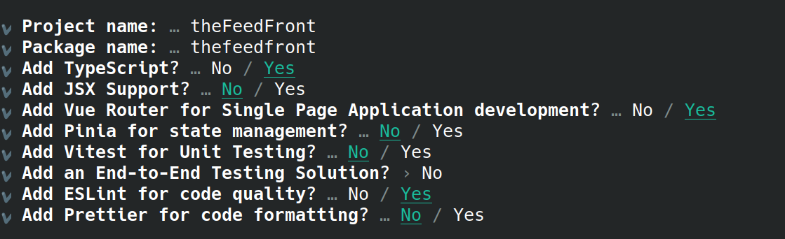




Remarquez qu'API Platform fournit [un outil](https://api-platform.com/docs/create-client/vuejs/) qui génère automatiquement le code client `vuejs` en TypeScript associé à une API développée en utilisant API Platform. Le résultat obtenu est évidemment très formaté, mais si l'on comprend son fonctionnement il est évidemment possible de le personnaliser à souhait. Dans ce TD, nous allons réaliser notre client Vue nous-même, mais tout ce que nous verrons est utile pour comprendre le fonctionnement du code généré par API Platform (mais il utilise aussi d'autres notions que nous n'aurons pas le temps d'étudier comme les `composables`).


## Initialisation du projet

Nous allons créer un nouveau projet Vue en utilisant la commande ```npm init vue@latest```. Cette fois, nous allons activer une option supplémentaire en acceptant le `Vue Router` :




Ensuite entrez les 3 lignes suggérées dans le terminal :

```sh
cd theFeedFront
npm install
npm run dev
```

Ouvrez la page correspondant au projet dans votre navigateur. Nous pouvons commencer à travailler sur notre projet.

Vous pouvez aussi modifier le titre de la page en `The Feed` dans le fichier `index.html`.

## Nos premières routes

Dans ce TD nous allons réaliser une "Application à Page Unique" (Single page application ou SPA). L'idée étant que lors de la navigation sur le site on ne chargera jamais une nouvelle page `html`, mais le JavaScript sera responsable de faire changer la page. Cela permet une navigation plus efficace et moins couteuse en bande passante. Cependant, pour rendre la navigation agréable pour l'utilisateur, il faut qu'elle se comporte comme si l'on avait plusieurs pages, il faudrait notamment :
- sauvegarder les "pages visitées" dans l'historique, 
- autoriser un clic sur le bouton "page précédente"
- permettre l'utilisation d'une URL qui change en fonction des "pages" (pour pouvoir l'enregistrer dans mes favoris ou la partager avec un autre utilisateur).

On pourrait gérer tout cela nous-même, mais le `router` de Vue est une solution très simple à tous ces problèmes. On va définir des vues (qui se déclarent et s'utilisent comme les composants), on va ensuite configurer les routes pour expliquer quelle route correspond à quelle vue. On pourra ensuite utiliser la balise `<router-view />` dans notre composant principal qui se chargera de détecter la vue à charger en fonction de l'URL. On pourra aussi utiliser le routeur pour générer automatiquement l'URL d'une vue pour définir (un lien par exemple). Bien que le contexte et le fonctionnement soient assez différent, l'utilisation des routes devrait vous rappelez les routes de Symfony.

Commençons par créer notre première vue.

<div class="exercice" markdown="1">

 
1. Commencez déjà par vider le contenu des dossiers `components` et `views`.

2. Remplacez le fichier `App.vue` par [celui ci](../assets/App.vue).


3. Créer un fichier `views/Feed.vue` qui contient le code suivant
    ```vue
    <template> 
    Ceci est la vue du Feed.
    </template>
    ```

4. Remplacez le contenu du fichier `router/index.ts` par le contenu suivant (en fonction de la version de Vue, il se peut que vous ayez un fichier `router.ts` à la place du fichier `router/index.ts`, le fonctionnement est le même) :
    ```ts
    import { createRouter, createWebHistory } from 'vue-router'
    import Feed from '../views/Feed.vue'

    const router = createRouter({
        history: createWebHistory(''),
        routes: [
            {
                path: '/',
                component: Feed
            },
            {
                path: '/feed',
                component: Feed
            }
        ]
    })

    export default router
    ```
5. Dans le dossier `assets/` remplacez le contenu du fichier `main.css` par 
    ```css
    body{
        margin:0;
        padding:0;
    }
    ```
    et supprimez les deux autres fichiers.

6. Vérifiez que votre page s'affiche correctement sans erreurs. Il faut qu'en dessous du menu, vous ayez l'affichage du texte `Ceci est la vue du Feed.`.
</div>

Prenons le temps de comprendre ce qu'il se passe. Commençons par regarder le contenu du fichier `main.ts`. On y trouve deux nouvelles lignes : 
```ts
import router from './router'
app.use(router)
```

La première ligne permet d'importer le routeur en indiquant où il est stocké (ici dans le dossier `router`). La seconde ligne permet de rendre le routeur disponible à l'ensemble des composants qu'on va charger par la suite dans `app`.

Ensuite dans le fichier `router/index.ts` la partie qui nous intéresse est celle qui définie deux routes différentes `/` et `/feed` qu'on associe toutes les deux au composant `Feed`. Notez qu'en haut du fichier le deuxième import défini le composant `Feed` comme étant celui contenu dans le fichier `/views/Feed.vue`.

Finalement, dans le fichier `App.vue`, la ligne intéressante est celle qui contient  
`<router-view />`. Cette ligne indique que cette partie du template doit être remplacée par le composant correspondant à la route actuelle. En l'occurrence, nous avons indiqué que la route `/`, correspondait au composant `views/Feed.vue` et c'est donc celui qui devrait s'afficher. Ouvrez la console du navigateur et regardez ce qu'il se passe si on ajoute `blabla` au bout de l'URL et qu'on recharge la page. Essayez ensuite avec `/feed` qui devrait fonctionner.

Pour s'assurer que nous avons compris, créons une autre vue qui nous servira plus tard.

<div class="exercice" markdown="1">

 
1. Créez le fichier `AllUsers.vue` sur le même modèle que `Feed.vue`, mais avec le texte `Ceci est la liste des utilisateurs.`

2. Ajoutez une route `/users` dans le fichier `router/index.ts` qui invoque le composant que nous venons de définir. N'oubliez pas de faire l'import du composant avant de définir la route.

3. Vérifiez que cette nouvelle route fonctionne.
</div>

Une fois que nos premières routes sont définies, il est temps de faire nos premiers liens vers nos routes. La première manière de faire cela consiste à utiliser la méthode `push` du routeur qui redirige l'utilisateur vers la route donnée en argument. Plus précisément, on commence par récupérer le routeur dans la partie script en faisant
```vue 
<script setup lang="ts">
    import {useRouter} from 'vue-router';
    const router = useRouter();
</script>
```

Ensuite, l'appelle à la méthode `router.push('maroute')` redirige la page vers `maroute`. Ainsi, par exemple en ajoutant l'attribut `@click="router.push('/maroute')"` à une balise `html`, je m'assure qu'un clic sur cette balise change la route.

<div class="exercice" markdown="1">

 Modifiez le fichier `App.vue` pour qu'un clic sur `The feed` renvoie sur la route `/feed` et qu'un clic sur `Les membres` renvoie sur la route `/users`. Vérifiez que tout fonctionne.

</div>

On peut aussi nommez nos routes en rajoutant un `name` à la route comme ceci
```ts
    {
        path: '/',
        name:'feed',
        component: Feed
    },
```

On peut ensuite utiliser la route par son nom comme ceci `router.push({name: 'nomDeLaRoute'})`. Cette syntaxe est légèrement plus lourde que la précédente, mais elle possède quelques avantages. Elle diminue les risques d'erreurs, mais surtout elle va nous simplifier la vie plus tard avec les routes paramétrées.


<div class="exercice" markdown="1">

 Nommez la route `/users` avec le nom `allUsers` et utiliser ce `name` dans le `push` comme montré au-dessus.

</div>

## Les routes paramétrées

Pour notre application, nous aurons besoin d'une autre fonctionnalité des routes : les routes paramétrées. Nous avons déjà rencontré le même concept dans Symfony : ce sont des routes dont l'URL contient une variable (par exemple, l'identifiant d'un utilisateur).

Pour définir une route paramétrée, il suffit de précéder le paramètre du symbole `:`. Ainsi, par exemple, je peux définir la route suivante :
```ts
{ 
    path: '/users/:id', 
    name: 'singleUser',
    component: User 
},
```
Ensuite dans le composant de notre route pour récupérer le paramètre, il suffit de récupérer l'objet `route`, puis d'aller y chercher le ou les paramètres désirés. Par exemple, pour récupérer le paramètre `id` défini dans la route précédente on pourrait faire : 
```ts
import { useRoute } from 'vue-router'
const route = useRoute()
const id = route.params.id
```

<div class="exercice" markdown="1">

 
1. Créez une vue `views/SingleMessage.vue` qui récupère le paramètre `id` de la route et affiche `J'affiche le message d'id {{id}}`. 

2. Ajoutez dans le routeur une route `/feed/:id` nommée `singleMessage` qui conduit vers la vue précédemment définie. 

3. Vérifiez que tout fonctionne en testant l'URL de la route `/feed/17`.

4. Faites de même pour une route `/users/:id` qui affiche une vue `SingleUser.vue` qui se contente d'afficher un message similaire au précédent pour l'instant.

</div>

Vous savez maintenant presque tout ce que vous avez besoin de savoir sur les routes. Nous allons maintenant pouvoir commencer à utiliser l'API The Feed pour rendre notre site fonctionnel.

## Mise en place des composants utilisateurs et message

Avant de chercher à utiliser l'API, nous allons commencer à voir comment nous utiliserons les informations de l'API. Ouvrir la page d'accueil de votre API pourrait être utile à partir de maintenant pour retrouver les informations sur son usage. La première chose à faire est de définir des types correspondants à ce que l'API nous renverra. Deux objets en particulier seront intéressant, l'utilisateur et la publication. On peut voir qu'un utilisateur possède comme données son `id` (un `number`), son `adresseEmail` (un `string`), son `login` (un `string`) et le `boolean premium`. On va définir son interface ainsi

```ts
export interface Utilisateur{
    id: number;
    adresseEmail: string;
    login: string;
    premium: boolean;
}
```

On peut enregistrer la définition de cette interface dans un fichier `.ts`. On pourra ensuite importer la définition de ce type dans un autre fichier avec la ligne
```ts
import type {Utilisateur} from 'definitionDeMonInterface.ts';
```

Si plusieurs types sont définis dans mon fichier, je peux en importer plusieurs en les listant entre les `{...}`.


<div class="exercice" markdown="1">

   Créez un fichier `src/types.ts` dans lequel vous ajouterez la définition des interfaces d'un utilisateur et d'une publication avec les mots clefs `export`. Pour l'interface `Publication`, basez-vous sur ce que votre API renvoie (il y a 4 champs et on utilisera un `string` pour la date).

</div>

La prochaine étape est de définir un composant pour afficher les données de l'utilisateur. Pour ce site, nous allons utiliser une boite qui ressemble à ceci pour les différents éléments de contenus (les messages, les utilisateurs...) :


En fonction du contexte, nous allons parfois vouloir rendre ces boites cliquables, parfois y mettre des liens et il est donc assez compliqué d'écrire un composant adapté (mais ce serait tout à fait possible notamment avec quelques outils que nous n'avons pas mentionnés). Par contre, il est très simple d'utiliser un CSS commun pour plusieurs composants. Nous allons donc utiliser le CSS suivant (que vous pouvez adapter à vos goûts) :

```css
div.contentBox{
    width:100%;
    margin:10px auto;
    display:flex;
    flex-direction:column;
}
.top{
    box-shadow: 0 0 0.3rem #999;
    border-radius: 15px 15px 0px 0px;
    background-color: rgb(140, 200, 250);
    border-bottom: black 2px solid;
    padding:8px;
    font-size: 8pt;
}
.top .clickable{
    font-size:16px;
    font-weight: 600;
    color:black;
    text-decoration: none;
}
.top .clickable:hover{
    color:aliceblue;
}

.content{
    margin:0px;
    padding:20px;
    flex-grow: 1;
    background-color: aliceblue;
    box-shadow: 0 0 0.3rem #999;
    font: 1.2em "Fira Sans", sans-serif;
}
.content.clickable:hover{
    box-shadow: 0 0 0.3rem #000;
    cursor: pointer;
}

```

Le HTML quant à lui ressemblera à ça
```html
<div class="wrapper">
    <div class="top">
        ici le titre du bloc
    </div>
    <div class="content" >
        ici le contenu du bloc
    </div>
</div>
```

Pour pouvoir importer un CSS dans le CSS de notre composant, il suffit d'utiliser les lignes suivantes :
```css
<style scoped>
  @import "/chemin/vers/moncss";
</style>
```

Remarquez que ce n'est pas un ajout de Vue, mais bien quelque chose qui est toujours possible en CSS (ici Vue se chargera d'appliquer aussi le `scoped` au fichier importé).

> *Petit point CSS :* Le CSS contenu dans `<style scoped>` n'est appliqué qu'au composant dans lequel, il est écrit. Schématiquement Vue ajoute des `data-attribut` aux éléments d'un composant et modifie les sélecteurs de notre CSS pour qu'ils utilisent ces `data-attribut`. Mais Vue rajoute de nombreuses possibilités. Par exemple, la pseudo-classe `:deep` permet d'accéder aux enfants d'un composant. Notez qu'on peut aussi charger un CSS global comme c'est actuellement fait dans `main.ts`.


 Dans un premier temps on pourra donc définir le composant correspondant à un utilisateur ainsi
```vue
<script setup lang="ts">
  import type {Utilisateur} from '@/types'; 
  const props = defineProps<{utilisateur: Utilisateur}>();
</script>

<template>
  <div class="contentBox">
    <div class="top">
      Profil de {{ utilisateur.login }}
    </div>
    <div class="content">
      <div class="group">
        <label>Login</label>
        <input :value="utilisateur.login" >
      </div> 
      <div class="group">
        <label>Adresse e-mail</label>
        <input :value="utilisateur.adresseEmail" > 
      </div> 
    </div>
  </div>
</template>


<style scoped>
    @import "@/components/ContentBox.css";
</style>
```

<div class="exercice" markdown="1">

 
1. Créez un fichier `components/ContentBox.css` et le fichier du composant `components/BoiteUtilisateur.vue` avec les contenus indiqués au-dessus.

2. Modifiez le contenu de `AllUser.vue` pour :
    - Ajouter dans le script la définition du tableau `users` qui contient un `user` comme suit (plus tard nous remplirons ce tableau en interrogeant l'API)
    ```ts 
    const users:Ref<Utilisateur[]> = ref([{
        id:4, 
        adresseEmail:"toto@gouv.fr", 
        login:"toto", 
        premium:false
    }]);
    ```
    - Dans le template, utiliser un `v-for` pour afficher chaque élément du tableau dans un composant `BoiteUtilisateur` (vous pouvez utiliser l'`id` pour l'attribut `key`).
    - Ajouter les `import` nécessaires : on a besoin de `ref` et de `BoiteUtilisateur`, ainsi que des types `Ref` et `Utilisateur` (l'IDE doit pouvoir le faire pour vous).
    - Vérifiez que tout fonctionne. Ajoutez un deuxième utilisateur au tableau `users` pour vérifier votre boucle.

3. Modifiez la vue `SingleUser` pour qu'elle crée un faux `Utilisateur` (mais avec le bon `id` qu'on peut récupérer en paramètre de la route) et l'affiche en utilisant le composant `BoiteUtilisateur`. Attention, l'id en paramètre (`route.params.id`) est de type `string` alors que l'id d'un `Utilisateur` doit être un `number`. On peut utiliser `Number(monstring)` pour convertir un `string` en `number`.

</div>

 On souhaite qu'un clic sur le login d'un utilisateur affiche son profil. 
 On pourrait utiliser `router.push`, mais pour faire un lien, nous pouvons utiliser à la place la balise `router-link`. Cette balise se comporte comme un `<a>` HTML avec l'URL correspondant à la route donnée en paramètre et s'utilise comme suit :
 ```html
 <router-link :to="{name:'nomDeLaRoute',params:{param1:valeureParam1, param2:valeureParam2}}">texte du lien</router-link>
```
Dans notre cas cela donne :
 ```html
 <router-link :to="{name:'singleUser', params:{id:utilisateur.id}}">texte du lien</router-link>
```
Ici, il pourrait être tentant de faire `<router-link :to="'/singleUser/'+utilisateur.id">`, mais il faudrait s'assurer que `utilisateur.id` est correctement encodé dans l'URL alors que l'autre syntaxe automatise l'encodage des URL.

<div class="exercice" markdown="1">

 Modifiez le composant `BoiteUtilisateur.vue` pour que le login de l'utilisateur soit un lien vers la page de cet utilisateur. On pourra ajouter la classe `clickable` à ce lien pour améliorer le CSS. Vérifiez que le lien fonctionne.

</div>

Nous avons une première version de l'affichage des utilisateurs prête pour être connecté avec notre API. Avant cela nous allons faire la même chose pour les publications. Pour le composant `BoitePublication` nous utiliserons le code suivant

```vue
<script setup lang="ts">
    import {useRouter, RouterLink} from 'vue-router';
    import type { Publication } from '@/types';

    const router = useRouter();
    const props = defineProps<{publication:Publication}>();
</script>

<template>
    <div class="contentBox">
        <div class="top">
            <router-link :to="{name:'singleUser', params: {id: publication.auteur.id}}" class="clickable">
                {{publication.auteur.login}}
            </router-link>
            -- {{(new Date(publication.datePublication)).toLocaleString("fr")}}
        </div>
        <div class="content clickable" @click="router.push({name:'singleMessage', params: {id: publication.id}})">
            {{publication.message}}
        </div>
    </div>
</template>

<style scoped>
     @import "@/components/ContentBox.css";
</style>
```

Prenez le temps de comprendre ce qu'il s'y passe. La seule nouveauté est le `(new Date(publication.datePublication)).toLocaleString("fr")` qui permet d'afficher la date dans un format plus lisible que celui contenu dans `datePublication`.


<div class="exercice" markdown="1">

 
1. Créez `BoitePublication` avec le code donné plus tôt. 

2. En vous inspirant de `AllUsers.vue`, modifiez la vue `Feed.vue` pour qu'elle affiche une liste de publication en utilisant ce composant. On pourra pour l'instant initialiser une fausse liste de publication avec le contenu suivant :
    ```ts
    const publications:Ref<Publication[]> = ref([{
        id:3,
        message:"Hello world !!",
        datePublication:"2023-09-15T12:02:09.037Z",
        auteur:{
            id:4,
            adresseEmail:"toto@gouv.fr",
            login:"toto",
            premium:false
        }
    }]);
    ```

3. Vérifiez que cela fonctionne. 

4. Modifiez la vue `SingleMessage` pour qu'elle utilise le composant pour afficher une fausse publication pour l'instant. 

</div>

Nous allons maintenant pouvoir commencer à remplir les vues que nous avons créées avec le contenu fourni par l'API.


## Premier contact avec l'API

Commençons par nous occuper du composant `AllUsers.vue` qui doit récupérer la liste des utilisateurs sur l'API, puis l'afficher. Rappelez-vous que pour obtenir la liste des utilisateurs, il suffit de faire un `GET` à l'adresse `.../the_feed_api/public/api/utilisateurs` (il faut bien sûr remplacer `...` par l'URL à laquelle votre api `the_feed_api` est disponible). 

Dans notre composant `AllUser`, on pourrait donc inclure le code suivant pour récupérer la liste des utilisateurs.
```vue
<script setup lang="ts">
import {ref} from 'vue'
const users = ref([]);

...

fetch('.../the_feed_api/public/api/utilisateurs')
  .then(reponsehttp => reponsehttp.json())
  .then(reponseJSON => {
    users.value = reponseJSON["hydra:member"];
  });
</script>

...
```

Notez qu'il faut bien s'assurer que `users` est réactif, puisqu'il n'aura pas sa valeur tout de suite, mais uniquement quand le `fetch` aura eu lieu et il faudra alors mettre l'affichage à jour. 

Cependant, les bonnes pratiques recommandent de plutôt procéder comme dans l'exemple suivant.

```vue
<script setup lang="ts">
import {ref, onMounted } from 'vue'
const users = ref([]);

...

onMounted(() => {
    fetch('.../the_feed_api/public/api/utilisateurs')
        .then(reponsehttp => reponsehttp.json())
        .then(reponseJSON => {
            users.value = reponseJSON["hydra:member"];
        });
})
</script>
```

En procédant ainsi, on indique à Vue de faire le `fetch` une fois que le composant est "monté" (`onMounted`), c'est-à-dire une fois qu'il a été crée et ajouté au DOM. Ça ne changera rien dans notre cas d'utilisation, mais c'est la pratique recommandée par la documentation Vue et nous allons donc la suivre.


<div class="exercice" markdown="1">

 
1. Modifiez le code de `AllUsers` pour qu'il affiche tous les utilisateurs. Vérifiez que tout fonctionne. Si vous êtes en local, il se peut que vous rencontriez des problèmes (mais pas nécessairement en fonction des détails de votre configuration). Dans ce cas, vous pouvez dans un premier temps utiliser l'API d'un de vos camarades hébergé sur le serveur de l'IUT. 

2. Faites la même chose pour que les trois autres vues fonctionnent. Il faudra regarder le format du JSON que retourne l'API pour adapter le traitement du `fetch`. Pour `AllUsers` et `Feed`, vous pouvez initialiser la variable qui contient le résultat du fetch avec un tableau vide, mais pour les deux autres il faudra que la valeur initiale soit déjà valide (puisque le composant sera déjà affiché avant le fetch). C'est en fait l'opportunité de mettre votre "faux utilisateur/publication" initiale avec des champs dont la valeur est `"chargement"` et c'est donc cela qui s'affichera en attendant que les vraies valeurs soient chargées.

3. N'oubliez pas d'utiliser `encodeURI()` sur toute variable qui pourrait se retrouver dans l'URL du `fetch`. Il faudra peut-être d'abord les convertir en string avec la fonction `String`.

</div>


## Gérer le JWT
### Se connecter et récupérer le JWT
Normalement, à ce stade, vous avez quasiment tous les outils pour finir notre application. Nous allons cependant vous guider pour la gestion des JWT qui soulève une difficulté bien particulière : comment et où le stocker ?

Commençons par créer un formulaire de connexion :
```vue
<script setup lang="ts">
    import {ref} from 'vue'; 
    const connectingUser = ref({
        login: "",
        password:""
    });
// à completer
    function connect():void{
// à completer
    }
</script>


<template>
  <div class="wrapper">
    <div class="top">
      <h3>Création du profil</h3>
    </div>
    <form  @submit.prevent="connect" class="content">
        <div class="group">
            <label>Login</label>
            <input v-model="connectingUser.login" >
        </div> 
        <div class="group">
            <label>Mot de passe</label>
            <input type="password" v-model="connectingUser.password" > 
        </div> 
        <button type="submit">
            Connexion
        </button>
    </form>
  </div>
</template>

<style scoped>
    @import "@/components/ContentBox.css";
</style>
```

Prenez le temps de comprendre tout ce qu'il se passe. Nous utilisons un événement spécial du `form` qui est `@submit` qui permet de détecter si le formulaire a été soumis. Le modificateur `.prevent` permet d'empêcher les autres événement lié à la soumission d'un formulaire d'avoir lieu. Autrement dit, quand on clique sur le bouton "connexion" seul la fonction `connect` sera appelée. Techniquement, `.prevent` est juste une syntaxe de Vue qui appelle la fonction JS [`event.preventDefault()`](https://developer.mozilla.org/fr/docs/Web/API/Event/preventDefault) vu l'an dernier en [cours de JavaScript](http://romainlebreton.github.io/R.4.01-DeveloppementWeb-JavaScript/classes/class2.html#34.0).

Il faudra compléter les parties manquantes de la fonction `connect`. Rappelez-vous la forme de la requête de connexion grâce à API Platform. Il faudra préciser la méthode de la requête (`POST`), le format du corps de la requête et le corps de la requête. Nous allons donc utiliser la syntaxe plus complète de `fetch` ce qui ressemblera à ceci :
```ts
fetch(".../api/auth", {
    method: "POST",  
    headers: {
        'Content-Type': 'application/json'
    },
    body: JSON.stringify(connectingUser.value),
}).then(...)
```

<div class="exercice" markdown="1">

 
1. Créez la vue `login.vue` et complétez là. Pour l'instant, nous allons simplement afficher dans le terminal (`console.log`) le retour de la demande de connexion.

2. Configurez la route `login` correspondante dans le fichier `router/index.ts` et ajoutez le lien correspondant dans le menu. 

3. Vérifiez que cela fonctionne. En particulier, si vous essayez de vous connecter avec des identifiants valides, vous devriez recevoir un JWT en réponse à votre requête.
</div>


### Stocker le JWT dans un store
Maintenant que nous savons recevoir le JWT, il nous faut voir comment l'utiliser. Avant de l'utiliser, il va falloir l'enregistrer. On veut enregistrer le JWT de manière à pouvoir l'utiliser depuis n'importe quelle autre vue de l'application, on ne peut donc pas se contenter de l'enregistrer dans une variable locale de la vue ou du composant. On pourrait le stocker dans le composant principal (`App.vue`) et le modifier avec un `emit`, mais il faudrait alors l'envoyer dans un `prop` à toutes les vues et les composants qui pourraient en avoir besoin. Pour stocker ce genre de variables globales, nous allons plutôt utiliser un store.

Nous pourrions utiliser le store de Vue. C'est le `Pinia` qu'il nous propose d'ajouter quand nous créons notre projet (et il est aussi possible d'utiliser d'autre store en les installant avec `npm`). Cependant, pour l'usage que nous allons en faire il est plus simple d'utiliser notre propre store, mais aussi cela permet de comprendre comment un store fonctionne.


Un store est simplement un objet commun qui permet de stocker les variables globales et qu'on peut facilement importer dans les composants qui l'utilise. Pour définir un store qui stocke le JWT, on pourra simplement écrire :

```ts
import { reactive } from 'vue'

export const storeAuthentification = reactive({
  JWT: ""
});
```

Maintenant, pour utiliser le store dans un composant on peut faire
```vue
<script setup>
    import { storeAuthentification } from '.../storeAuthentification.ts'
    //faire des trucs avec storeAuth.JWT qui contient mon JWT
</script>
```
Si j'importe le store dans plusieurs composants, c'est bien le même qui est importé à chaque fois donc il y a un seul objet store commun pour tous mes composants. Maintenant, puisque cet objet est accessible depuis tous les composants, il est conseillé de ne pas modifier ses attributs directement, mais plutôt de fournir des méthodes pour les différentes manières de le modifier. 

En effet, si votre application grandit il se peut que vous soyez obligé de modifier l'organisation de votre store. Si vos composants utilisent directement les attributs, il se peut que vous ayez besoin de modifier du code dans l'ensemble des composants de votre application. Au contraire, si vous utiliser uniquement des méthodes du store, vous pourrez changer l'organisation du store et il suffira de modifier ces méthodes sans toucher au reste du code de l'application. La première chose à faire serait donc d'ajouter des setters. Mais en fait, on peut aller plus loin, on peut faire gérer l'authentification par le store directement, ce qui donnerait le code suivant.

```ts
import { reactive } from 'vue'

export const storeAuthentification = reactive({
  JWT: "",
  connexion(login: string, motDePasse: string, succes:()=>void, echec:()=>void): void{
    //fait le fetch et change le JWT si succès
    //return true/false en fonction du suddès de l'authentification
  }
});
```
On a donc une fonction connexion qui fait la requête HTTP de connexion avec fetch. En cas d'échec, cette fonction appelle la fonction callback `echec` donnée en paramètre et en cas de succès, elle enregistre le JWT puis appelle la fonction `succes`. Les deux fonctions de callback permettront de changer la route ou d'afficher un message flash en cas de succès/échec. Remarquez que `()=>void` est le type d'une fonction qui ne prend pas d'argument et qui ne renvoie rien.

<div class="exercice" markdown="1">

 
1. Créez le fichier `store/storeAuthentification.ts` qui contient le code du store. Basez-vous sur la requête fetch de l'exercice précédent pour compléter la fonction connexion. Pour tester si la connexion a échoué on pourra utiliser `reponsehttp.status !== 200` (il vaut 200 si la connexion est réussie).

2. Modifiez la vue login pour qu'elle puisse accéder au `storeAuthentification` et que la fonction `connect` utilise la méthode connexion pour enregistrer le JWT. Pour l'instant on pourra utiliser `()=>{}` pour les fonctions `succes` et `echec`.

3. Pour tester, modifier temporairement la vue `login` pour afficher le JWT actuellement stocké en haut de la page. Annulez ensuite cet affichage.

4. Modifiez les deux fonctions de callback pour qu'en cas de connexion réussie l'utilisateur soit redirigé vers la route `/feed` et qu'en cas d'échec la variable `connectingUser` soit réinitialisée. Vérifiez que tout fonctionne.

5. Modifiez le store pour ajouter un booléen "estConnecte" qui indique si l'utilisateur est connecté. Modifiez la fonction connexion pour qu'elle change la valeur du booléen quand c'est nécessaire.

6. Dans la vue principale `App.vue`, importez le store et utilisez ce booléen pour cacher les boutons `s'incrire` et `se connecter` si l'utilisateur est déjà connecté. On pourra utiliser la directive `v-if` dont le fonctionnement est expliqué [ici](https://fr.vuejs.org/guide/essentials/conditional.html).

</div>


**Remarque :** Le store est une variable JavaScript comme les autres et dès qu'on quitte ou qu'on rafraichit la page cette variable est réinitialisée. Il existe des solutions pour stocker des variables entre plusieurs chargements de la page. Cependant, les deux principales solutions (localStorage et cookie) sont sensibles aux injections JS (XSS) et il faut donc être très prudent pour pouvoir utiliser ces solutions correctement. En fait, même notre store pourrait être vulnérable en cas d'injection XSS. On peut aussi utiliser les `workers` pour stocker le JWT de manière plus sécurisé jusqu'à la prochaine fermeture du navigateur web. Toutes ces solutions ne sont pas forcément très compliquées à mettre en place, mais sortent du contexte de ce TD et nous n'allons donc pas les explorer.


### Utilisez le JWT

Nous savons récupérer, stocker et accéder au JWT, il ne nous reste plus qu'à l'utiliser.
Nous allons créer un nouveau composant qui permet poster un message. Nous pourrons utiliser le template suivant et le style habituel :
```vue
<script setup lang="ts">
//todo
</script>
<template>
  <div class="wrapper">
    <div class="top">
      <h3>Nouveau message</h3>
    </div>
    <form  @submit.prevent="envoyer">
        <div class="group">
            <label>Message</label>
            <input v-model="message" >
        </div> 
        <button type="submit">
            Envoyer
        </button>
    </form>
  </div>
</template>
```

Rappelez-vous que pour faire un `POST` d'une publication, l'utilisateur doit fournir son JWT dans le champ `Authorization`. La syntaxe qui permet d'ajouter ce champ au `fetch` est la suivante :

```ts
fetch("/monapi/publications", {
            method: "POST",  
            headers: {
                'Content-Type': 'application/json',
                'Authorization': 'Bearer '+ monJWT
            },
            body: JSON.stringify({message:"le message à poster"}),
        }).then(...);
```
Il faut bien évidemment remplacer `monJWT` par le JWT enregistré.

<div class="exercice" markdown="1">

 
1. Créez le composant `views/FormulairePost.vue` en utilisant l'exemple plus haut. Complétez le composant en définissant la fonction `envoyer` et la variable message comme il faut. Pour l'instant, on peut ne pas mettre de `then` et se contenter d'ignorer la réponse de notre requête.

2. Si l'utilisateur est connecté, affichez ce composant en haut de la vue feed.

3. Vérifiez que tout fonctionne. Attention pour l'instant la page feed n'est pas rechargé automatiquement avec le nouveau message.
</div>

Il faudrait que l'ajout d'un message déclenche le rechargement de la page `feed`. On pourrait ajouter nous-même le nouveau message au tableau (la réponse à notre requête contient toutes les infos sur le nouveau message). Mais nous allons plutôt recharger toute la page. L'avantage de procéder ainsi est que si d'autres changements ont eu lieu entre temps on va aussi les recharger et donc l'état de notre page correspond effectivement à l'état de l'API à un moment donné. L'autre solution aurait l'avantage d'être légèrement plus efficace puisqu'elle nous évite de faire une requête. 

Pour faire cela, notre composant `FormulairePoste` émettra un événement pour signaler à son parent qu'il faut qu'il recharge la page. 


<div class="exercice" markdown="1">

 
1. Dans le composant `FormulairePoste`, définissez un nouvel évènement avec `const emit = defineEmits<{ updated: []}>();`. Modifiez le traitement du `fetch` pour émettre cet évènement en cas de succès de la requête.

2. Modifiez maintenant le composant `Feed` pour appeler la fonction `chargerFeed` quand le composant `FormulairePoste` émet l'évènement `update` (il suffit de faire `@updated="chargerFeed"` au bon endroit).

3. Définissez la fonction `chargerFeed` qui réutilise le code du `fetch` qui était dans `onMounted`. Modifiez `onMounted` pour appeler aussi la fonction `chargerFeed`.

4. Vérifiez que tout fonctionne.

</div>

## Importer un composant pour les messages flash

Il est possible d'utiliser de nombreux composants créés par d'autres développeurs au sein de notre application. Pour notre site, nous allons utiliser le composant `FlashMessage` disponible [ici](https://www.npmjs.com/package/@smartweb/vue-flash-message/v/next) pour afficher des messages flash quand certains événements ont lieu.

Pour commencer, il faut installer la dépendance nécessaire à notre projet. Dans le terminal, entrez la commande :
```sh
npm install @smartweb/vue-flash-message@next
```
Ça y est, le paquet est disponible dans notre application. C'est l'intérêt d'un gestionnaire de paquet.

Ensuite pour l'utiliser, nous allons commencer par l'enregistrer dans `main.ts` comme nous avions fait pour le routeur. Pour cela, nous devons ajouter au bon endroit les deux lignes suivantes au fichier `main.ts`:
```ts
import FlashMessage from '@smartweb/vue-flash-message';
...
app.use(FlashMessage);
...

```

Notez que nous pourrions aussi importer les messages flash dans chaque composant où nous allons l'utiliser. D'ailleurs, nous pourrions aussi enregistrer certain de nos propres composants ici, pour ne pas avoir besoin de les importer dans le reste du code.

Enfin, pour utiliser les messages flash :
- placer la balise `<FlashMessage />` pour indiquer l'endroit où l'on souhaite qu'ils s'affichent.
- pour afficher un message flash, je peux ensuite appeler la fonction `flashMessage` dont voici un exemple d'utilisation
    ```ts
    flashMessage.show({
        type: 'error',
        title: 'Error Message Title'
    });
    ```
**Attention :** Pour utiliser l'objet `flashMessage` dans le template, il faut en fait utiliser `$flashMessage`. Par contre, pour l'utiliser dans le `script setup`, il faudra d'abord l'importer 
`import { flashMessage } from '@smartweb/vue-flash-message';` 
car les composants enregistrés dans `main.ts` ne sont pas disponible dans le `script setup`.

<div class="exercice" markdown="1">

 
1. Utilisez la commande `npm` et modifiez le fichier `main.ts` de manière à pouvoir utiliser les messages flash.

2. Ajoutez la balise `<FlashMessage />` dans le main de `App.vue`.

3. Modifiez la fonction `connect` de la page login pour que :
    - si la connexion échoue, on affiche un message flash d'erreur qui prévient que la connexion a échoué
    - si la connexion réussit, on affiche un message flash de réussite (`success`) et on redirige la route vers le feed.
</div>

## Ce qu'il reste à faire

Voici une liste de ce qu'il reste à faire :

<div class="exercice" markdown="1">

 
1. Faites fonctionner le bouton d'inscription.
2. Ajoutez un bouton de déconnexion qui n'est visible que quand on est déconnecté. Il faudrait rajouter une fonction au store.
3. Modifiez la page d'information d'un utilisateur (`SingleUser.vue`) pour qu'elle affiche toutes les publications de cet utilisateur. Profitez en aussi pour que les champs login et adresse e-mail dans l'interface ne soient modifiables que si l'utilisateur est sur sa propre page.


Et si le temps le permet :
1. Permettre à un utilisateur de mettre à jour son profil depuis sa page utilisateur.
2. Ajoutez un bouton de suppression sur ses propres messages. Pour cela, il peut être intéressant de stocker le login de l'utilisateur connecté en modifiant le store. Dans un premier temps, on peut tricher et enregistrer le login, mais la bonne solution est plutôt de décoder le JWT. Pour cela deux solutions : une recherche Google ou utiliser une [bibliothèque](https://www.npmjs.com/package/jwt-decode)
3. Utilisez les messages flash aux endroits nécessaires. Par exemple, pour indiquer qu'un post ou qu'une de-connexion ont bien fonctionné. De manière générale, tous nos fetch peuvent échouer pour une raison ou une autre, il faudrait gérer tous ces cas d'erreur.
4. Gérez l'expiration du webtoken. En particulier, si on se rend compte que le token est expiré on pourrait déconnecter l'utilisateur en le prévenant avec un message flash. On pourrait même gérer son renouvellement si vous l'avez implémenté dans l'API (pour que cela soit pertinent, il faudrait se poser la question de la gestion longue durée du token).
5. Toutes les améliorations qui vous passent par la tête...
</div>

N'oubliez pas que pour déployer votre site, il faudra refaire les étapes du [TD précédent](TD2.html#déployer-le-site).

<!-- ### Configuration du proxy
Avant de conclure ce TD discutons d'un dernier point qui peut s'avérer assez utile. Il y a de nombreuses bonnes raisons pour utiliser une version différente de l'API sur notre site en développement et sur notre site déployé. La première de ces raisons est d'éviter de polluer la base de donnée réelle de notre application qui est utilisée par des milliers d'utilisateurs. Une seconde raison est que notre API, n'est peut-être pas une API accessible à tous, mais juste le back-end de notre site. Dans ce cas, elle interdit probablement les cross origin request (c'est-à-dire, les requêtes http qui sont faite à partir d'une fenêtre du navigateur qui n'est pas en train de visiter une page sur le même domaine). Interdire ces requêtes augmente la sécurité en particulier contre certaines injections XSS. Si c'est le cas il faut que le front-end soit déployé sur le même domaine que le back-end. Mais quand on teste notre site en mode dev, il tourne sur localhost et pas sur le domaine où il serra hébergé donc il devra faire une cross origine request. Le proxy permet aussi de régler ce problème. -->


